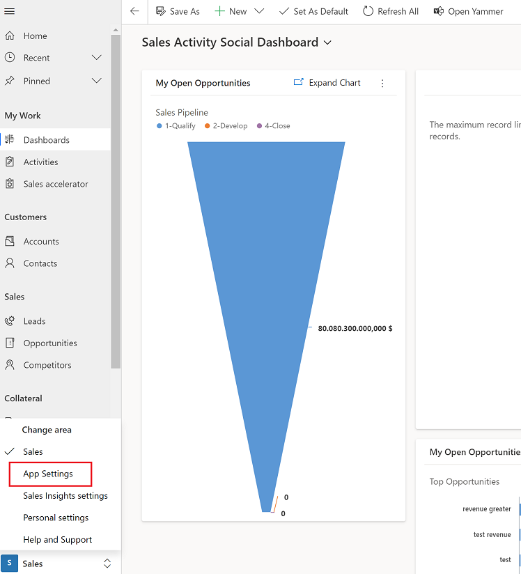
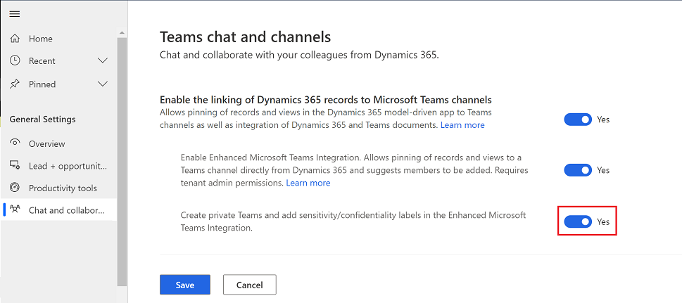

# Use sensitivity labels to protect content in Microsoft Team

[!INCLUDE [cc-beta-prerelease-disclaimer](../includes/cc-beta-prerelease-disclaimer.md)]

This feature is available with early access. For more information, see [early access](/power-platform/admin/opt-in-early-access-updates)

Users in your organization collaborate with others both inside and outside the organization. This means that content no longer stays behind a firewall—it can roam everywhere, across devices, apps, and services. And when it roams, you want it to do so in a secure, protected way that meets your organization's business and compliance policies.

Sensitivity labels in Microsoft Teams integration with customer engagement apps in Dynamics 365 (such as Dynamics 365 Sales, Dynamics 365 Customer Service, Dynamics 365 Field Service, Dynamics 365 Marketing, and Dynamics 365 Project Service Automation) lets you create teams with sensitivity label and  make the team private so that only the owner of the team can add additional members to the team.

> [!div class="mx-imgBorder"]
> 

## Turn on Sensitivity labels

Sensitivity labels is only available when the Enhanced Collaboration Experience is turned on. For more information, see [Install and set up Microsoft Teams integration](teams-install-app).

1. On the lower right, go to **Change area** and then select, **App Settings**.

   > [!div class="mx-imgBorder"]
   > 

2. From the site map, under **General Settings**, select **Chat and collaborate**.

3. Set the **Create private Teams and add sensitivity/confidentiality labels in the Enhanced Microsoft Teams Integration** toggle to **Yes**. When you're done, select **Save**. 

   > [!div class="mx-imgBorder"]
   > 

To learn how to use sensitivity labels, see [Enhanced Collaboration Experience with Microsoft Teams](teams-collaboration-enhanced-experience).
