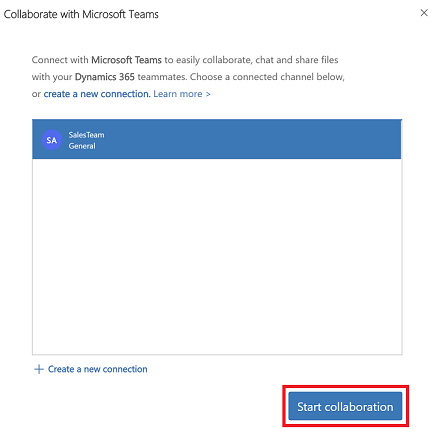
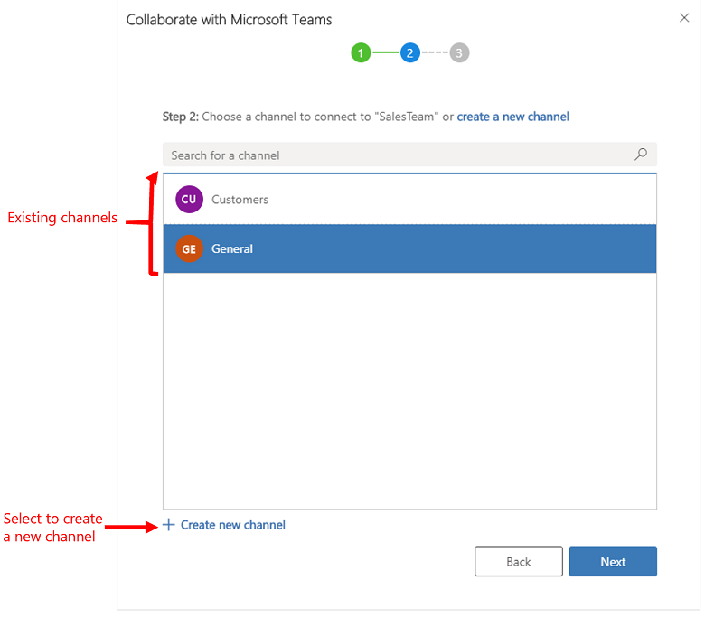
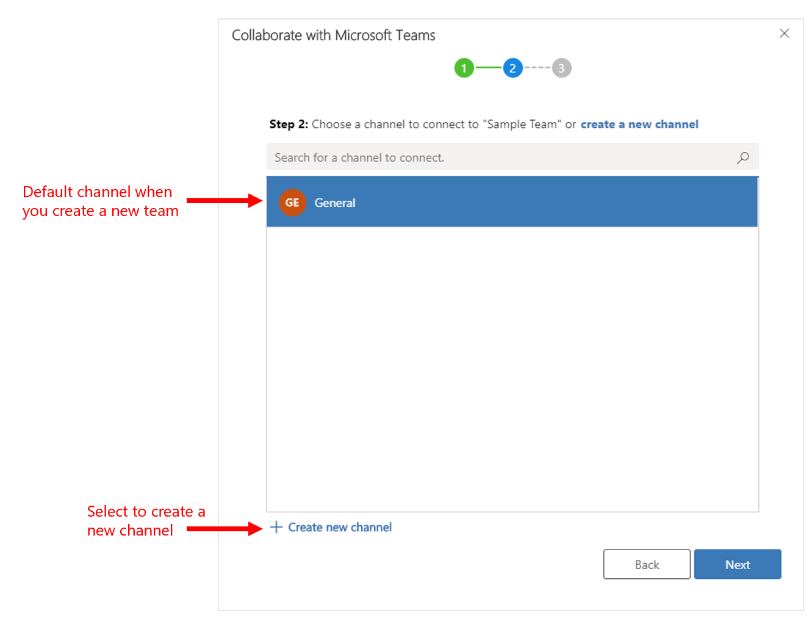

# Enhanced Collaboration Experience with Team

Easily connect a model-driven app record or view to a Teams channel using the **Collaborate** button on the record or view page. The step-by-step process will help you connect the selected record or view to a Microsoft Teams channel.

The [basic collaboration experience](teams-collaboration.md) only lets you pin a record or a view to a team channel from within Microsoft Teams. The enhanced collaboration experience includes everything in the [basic collaboration experience](teams-collaboration.md) and also lets you pin connect a record or a view to a team channel while you are working in model-driven apps in Dynamics 365. 

## Connect a record or a view to a team channel from model-driven apps in Dynamics

1. In your model-driven app, open a record or view.
2. When the record or view is open, on the command bar, select **Collaborate**.

   > [!div class="mx-imgBorder"]
   > 

3. On the **Collaborate with Microsoft Teams** window, you will see one of the following: 
    - **If there’s no channel that is already connected**: You can connect the current record or view to any team channel by selecting, **Get started**.

      > [!div class="mx-imgBorder"]
      > 

    - **If there is channel that is already connected**: You can use the existing connected channel by selecting the channel and then select **Start collaboration**. This will open Microsoft Teams and navigate to the connected channel that you selected. Or, you can connect the current record or view to another team channel by selecting, **Create a new connection**.

      > [!div class="mx-imgBorder"]
      > 

     > [!NOTE]
     >  If you selected an existing connected team channel where you are not the owner or member in that team, then when Microsoft Teams opens, select **Join** to send request to be added to the channel. 

4. After you select **Get started** or **Create a new connection**, you will enter into the connection process. 

   **Step 1**- **Team selection**: Choose an existing team or create a new team.
   - Choose an existing team that you belong to and then select **Next**.

     > [!div class="mx-imgBorder"]
     > 

   - Or, create a new team:  

        1. Select **Create new team**.
            > [!div class="mx-imgBorder"]
            > 

        2. Enter a name for the team and then select **Next**.
            > [!div class="mx-imgBorder"]
            > 

   **Step 2**- **Channel selection**: Choose an existing channel and then select **Next**, or select **Create new channel** to create a new channel.

      > [!div class="mx-imgBorder"]
      > 

      > [!NOTE]
      > When you create a new team, the system automatically creates a channel named **General**. You can connect the current record to the **General** channel and then select **Next** or select **create new channel** to create a new channel under the new created team.
      > > [!div class="mx-imgBorder"]
      > > 

   **Step 3**- **Add recommended team members**: If you are the owner of the selected team then you can add recommended Common Data Service teammates who either own the record or the record has been shared with them to the team member group. From the list, select any or all listed Common Data Service teammates. You can also use the search option to find the teammates in the list. When you are done, select **Finish**.

   > [!NOTE]
   > You will only see this step only if you are the owner of the selected team while connecting to a model-driven app record. If you are connecting a view of model-driven app to a Microsoft Teams channel, you will skip this step. For more information on how to share a record, see [Assign or share records.](https://docs.microsoft.com/powerapps/user/assign-or-share-records).

   > [!div class="mx-imgBorder"]
   > 

5. When the connection process is complete, the system will open Microsoft Teams and go to channel that you connected.
  
### See also  

[Install the app and set up the Teams tab](teams-install-app.md#install-the-app-and-set-up-the-teams-tab)

[Use Teams to open a record or view](teams-work-records-and-view.md)

[Basic Collaboration with Teams](teams-collaboration.md)

