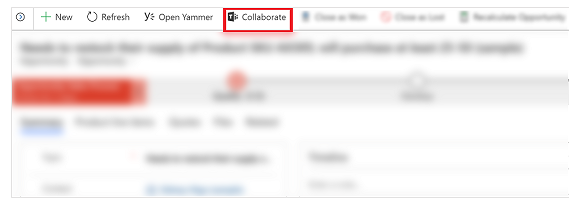
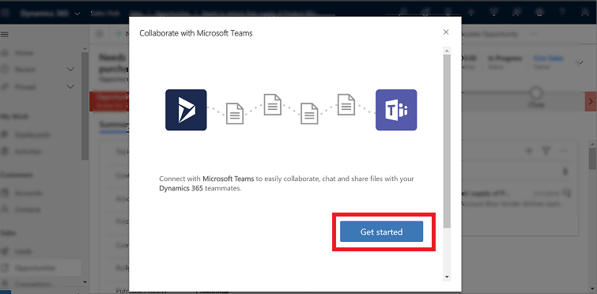
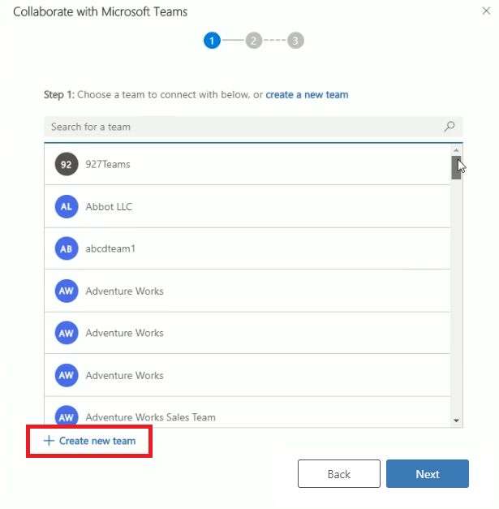
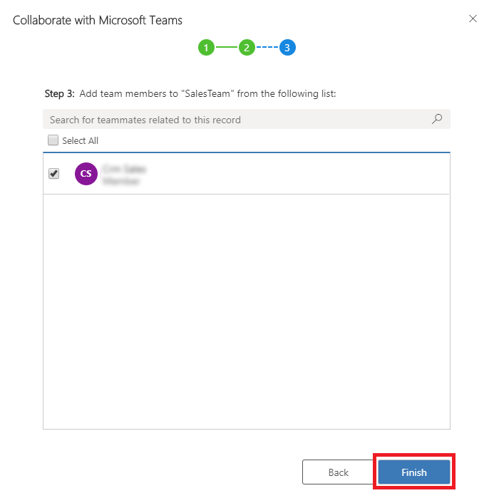

# Enhanced Collaboration Experience with Team

Easily connect model-driven app record or view to a Teams channel using the **Collaborate** button on the record or view page. The step-by-step process will help you connect the selected record or view to a Microsoft Teams channel. 

The [basic collaboration experience](teams-collaboration.md) only lets you pin a record or a view to a team channel from within Microsoft Teams. The enhanced collaboration experience includes everything in the [basic collaboration experience](teams-collaboration.md) and also lets you pin connect a record or a view to a team channel while you are working in model-driven apps in Dynamics 365. 

## Connect a record or a view to a team channel from model-driven apps in Dynamics

1. In your model-driven app, open a record or view.
2. When the record or view is open, on the command bar, select **Collaborate**.

   > [!div class="mx-imgBorder"]
   > 

3. On the **Collaborate with Microsoft Teams** window, select **Get started**.

   > [!div class="mx-imgBorder"]
   > 
   
   > [!NOTE]
   >  - If there is channel that is already set-up, then you can use the existing pinned channel by selecting the channel and then select **Start collaboration**. This will open the Teams app and go to the pinned channel that you selected. Or, you can pin the page to another Teams channel, by selecting **Create a new connection**.
    
      > [!div class="mx-imgBorder"]
      > 
   
     >  - If you selected an existing channel where you are not the owner or member, then when the Teams app opens select **Join** to send request to be added to the channel. 
   
4. To pin the record to an exising team or a new team, do one of the following:

  - **To pin to an existing team**
    1. From the list of teams that you belong to, choose the team that you want to pin the record to and select **Next**.
   
       > [!div class="mx-imgBorder"]
       > 
    
    2. Choose an existing channel and then select **Next** or select **Create new channel** to create a new channel.
    
       > [!div class="mx-imgBorder"]
       > 
   
  - **Or, to pin to a new team**
    1. To create a new team select, **Create new team**. 
 
       > [!div class="mx-imgBorder"]
       > 

    2. Enter a name for the team and then select **Next**.
    
       > [!div class="mx-imgBorder"]
       > 
      
    3. When you create a new team, the system automatically creates a channel named **General**. You can add the record to the **General** channel and then select **Next** or select **create new channel** to create a new channel. 
    
       > [!div class="mx-imgBorder"]
       > 
       
 > [!NOTE]
 >  You will only see the next step only if you pin a record and you are the owner of the Teams channel. If you pin a view  of Dynamics 365 apps records, then you will not see the next step.
 
 5. If you are the owner of the Teams channel then you can add teammates to the channel. From the list, select the recommended members who either own the record or the record has been shared with them. You can also use the search option to find other teammates related to the record. When you are done, select **Finish**.
 
 > [!NOTE]
 > For more information on how to share a record, see [Assign or share records.](https://docs.microsoft.com/powerapps/user/assign-or-share-records)

   > [!div class="mx-imgBorder"]
   > 
   
When the set-up process is complete, the system will open the Teams app and go to channel that you created.

### See also  

[Install the app and set up the Teams tab](teams-install-app.md#install-the-app-and-set-up-the-teams-tab)

[Use Teams to open a record or view](teams-work-records-and-view.md)

[Basic Collaboration with Teams](teams-collaboration.md)
