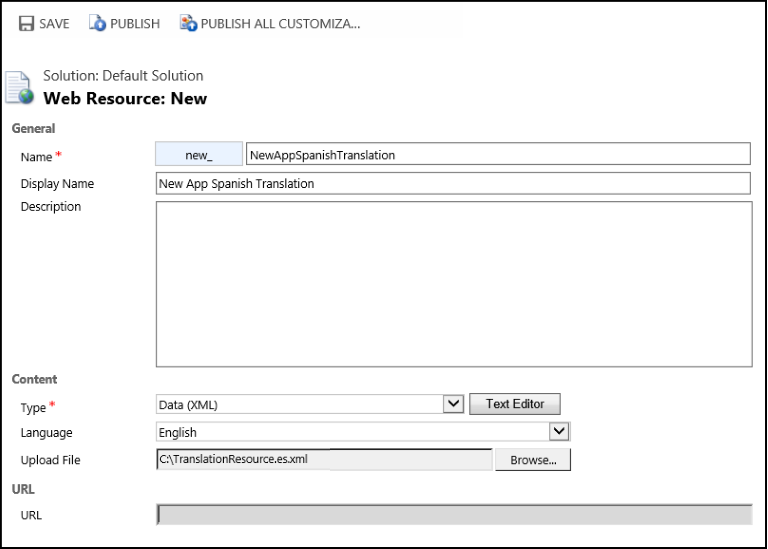

# Add multilanguage support for your agent applications
[!INCLUDE[pn_unified_service_desk](../includes/pn-unified-service-desk.md)] enables you to bundle in localized strings for your controls interface so that they appear in the language based on the locale settings of the user’s computer. The multi-language support is available for all the components except for those that are surfaced through [!INCLUDE[pn_customer_care_accelerator](../includes/pn-customer-care-accelerator.md)], which doesn’t support multi-language scenarios. This includes the hosted control tab names.  
  
 To provide localized resources for your component:  
  
1.  Start by creating an XML file using the [!INCLUDE[pn_ASP.NET_short](../includes/pn-asp-net-short.md)]resx formatting. Here’s an example of this format.  
  
    ```xml  
    <root>  
      <data name="Welcome">  
        <value>My Translated Welcome</value>   
      </data>  
    </root>  
    ```  
  
     Each term that you want to provide a translation for must be included in a data element with a name and a value child with the translation.  
  
2.  Save the file with the language identifier in the file name. For example, if you have Spanish resources, you can save the file with the name “TranslationResource.es.xml.”  
  
3.  Upload the file as a web resource to [!INCLUDE[pn_microsoftcrm](../includes/pn-microsoftcrm.md)]. Name the web resource so that you can identify the language of the string resources in it.  
  
    1.  Sign in to [!INCLUDE[pn_microsoftcrm](../includes/pn-microsoftcrm.md)].  
  
    2.  Go to **Settings** > **Customizations** ([How do I get there?](http://go.microsoft.com/fwlink/p/?LinkId=525636))  
  
    3.  Click **Customize the System** to add the web resources to the default solution.  
  
    4.  On the **Default Solution** page, click **Web Resources**, and then click **New**.  
  
    5.  On the new web resource page, specify the name of the web resource, select **Data (XML)** as the type, **English** as the language, and then select your .xml file.  
  
   
  
    6.  Save and publish the web resource.  
  
4.  After publishing the web resource for your language resource file, add the web resource to your **Global Manager** hosted control.  
  
    1.  On the nav bar, choose **Settings** > **Unified Service Desk** > **Hosted Controls**.  
  
    2.  Click **Dynamics 365 Global Manager** under the **Name** column, or select the record, and click **Edit** on the command bar.  
  
        > [!NOTE]
        > **Dynamics 365 Global Manager** is the name of the default **Global Manager** hosted control type in [!INCLUDE[pn_unified_service_desk](../includes/pn-unified-service-desk.md)]. If you have a Global Manager hosted control with different name, select it instead.  
  
    3.  On the **Dynamics 365 Global Manager** page, under the **Language Services** area, click **+** to add a language module record.  
  
   
  
    4.  On the **New Language Module** page, specify the name, LCID, and the name of the web resource that contains the translation file.  
  
         The LCID should be populated with a value that represents the language that this resource represents. [View the list of locale IDs](https://msdn.microsoft.com/library/ms912047\(WinEmbedded.10\).aspx).  
  
   
  
    > [!IMPORTANT]
    >  If you use language services, you should always configure language services for your base [!INCLUDE[pn_crm_shortest](../includes/pn-crm-shortest.md)] language. In this example, add an English language service as well. The base language translation file is always used if someone uses a language pack in [!INCLUDE[pn_crm_shortest](../includes/pn-crm-shortest.md)] that doesn’t have a translation file in [!INCLUDE[pn_unified_service_desk](../includes/pn-unified-service-desk.md)] language services.  
  
5.  Click **Save**.  
  
## Use the translated text  
 To use the translated text, refer to the entry using a replacement parameter as shown here.  
  
```xml  
[[$Resources.Welcome]]  
```  
  
 This can be used anywhere that you use a replacement parameter and the translation file may contain other replacement parameter as well. The language translation will be substituted first and then the other replacement parameters will be applied. These can be used for names of buttons, text of agent scripts, or wherever you can use replacement parameters.  
  
### See also  
 [Global Manager (Hosted Control)](../unified-service-desk/global-manager-hosted-control.md)