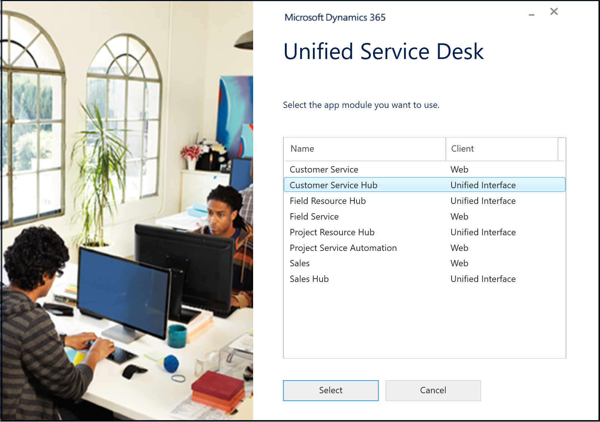

# Support for Unified Interface apps in Unified Service Desk

[!INCLUDE[cc-data-platform-banner](../../includes/cc-data-platform-banner.md)]

[!INCLUDE[pn_unified_service_desk](../../includes/pn-unified-service-desk.md)] now supports apps based on Unified Interface.

## What is Unified Interface?

With the release of latest release, we have introduced a new user experience - Unified Interface - which uses responsive web design principles to provide an optimal viewing and interaction experience for any screen size, device, or orientation.

Unified Interface brings all the rich experiences to any client that you are using. Whether you are on a browser, tablet, or phone, you will be able to consume similar experiences. More information: [About Unified Interface](/dynamics365/customer-engagement/admin/about-unified-interface)

## What is Unified Interface supportability in Unified Service Desk?

[!INCLUDE[pn_unified_service_desk](../../includes/pn-unified-service-desk.md)] supports the apps built using the Unified Interface framework. That is, you can host a Unified Interface page to load a URL or page from the model-driven app, which is built based on the Unified Interface framework.

The experience of the supportability is that the Unified Interface Page hosted control type exposes number of predefined UII actions and events that are unique to handling of model-driven app windows built using Unified Interface framework including list manipulation actions, and a find action for displaying a quick search or advanced search page.

## Deploy the Unified Interface sample application

[!INCLUDE[pn_unified_service_desk_for_crm](../../includes/pn-unified-service-desk-for-crm.md)] comes with sample applications that you can use as the base for starting with your configuration of your agent application.  
  
 The Unified Interface sample application is bundled as a package that you need to deploy on the Microsoft Dataverse instance before you can start working. The deployment of the Unified Interface sample application package is performed using [!INCLUDE[pn_package_deployer_long](../../includes/pn-package-deployer-long.md)]. After the deployment, the entities and custom code specific to [!INCLUDE[pn_unified_service_desk](../../includes/pn-unified-service-desk.md)] become available in the instance.

To deploy the Unified Interface sample application package, refer [Deploy a sample Unified Service Desk package using Package Deployer](../admin/deploy-sample-unified-service-desk-applications-using-package-deployer.md)

::: moniker range="dynamics-usd-3"

## Configure application selection window in Unified Service Desk

> [!IMPORTANT]
> This section is only applicable to Unified Service Desk 3.3.

An application selection is introduced to ensure that you can select Web or Unified Interface app as per your business requirement.

The application selection window appears when you login to [!INCLUDE[pn_unified_service_desk](../../includes/pn-unified-service-desk.md)]. To enable the application selection window, you must update a **SelectAppModule** key under the **\<appSettings>** section of the **UnifiedServiceDesk.exe.config** (application configuration) file and set it to **true**.

### Add the application selection window key

> [!IMPORTANT]
> This section is only applicable to Unified Service Desk 3.3.

1. Go to `C:\Program Files\Microsoft Dynamics CRM USD\USD`.
2. Select **UnifiedServiceDesk.exe.config** file.
3. Under the **\<appSettings>** section, type the key. 
`<add key="SelectAppModule" value="true"/>` 
  
4. Save the file.

### Login to Unified Service Desk client application

> [!IMPORTANT]
> This section is only applicable to Unified Service Desk 3.3.

After you update the **SelectAppModule** key in the **UnifiedServiceDesk.exe.config** file, you need to login to [!INCLUDE[pn_unified_service_desk](../../includes/pn-unified-service-desk.md)] to select a web or Unified Interface app.

::: moniker-end

### See also

 [Unified Interface Page (Hosted Control)](../../unified-service-desk/unified-interface-page-hosted-control.md)
 [Unified Service Desk and Unified Interface Configuration Walkthroughs](../../unified-service-desk/unified-service-desk-unified-interface-configuration-walkthroughs.md)
 [Walkthrough 1: Build a simple agent application for Unified Interface Apps](../../unified-service-desk/walkthrough1-unified-interface-build-a-simple-agent-application.md) 
 [Walkthrough 2: Display an external webpage in your agent application](../../unified-service-desk/walkthrough2-unified-interface-display-an-external-webpage-in-your-agent-application.md)   
 [Walkthrough 3: Display records in your agent application](../../unified-service-desk/walkthrough3-unified-interface-display-microsoft-dynamics-365-records-in-your-agent-application.md)   
 [Walkthrough 4: Display a record in a session in your agent application](../../unified-service-desk/walkthrough4-unified-interface-display-dynamics-365-record-session-agent-application.md)   
 [Walkthrough 5: Display enhanced session information by displaying session name and overview data](../../unified-service-desk/walkthrough5-unified-interface-display-enhanced-session-information-displaying-session-name-overview-data.md)   
 [Walkthrough 6: Configure the Debugger hosted control in your agent application](../../unified-service-desk/walkthrough6-unified-interface-configure-debugger-hosted-control-agent-application.md)
 [Walkthrough 7: Configure agent scripting in your agent application](../../unified-service-desk/walkthrough7-unified-interface-configure-agent-scripting-agent-application.md)  

[!INCLUDE[footer-include](../../includes/footer-banner.md)]
