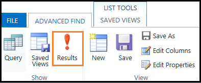
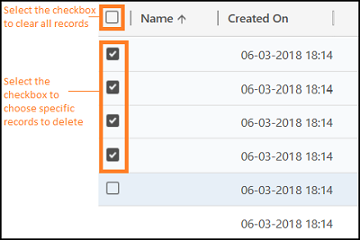
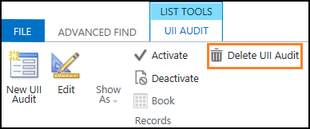

# [!INCLUDE[pn_unified_service_desk](../../includes/pn-unified-service-desk.md)] data compliance under GDPR

[!INCLUDE[cc-data-platform-banner](../../includes/cc-data-platform-banner.md)]

Data definitions and stages are outlined in the GDPR. Let's look at the following data contained in [!INCLUDE[pn_unified_service_desk](../../includes/pn-unified-service-desk.md)] and see how they relate to those outlined in the GDPR:

- Audit log files
- Diagnostic log files
- Telemetry data

## Audit log files

### Standard auditing by using an Audit & Diagnostic record

If you configure standard or custom auditing using an Audit & Diagnostics record, you can write a custom listener to send the log to files. The audit data log files are present in your local computer, or you can configure a path to store the file in your local computer or another computer in the network. 

Using a custom listener, you can send the log output to files, the event log, or other sources.

To delete audit logging that you configure using an Audit & Diagnostic record by writing a standard or custom listener:

1. Navigate to the location where you store the audit data log files.
2. Select the files that you want to delete, and then press **Delete**.

### Standard auditing by adding an audit flag

If you configure audit logging using the standard auditing by adding an audit flag, the
events and logs are present in the **UII_auditBase** table in the organization database.

To delete audit logging that you configure using standard auditing by adding an audit flag:

1. Sign in to the Common Data Service platform.
2. From a productivity area, select **Advanced Find**. 
   
3. In the **Look for** list, select **UII Audit**. 
   
4. To see all audit logging details, select **Results**. 
   
5. Select the records that you want to delete. 
   
6. To delete the records, select **Delete UII Audit**. 
   

## Diagnostic log files

The diagnostic logging records operational events and errors in the client application. UTF-8 encoded text files that are named UnifiedServiceDesk-<date>.log are maintained at the following location on the client computer:

`c:\Users\<UserName>\AppData\Roaming\Microsoft\Microsoft Dynamics 365 Unified Service Desk\<Version>`

To delete diagnostic logging:

1. Go to the default or configured folder path where you store the diagnostic log files.
The default folder path is:  
`c:\Users\<UserName>\AppData\Roaming\Microsoft\Microsoft Dynamics 365 Unified Service Desk\<Version>`
2. Select the **UnifiedServiceDesk-<date>.log** file, and then select **Delete**.

## Telemetry data

[!INCLUDE[pn_unified_service_desk](../../includes/pn-unified-service-desk.md)] client application collects telemetry data ([!INCLUDE[pn_unified_service_desk](../../includes/pn-unified-service-desk.md)] application-specific information) that is maintained in the Common Data Service platform. In these cases, the natural or legal person, public authority, agency, or other body which, alone or jointly with others, becomes the controller, and the processor is Microsoft, which processes the data on behalf of the controller.

The category of telemetry that [!INCLUDE[pn_unified_service_desk](../../includes/pn-unified-service-desk.md)] collects are:

- Action call results data
- Start-up performance data
- Error and exit data
- Feedback
- Freeze or performance data
- Session start and end data

[!INCLUDE[proc_more_information](../../includes/proc-more-information.md)] [Microsoft Dynamics 365 and GDPR](https://docs.microsoft.com/dynamics365/get-started/gdpr/index)

## See also

[Comply with General Data Protection Regulation (GDPR)](comply-gdpr.md)
