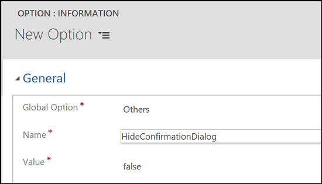

# How to configure close confirmation window to prevent accidental closure of Unified Service Desk

## Accidental closure of Unified Service Desk

At contact centers, one of the key measure is the Customer Satisfaction (CSAT) where the agents are thriving to increase the CSAT score by solving the customer problems. When you (agent) are working on an important case or attending a customer call using [!INCLUDE[pn_unified_service_desk](../../includes/pn-unified-service-desk.md)], it may happen that you accidentally closed [!INCLUDE[pn_unified_service_desk](../../includes/pn-unified-service-desk.md)]. Perhaps, you may lose all the unsaved work or the customer call is terminated due to the closure of [!INCLUDE[pn_unified_service_desk](../../includes/pn-unified-service-desk.md)]. The sudden closure of [!INCLUDE[pn_unified_service_desk](../../includes/pn-unified-service-desk.md)] impacts your productivity and also leads to low CSAT score.

## How to avoid the accidental closure of Unified Service Desk

To avoid the accidental closure of [!INCLUDE[pn_unified_service_desk](../../includes/pn-unified-service-desk.md)], the close confirmation window feature is introduced, which shows an **Confirm** window with a message.  
  
  

> [!NOTE]
> By default, the close confirmation window is enabled. To disable the close confirmation window, [!INCLUDE[pn_unified_service_desk](../../includes/pn-unified-service-desk.md)] administrator must configure the **HideConfirmationDialog** option on the **Options** page and set it to **true**.

## Enable/Disable Close Confirmation window

1. Sign in to [!INCLUDE[pn_microsoftcrm](../../includes/pn-microsoftcrm.md)].

2. [!INCLUDE[proc_settings_usd](../../includes/proc-settings-usd.md)]

3. Choose **Options**.  

4. click **New** on the **Active UII Options** page.

5. Choose **Others** for the **Global Option** field.

6. Type **HideConfirmationDialog** for the **Name** field.

7. Sepcify the value in the **Value** field. Specify **false** to enable and **true** to disable.

8. Click **Save**.

   

## See also

[Manage Options for Unified Service Desk](../../unified-service-desk/admin/manage-options-unified-service-desk.md)