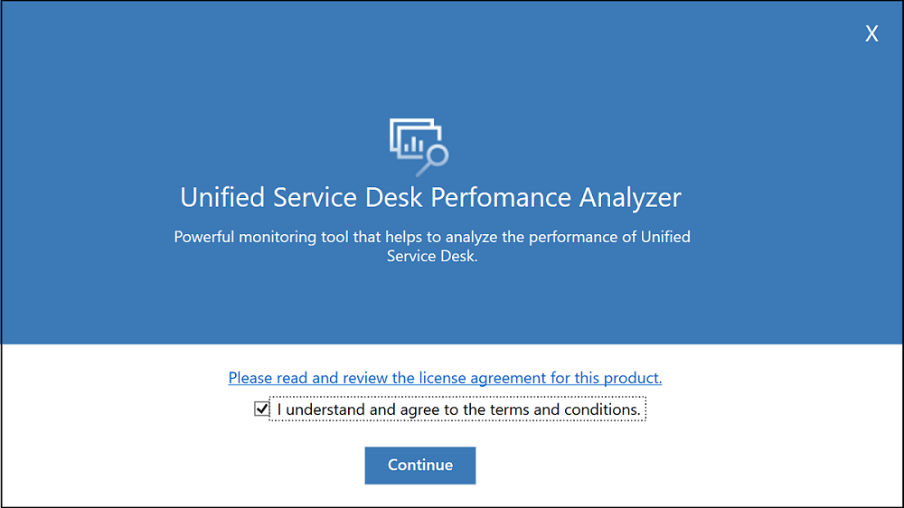

# Generate Unified Service Desk performance report

1. Go to location where you have downloaded the **Unified Service Desk Performance Analyzer**.

2. Double-click to run the tool.   Unified Service Desk Performance Analyzer appears.

3. Select the check box after reading and understanding the license terms and conditions and select **Continue**. 

4. In the **Import performance log files** window, browse and select the folder where you have saved the performance data log files and select **Import**. 

 
> [!NOTE]
> The folder you select must have at least one performance data log file.

5. In the **File Import status** window, you can see the performance data log files that the tool imports. 

6. Select **Launch report** to see the HTML report in a web browser. 

## See also