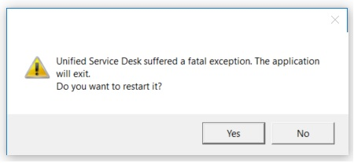
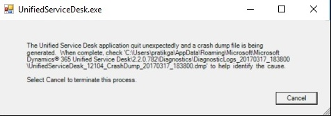

# Application and system faults
Having detailed and comprehensive logging and reporting that occurs during a  component, application, or system fault can help identify when and how the fault occurred. The [!INCLUDE[pn_unified_service_desk](../../includes/pn-unified-service-desk.md)] client can record diagnostics logs, system and application state details, and application memory dumps in the event of an exception in the [!INCLUDE[pn_unified_service_desk](../../includes/pn-unified-service-desk.md)] client.  
  
> [!NOTE]
> For more information about the error diagnostics reporting files that are mentioned in this topic, see [Error diagnostics reporting](../../unified-service-desk/admin/configure-client-diagnostic-logging-unified-service-desk.md#exceptionlogging).  
  
 
   
## Types of exceptions  
 Exceptions can be either fatal or non-fatal.  
  
### Fatal exceptions  
 These are issues that cannot be resolved or ignored by the [!INCLUDE[pn_unified_service_desk](../../includes/pn-unified-service-desk.md)] client and typically cause the application to quit or become unresponsive. An example of a handled fatal exception is a case when the system runs out of memory. An example of an unhandled fatal exception is an operating system stack overflow. When a fatal exception occurs, the [!INCLUDE[pn_unified_service_desk](../../includes/pn-unified-service-desk.md)] client must restart to continue.  
  
   
  
 Clicking **Yes** on the error dialog box begins the collection of the error diagnostics reporting files and restarts the [!INCLUDE[pn_unified_service_desk](../../includes/pn-unified-service-desk.md)] client. Clicking **No** begins the collection of the error diagnostics reporting files but does not restart the [!INCLUDE[pn_unified_service_desk](../../includes/pn-unified-service-desk.md)] client.  
  
 Next, this dialog box  appears for a few seconds so that you can click **Cancel** if you don’t want a memory dump file created. If Cancel is not clicked, a full memory dump file of the [!INCLUDE[pn_unified_service_desk](../../includes/pn-unified-service-desk.md)] process is created.  
  
   
  
> [!NOTE]
>  Memory dump files are large and require a significant amount of processor and RAM computer resources  to complete.  
  
### Non-fatal exceptions  
 These are issues that are handled by the [!INCLUDE[pn_unified_service_desk](../../includes/pn-unified-service-desk.md)] client and typically don’t destabilize the application. An example of a non-fatal exception is when a hosted control makes an invalid request, such as divide by zero. When a non-fatal exception occurs, often the [!INCLUDE[pn_unified_service_desk](../../includes/pn-unified-service-desk.md)] client can continue running. Click **Yes** on the dialog box to collect error diagnostics reporting exit logs (memory dump files are not collected) and restart the [!INCLUDE[pn_unified_service_desk](../../includes/pn-unified-service-desk.md)] client. Click **No** to continue working in the [!INCLUDE[pn_unified_service_desk](../../includes/pn-unified-service-desk.md)] client without collecting any error diagnostics reporting files.  
  
   
  
   
## Create a memory dump on-demand  
 At any time agents running [!INCLUDE[pn_unified_service_desk](../../includes/pn-unified-service-desk.md)] can invoke an on-demand full memory dump of the [!INCLUDE[pn_unified_service_desk](../../includes/pn-unified-service-desk.md)] client application. By default, the shortcut key combination to invoke the manual creation of a  dump file is CTRL+ALT+a.  
  
> [!NOTE]
>  Memory dump files are large and require a significant amount of processor and RAM computer resources  to complete.  
  
## See also  
 [Manage Options for Unified Service Desk](../../unified-service-desk/admin/manage-options-unified-service-desk.md)
