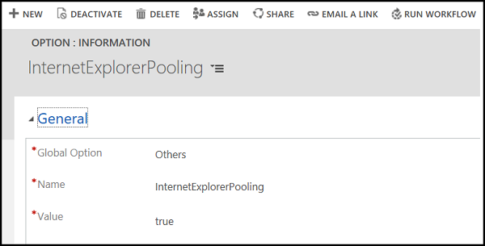

# Internet Explorer pooling overview
With this release of [!INCLUDE[pn_unified_service_desk](../../includes/pn-unified-service-desk.md)], you can experience enhanced CRM entity type navigation in [!INCLUDE[pn_unified_service_desk](../../includes/pn-unified-service-desk.md)].

The `IE Process` browser control hosts your controls in individual Internet Explorer process instances and displays them in tabs in the [!INCLUDE[pn_unified_service_desk](../../includes/pn-unified-service-desk.md)] client application.  

Whenever you are opening a CRM entity type hosted control in a [!INCLUDE[pn_unified_service_desk](../../includes/pn-unified-service-desk.md)] client application, the Internet Explorer Pooling feature creates a dynamic pool of Internet Explorer process instances. The hosted control uses an Internet Explorer instance from the pool, which performs inline navigation. If you open another hosted control, the [!INCLUDE[pn_unified_service_desk](../../includes/pn-unified-service-desk.md)] opens it using an Internet Explorer instance from the pool and performs the inline navigation.
When you close a hosted control, the Internet Explorer Pooling feature recycles the Internet Explorer instance and adds it back to the pool. 
  
Unified Service Desk always maintains a pool of Internet Explorer instances for hosted controls to use. Opening a hosted control using a pooled Internet Explorer instance enhances the performance of the Unified Service Desk.

> [!Note]
> The Internet Explorer pool feature supports only CRM entity type navigation.

## Enable Internet Explorer pooling

By default, Internet Explorer pooling is disabled. To enable pooling, a System Administrator must configure the option on the **Active UII Options** page and set it to **true**.

To enable Internet Explorer pooling:

1. Sign in to [!INCLUDE[pn_microsoftcrm](../../includes/pn-microsoftcrm.md)].

2. [!INCLUDE[proc_settings_usd](../../includes/proc-settings-usd.md)]

3. Choose **Options**.  

4. click **New** on the **Active UII Options** page.

5. Choose **Others** for the **Global Option** field.

6. Type **InternetExplorerPooling** for the **Name** field.

7. Set **true** for the **Value** field.

8. Click **Save**.

  

[comment]: <> (We need to rewrite the title on this to make it clearer and easier to understand. Please ping me to discuss.)
## See also

[Manage Options for Unified Service Desk](../../unified-service-desk/admin/manage-options-unified-service-desk.md)
 
