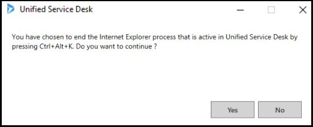
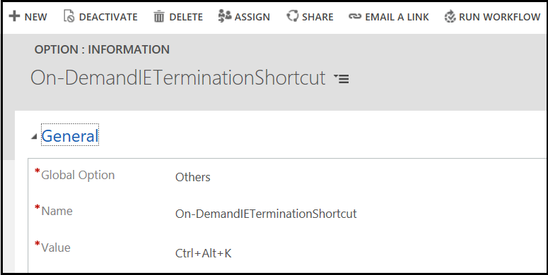

# Recover an Internet Explorer process instance
Starting with [!INCLUDE[pn-unified-service-desk-3-2](../../includes/pn-unified-service-desk-3-2.md)], [!INCLUDE[pn_unified_service_desk](../../includes/pn-unified-service-desk.md)] can help agents to recover the terminated (crashed) webpages hosted in Internet Explorer process in [!INCLUDE[pn_unified_service_desk](../../includes/pn-unified-service-desk.md)].

By default, Internet Explorer process instance recovery is enabled. To disable the feature, a system administrator must configure the `IEWebPageRecovery` option on the **Active UII Options** page, and set it to **false**. [!INCLUDE[proc_more_information](../../includes/proc-more-information.md)] [Manage a Unified Service Desk option](../admin/manage-options-unified-service-desk.md)

### Disable IEWebPageRecovery option

1. Sign in to [!INCLUDE[pn_microsoftcrm](../../includes/pn-microsoftcrm.md)] apps.

2. [!INCLUDE[proc_settings_usd](../../includes/proc-settings-usd.md)]

3. Choose **Options**.  

4. click **New** on the **Active UII Options** page.

5. Choose **Others** for the **Global Option** field.

6. Type **IEWebPageRecovery** for the **Name** field.

7. Type **false** for the **Value** field.

8. Click **Save**.

## When [!INCLUDE[pn_unified_service_desk](../../includes/pn-unified-service-desk.md)] can help recover Internet Explorer process instances

[!INCLUDE[pn_unified_service_desk](../../includes/pn-unified-service-desk.md)] can help agents to recover an Internet Explorer process instance in the following scenarios:

- When Internet Explorer closes abruptly.
- When you manually end an unresponsive Internet Explorer process instance from Task Manager.
- When a script on the hosted control that uses `IE process` browser control takes time more than the timeout period ([IEWebPageInactivityTimeOut](#change-iewebpageinactivitytimeout-option)) for page navigation.

## Recover an unresponsive Internet Explorer process instance

When a hosted control that uses an Internet Explorer process browser control closes abruptly, the [!INCLUDE[pn_unified_service_desk](../../includes/pn-unified-service-desk.md)] client application displays the message **Internet Explorer closed abruptly**.

To recover the closed instance (which may contain more than one webpage), select **Reload**. After you select **Reload**, [!INCLUDE[pn_unified_service_desk](../../includes/pn-unified-service-desk.md)] reloads the webpage to the last known URL. That is, when you open an **Account** Internet Explorer webpage and navigate inline to a **Case** Internet Explorer webpage. If the **Case** webpage becomes unresponsive, the recovery feature reloads only the **Account** webpage.

If you do not want to recover, select **Cancel**. If you cancel, the [!INCLUDE[pn_unified_service_desk](../../includes/pn-unified-service-desk.md)] client application skips recovery of the Internet Explorer process instance and displays a message, **The webpage stopped responding. If you frequently experience unexpected closing of Internet Explorer webpage, contact your system administrator**.

## Recover when script executed on the webpage causes the webpage to run slowly

If a script running on a Internet Explorer causes the Internet Explorer webpage to run slowly, then [!INCLUDE[pn_unified_service_desk](../../includes/pn-unified-service-desk.md)] waits until the timeout period ([IEWebPageInactivityTimeOut](../admin/recover-internet-explorer-process-instance.md#change-iewebpageinactivitytimeout-option)) to display the message - **A script on \<Hosted Control Name> is causing the Internet Explorer webpage to run slowly**.

To recover the webpage, select **Reload**. After you select **Reload**, [!INCLUDE[pn_unified_service_desk](../../includes/pn-unified-service-desk.md)] reloads the webpage to the last known URL.

Select **Stop** if you want to terminate and do not want to recover the webpage on which the script is executed. 

If you want to wait for the Internet Explorer webpage to respond, select **Continue**, and wait for the Internet Explorer webpage to respond. If the webpage does not respond, [!INCLUDE[pn_unified_service_desk](../../includes/pn-unified-service-desk.md)] displays the window again after the timeout period.

The following list shows the options and descriptions to select when you see the message window. 

| Option   | Description                                                                                                                                                                                                               |
|:---------|:--------------------------------------------------------------------------------------------------------------------------------------------------------------------------------------------------------------------------|
| Reload   | Recovers the Internet Explorer webpage.                                                                                                                                                                                   |
| Stop     | Terminates and does not to recover the Internet Explorer webpage.                                                                                                                                                         |
| Continue | Waits until the Internet Explorer webpage to respond. If the webpage does not respond, [!INCLUDE[pn_unified_service_desk](../../includes/pn-unified-service-desk.md)] displays the window again after the timeout period. |

> [!Note]
> If there are other webpages that are unresponsive, [!INCLUDE[pn_unified_service_desk](../../includes/pn-unified-service-desk.md)] displays the message - **Internet Explorer closed abruptly.**   
> Select **Reload** to recover the webpage to the last known URL. Or, select **Cancel** to not to recover the webpage. 
> 

### Change IEWebPageInactivityTimeOut option

**IEWebPageInactivityTimeOut** Indicates the timeout period for the duration (in milliseconds) that the Unified Service Desk waits before displaying a message - **A script on \<Hosted Control Name> is causing the Internet Explorer webpage to run slowly**.

By default, the **IEWebPageInactivityTimeOut** is enabled and timeout period is 15000 milliseconds (15 seconds).
To change the default timeout period, a System Administrator must configure the **IEWebPageInactivityTimeOut** on the **Active UII Options** page and type the value in milliseconds. [!INCLUDE[proc_more_information](../../includes/proc-more-information.md)] [Manage Options for Unified Service Desk](../../unified-service-desk/admin/manage-options-unified-service-desk.md).
If you set the value as 0 milliseconds, then the **IEWebPageInactivityTimeOut** is disabled.

To change the **IEWebPageInactivityTimeOut** timeout value:

1. Sign in to [!INCLUDE[pn_microsoftcrm](../../includes/pn-microsoftcrm.md)] apps.

2. [!INCLUDE[proc_settings_usd](../../includes/proc-settings-usd.md)]

3. Choose **Options**.  

4. click **New** on the **Active UII Options** page.

5. Choose **Others** for the **Global Option** field.

6. Type **IEWebPageInactivityTimeOut** for the **Name** field.

7. Type the value in milliseconds for the **Value** field.

8. Click **Save**.

## Terminate and recover unresponsive Internet Explorer process instances using a keyboard shortcut

When the Internet Explorer webpage is unresponsive and causes the [!INCLUDE[pn_unified_service_desk](../../includes/pn-unified-service-desk.md)] to freeze, hover the cursor on the unresponsive tab and use the keyboard shortcut **Ctrl+Alt+K** to terminate. 

The [!INCLUDE[pn_unified_service_desk](../../includes/pn-unified-service-desk.md)] displays a dialog box: **You have chosen to end the Internet Explorer process that is active in Unified Service Desk by pressing Ctrl+Alt+K. Do you want to continue?**. 

Select **Yes** to terminate the Internet Explorer process instance. Select **No** to cancel the operation.

After you end the Internet Explorer process instance, the [!INCLUDE[pn_unified_service_desk](../../includes/pn-unified-service-desk.md)] client application displays a message, **Internet Explorer closed abruptly**. Select **Reload** to recover the closed Internet Explorer process instance. If you do not want to recover, select **Cancel**.

> [!Note]
> - An agent must wait for the [!INCLUDE[pn_unified_service_desk](../../includes/pn-unified-service-desk.md)] monitoring process (usdmp.exe) to detect and terminate the unresponsive Internet Explorer process instance. 
> - The agent must use the keyboard shortcut as last option when the [!INCLUDE[pn_unified_service_desk](../../includes/pn-unified-service-desk.md)] monitoring process fails to detect the unresponsive Internet Explorer process instance. 
> - Using the keyboard shortcut may terminate any Internet Explorer webpage, causing you to lose any unsaved work.

### Change keyboard shortcut

To change the keyboard shortcut:

1. Sign in to [!INCLUDE[pn_microsoftcrm](../../includes/pn-microsoftcrm.md)] apps.

2. [!INCLUDE[proc_settings_usd](../../includes/proc-settings-usd.md)]

3. Choose **Options**.  

4. click **New** on the **Active UII Options** page.

5. Choose **Others** for the **Global Option** field.

6. Type **On-DemandIETerminationShortcut** for the **Name** field.

7. Type the keyboard shortcut in the format _key1+key2+key3_ for the **Value** field.

8. Click **Save**.

## Limitations 

- When you recover an Internet Explorer webpage, [!INCLUDE[pn_unified_service_desk](../../includes/pn-unified-service-desk.md)] triggers again all the events that associate with the webpage.  
  For example:   **TaskUpdated** is a event configured for the **Agent Scripting** hosted control (webpage) and has **Action Call for Reminder** and **Action Call for Resolve Case** as Action Calls. 
  If you recover **Agent Scripting** webpage, [!INCLUDE[pn_unified_service_desk](../../includes/pn-unified-service-desk.md)] triggers again the **TaskUpdated** event and the **Action Calls**. [!INCLUDE[proc_more_information](../../includes/proc-more-information.md)] [Events](../events.md)

- [!INCLUDE[pn_unified_service_desk](../../includes/pn-unified-service-desk.md)] does not recover inline navigation of an Internet Explorer webpage. 
  For example:  
  You open an **Account** Internet Explorer webpage and navigate inline to a **Case** Internet Explorer webpage. If the **Case** webpage becomes unresponsive, the recovery feature reloads only the **Account** webpage and not the **Case** webpage.

- [!INCLUDE[pn_unified_service_desk](../../includes/pn-unified-service-desk.md)] does not recover unsaved work.  
  For example:  
  You open an **Account** Internet Explorer webpage and navigate inline to a **Case** Internet Explorer webpage, and enter details on the **case** webpage. If the **Case** webpage becomes unresponsive, the recovery feature reloads only the **Account** webpage and not the **Case** webpage. You may lose any unsaved data that you had entered in the **Case** webpage.

- If the web browser runs slowly while executing a script, and you choose **Stop** to terminate and not to recover the Internet Explorer webpage, [!INCLUDE[pn_unified_service_desk](../../includes/pn-unified-service-desk.md)] may terminate other Internet Explorer webpages.

- Using **Ctrl+Alt+K** keyboard shortcut may terminate other Internet Explorer webpage, causing you to lose any unsaved work.

## See also

[Manage Options for Unified Service Desk](../../unified-service-desk/admin/manage-options-unified-service-desk.md)
