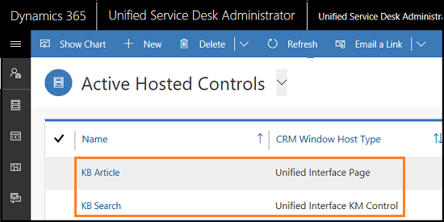

# Post-requisites steps for migration of configurations

This topic describes the steps you need to perform after you migrate the configurations from web client to unified interface app.

## Post-requisites

- [Reconfigure window navigation rules](#reconfigure-window-navigation-rules)
- [Reconfigure events](#reconfigure-events)
- [Reconfigure associated view action call](#reconfigure-associated-view-action-call)
- [Reconfigure RunXrmCommands](#reconfigure-runxrmcommands) 
- [Update Hosting Type to Chrome](#update-hosting-type-to-chrome) (optional)
- Update to Unified Interface theme (optional)

### Reconfigure window navigation rules

The page navigation in web client and unified interface are different. In web client, if you've set up the **Route-type** as **Pop-up**, then migration tool replaces all the **Pop-up** to **Inplace**. Based on your earlier configuration, if required, you might want to update the window navigation rules.

**Verify page navigation behavior:**

You view an account page in a browser or in Unified Service Desk client application and want to open a related case from the sub-grid. Now, if the case is opened in a same browser, then route type is Inplace. If it opens in new browser window, then route type is Pop-up.

 > [!Note]
 > For certain URLs if you've defined window.open method, those URLs are opened in a new browser tab (pop-up route type). For these URLs, you don't need to change the behavior for these window navigation rules.

### Reconfigure events

The **BrowserDocumentComplete** event in web client is converted to the **PageReady** event in unified interface.

The **PageLoadComplete** event maps to **DataReady** event in web client. After conversion of the **BrowserDocumentComplete** to the **PageReady** event, the **DataReady** event is fired in unified interface. In this case, your page might not be ready for DOM interactions, so if you have any Runscript action calls on the **DataReady** event, we recommend moving the Runscript action calls to the **PageReady** event.

### Reconfigure associated view action call

The **AssociatedView** action call is used to open entity view. In web client, to open associated view of an entity, you might've defined the navigate action call with the URL for the corresponding associated view.

The parameters for **AssociatedView** action call in the [Unified Interface Page](unified-interface-page-hosted-control?#associatedview) is different from [CRM Page](crm-page-hosted-control?#associatedview) hosted control.

You need to update parameters of the **AssociatedView** action call in the Unified Interface Page hosted control. To learn more, see [Unified Interface Page](unified-interface-page-hosted-control?#associatedview).

**For example:**

- Action call to view associated cases for an account. The data parameters will be:

  ```
  ent=account
  id=[[account.id]]
  navitemid=navService
  ```

- Action call to show associated contacts for an account. The data parameters will be:

  ```
  ent=account
  id=[[account.id]]
  navitemid=navContacts
  ```

### Reconfigure RunXrmCommands

In web client, you can pass a script as data in an action call. In unified interface, you need write the function in the web resource and pass the Unified Service Desk data parameters as parameters to that function.

The migration tool converts all your action calls and replaces the data parameters with the variables in the function.

All the data parameters are passed as strings in quotes. For example, `‘[[incident.Id]+]’`.

> [!Note]
> If data parameters is a JSON object and not a string, you've to remove the quotes from the data parameter.

### Update Hosting Type to Chrome

It is recommended to update your Hosting Type to Chomre. To learn more, see [Update Unified Service Desk Component type to Chrome](../chrome-process.md).

## Test the configurations on the target Unified Interface app.

1. Sign in to the Common Data Service platform.

2. Select the down arrow next to Dynamics 365.

3. Select **Unified Service Desk Administrator**.

4. Select configurations that you migrated from the Web Client.</br>
For example, the selected configuration elements are as follows:

  |Configuration Name|Description|
  |-------|-------|
  |KB Article| CRM Page|
  |KB Search| KM Control|

  </br>
 You must select **Hosted Controls** to verify.</br></br>
 You can see configurations are migrated to Unified Interface specific elements.

  |Configuration Name|Description|
  |-------|-------|
  |KB Article| Unified Interface Page|
  |KB Search| Unified Interface KM Control|
  
  