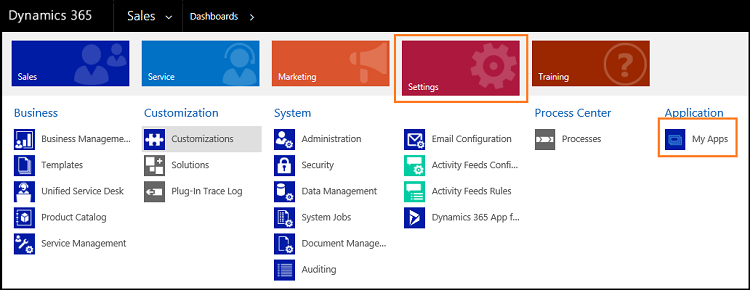

# Preview feature: Administer and manage Unified Service Desk using the Administrator app

## Overview

With Unified Service Desk 4.0, you can use [!INCLUDE[pn_unified_service_desk](../../includes/pn-unified-service-desk.md)] Administrator App built on the Unified Interface framework to administer and manage the [!INCLUDE[pn_unified_service_desk](../../includes/pn-unified-service-desk.md)] client application.

The [!INCLUDE[pn_unified_service_desk](../../includes/pn-unified-service-desk.md)] Administrator app is built on the Unified Interface framework, which has a new user experience - **Unified Interface** - which uses responsive web design principles to provide an optimal viewing and interaction experience for any screen size, device, or orientation. 

The [!INCLUDE[pn_unified_service_desk](../../includes/pn-unified-service-desk.md)] Administrator app brings rich experience to administrate and manage your [!INCLUDE[pn_unified_service_desk](../../includes/pn-unified-service-desk.md)] client application.

## Download and install Unified Service Desk Administrator app

The Unified Service Desk Administrator app is made available through the **USDUnifiedInterfaceCustomization_1_0_managed** solution. The solution is present in the following packages under the folder `<Unified Service Desk download directory>\USDPackageDeployer\`:

- **NewEnvironment**
- **UpdatePackage**
- **UnifiedClientDemoPackage**

### Install the Unified Service Desk Administrator app solution

1. Download Unified Service Desk 4.0 and Package Deployer and save it on your computer. See [Download Unified Service Desk](../download-unified-service-desk.md).

2. Run the downloaded file to extract the Dynamics 365 Package Deployer into a folder.

3. After the files are extracted, if the Package Deployer tool starts automatically, close it.

4. Open the **USDPackageDeployer** > **NewEnvironment** folder and locate the **USDUnifiedInterfaceCustomization_1_0_managed** solution.

5. Sign in to [!INCLUDE[pn_microsoftcrm](../../includes/pn-microsoftcrm.md)]

6. Go to **Settings** > **Solutions**.

7. On the **Actions** toolbar, choose **Import**.

8. In the **Import Solution** window, browse for the **USDUnifiedInterfaceCustomization_1_0_managed** solution in the  appropriate folder as mentioned in the step 4, and choose **Next**.   After few moments the import completes successfully and you can view the results.

9. Choose **Close**.

### Use package deployer to deploy the Unified Service Desk Administrator app

The [!INCLUDE[pn_unified_service_desk](../../includes/pn-unified-service-desk.md)] Administrator app is available through the the **Unified Service Desk - Unified Interface** and **New Environment** sample package. To deploy the sample package, see [Deploy a sample Unified Service Desk package using Package Deployer](../admin/deploy-sample-unified-service-desk-applications-using-package-deployer.md#deploy-a-sample-unified-service-desk-package-using-package-deployer)

> [!IMPORTANT]
> - The sample applications are not supported for production use.  
>   - Only one [!INCLUDE[pn_unified_service_desk](../../includes/pn-unified-service-desk.md)] package can be deployed in a [!INCLUDE[pn_crm_shortest](../../includes/pn-crm-shortest.md)] instance to avoid any loss or overlap of functionality. If you want to install another [!INCLUDE[pn_unified_service_desk](../../includes/pn-unified-service-desk.md)] package, remove the existing one, and then install the other package. For information about removing an existing [!INCLUDE[pn_unified_service_desk](../../includes/pn-unified-service-desk.md)] package, see [Remove a sample Unified Service Desk package](../../unified-service-desk/admin/deploy-sample-unified-service-desk-applications-using-package-deployer.md#Remove).  
>   - Before deploying a [!INCLUDE[pn_unified_service_desk](../../includes/pn-unified-service-desk.md)] package on a production instance, ensure that you test the package on a pre-production instance, preferably a mirror image of the production instance. Also, be sure to back up the production instance before deploying the package.  
>   - You can also use [!INCLUDE[pn_PowerShell_short](../../includes/pn-powershell-short.md)] cmdlets for [!INCLUDE[pn_package_deployer_short](../../includes/pn-package-deployer-short.md)] to deploy packages. [!INCLUDE[proc_more_information](../../includes/proc-more-information.md)] [Deploy packages using CRM Package Deployer and Windows PowerShell](../../admin/deploy-packages-using-package-deployer-windows-powershell.md)
  

## How to find the Unified Service Desk Administrator app

If you deploy the sample package or import the solution, in either way you can find the Administrator app by performing the following:

1. Sign in to [!INCLUDE[pn_microsoftcrm](../../includes/pn-microsoftcrm.md)].

2. [!INCLUDE[proc_settings_usd](../../includes/proc-settings-usd-admin-app.md)]  

  

 
## See also  
 [Hosted control types, action, and event reference](../../unified-service-desk/hosted-control-types-action-event-reference.md)  
 
[Configure your agent application using Unified Service Desk](../../unified-service-desk/configure-agent-application-unified-service-desk.md)  
  
[Extend Unified Service Desk](../../unified-service-desk/extend-unified-service-desk.md)
