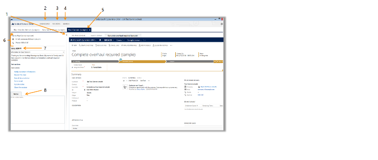

# Base sample application package
[!INCLUDE[pn_unified_service_desk](../../includes/pn-unified-service-desk.md)] is a desktop application that helps your customer service agents provide phone, email, and chat support to your customers. [!INCLUDE[pn_unified_service_desk](../../includes/pn-unified-service-desk.md)] provides a configurable framework to quickly build an Agent Desktop application that’s integrated with the Common Data Service platform. With [!INCLUDE[pn_unified_service_desk](../../includes/pn-unified-service-desk.md)] you can quickly make a customized Agent Desktop application by leveraging the User Interface Integration (UII) framework.  
  
 With the Unified Service Desk Base sample application package, the following components are installed:  
  
- User Interface Integration Solution  
  
- Unified Service Desk Solution  
  
- Data required for the Common Data Service platform and customizations  
  
> [!IMPORTANT]
>  The sample applications are not supported for production use.  

  
 Here’s what you’ll see when you install the Base package:  
  
1. **Left Nav**: Opens the left navigation area that you can open or collapse.  
  
2. **Dashboards**: Opens the customer service dashboard.  
  
3. **My Work**: Shows a list of all active cases assigned to a service rep.  
  
4. **search**: Opens search for navigating through various entities. For this package you can search for accounts and contacts.  
  
5. **Session tabs**: When you have multiple customer sessions open, each tab shows a different session. The tabs make it easy for an agent to work on multiple customer cases.  
  
6. **Session overview**: Shows relevant information about the customer.  
  
7. **Call Script**: Shows call scripts that the service agent can use when they’re working on a case. The scripts help guide the agent by giving them step-by-step instructions on how to handle the case.  
  
8. **Notes**: This is the area to take notes in regarding the case.  
  
     
  
## View active cases  
 From the toolbar, click **My Work** to see all of your active cases, and then select a case to work on. When you open a case, a new session opens.  
  
## Create a case  
  
1.  Look up the contact information by clicking **search** on the toolbar.  
  
2.  In the **search** field, enter the contact information.  
  
3.  When you find the contact information, click the record to open a new session.  
  
4.  In the left nav **Call Script** area, use the list of call scripts to guide you through the support case. When you click a call script, a green check mark indicates the action has been performed.  
  
5.  Enter your case notes in the **Notes** area. To attach your notes to the case, click **Update notes** from call scripts.  
  
## Search for solutions  
 To help resolve the case, use the knowledge base articles or Bing search to find a solution.  
  
1.  From the **Call script** area, click the **search for solutions** call script.  
  
2.  Then click on one of the following:  
  
    - **KB articles**: Use the search to find articles that can help you resolve the case.  
  
    - **Bing search**: The title automatically populates in the Bing search box.  
  
## Send an email  
 From the list of call scripts, click the **Send email** call script, and then select a template that automatically populates the body of the email.  
  
## Resolve a case  
 To resolve a case, from the **Call Script** area, click the **Resolve Case** call script.  
  
## See also  
 [Unified Service Desk Overview](../../unified-service-desk/admin/overview-unified-service-desk.md)
