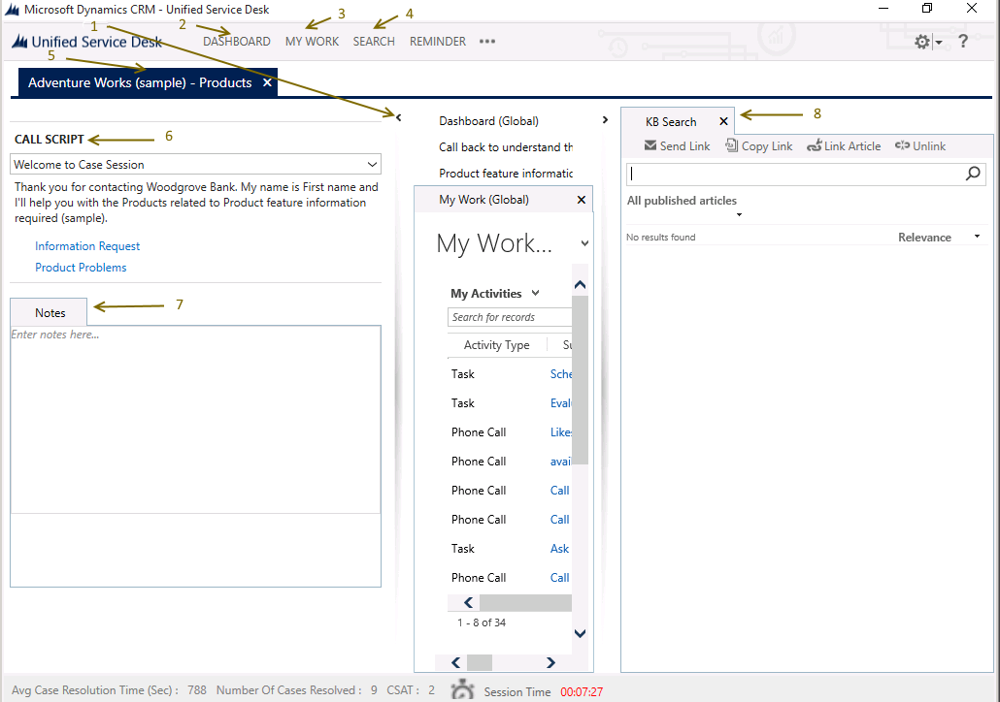

# Web Client sample application package
[!INCLUDE[pn_unified_service_desk](../../includes/pn-unified-service-desk.md)] is a desktop application that helps your customer service agents provide phone, email, and chat support to your customers. [!INCLUDE[pn_unified_service_desk](../../includes/pn-unified-service-desk.md)] provides a configurable framework to quickly build an Agent Desktop application that’s integrated with [!INCLUDE[pn_microsoftcrm](../../includes/pn-microsoftcrm.md)]. With [!INCLUDE[pn_unified_service_desk](../../includes/pn-unified-service-desk.md)] you can quickly make a customized Agent Desktop application by leveraging the User Interface Integration (UII) framework.  
  
 This package is best used in the following situations:  
  
-   To demonstrate the rich set of customer service capabilities in [!INCLUDE[pn_microsoftcrm](../../includes/pn-microsoftcrm.md)] and simplify the customization of your agent desktop application.  
  
 With the [!INCLUDE[pn_unified_service_desk](../../includes/pn-unified-service-desk.md)] Dynamics 365 Web Client sample application package, the following components are installed:  
  
-   User Interface Integration Solution  
  
-   Unified Service Desk Solution  
  
-   Data required for [!INCLUDE[pn_microsoftcrm](../../includes/pn-microsoftcrm.md)] and customizations  
  
-   The following sample hosted controls  
  
    -   KPI Custom Control  
  
    -   Customer Information System  
  
> [!IMPORTANT]
>  The sample applications aren't supported for production use.  
  
  
 Here’s what you’ll see when you install the Dynamics 365 Web Client package:  
  
1.  Left Nav: Opens the left navigation area that you can open or collapse.  
  
2.  Dashboards: Opens the [!INCLUDE[pn_crm_shortest](../../includes/pn-crm-shortest.md)] customer service dashboard.  
  
3.  My Work: Shows a list of all active cases assigned to a service rep.  
  
4.  search tab: Opens search for navigating through various entities. For this package you can search for accounts and contacts.  
  
5.  Session tabs: When you have multiple customer sessions open, each tab shows a different session. The tabs make it easy for an agent to work on multiple customer cases.  
  
6.  Call Script: Shows call scripts that the service agent can use when they’re working on a case. The scripts help guide the agent by giving them step-by-step instructions on how to handle the case.  
  
7.  Notes: This is the area to take notes in regarding the case.  
  
8.  KB search:  Use this for finding relevant knowledge base (KB) articles to link to.  
  
 Additional KPI features displayed at the bottom of the [!INCLUDE[pn_unified_service_desk](../../includes/pn-unified-service-desk.md)] client  include:  
  
-   Avg Case Resolution Time (Sec). Displays the average case resolution duration in seconds for the agent.  
  
-   Number of cases resolved. Displays the total number of resolved cases for the agent.  
  
-   Session Time: Displays the accrued time that the session tab it open.  
  
   
  
## View active cases  
 From the toolbar, click **My Work** to see all of your active cases, and then select a case to work on. When you open a case, a new session opens.  
  
## Create a case  
  
1.  Look up the contact information by clicking **search** on the toolbar.  
  
2.  In the **search** field, enter the contact or account information. You can also search on other entities such as cases, activities, or queues.  
  
3.  When you find the contact information, click the record to open a new session.  
  
4.  In the left nav **Call Script** area, use the list of call scripts to guide you through the support case. When you click a call script, a green check mark indicates the action has been performed.  
  
5.  Enter your case notes in the **Notes** area. To attach your notes to the case, click **Update** notes from call scripts.  
  
## search for a resolution  
 To help resolve the case, use the knowledge base articles search window to find a solution.  
  
1.  From the **KB search** area, enter text to search for published articles that can be used to help resolve the case.  
  
2.  Send a link via email, link the article to the case, or copy the article link to the clipboard to  paste it into another application.  
  
## Resolve a case  
 To resolve a case, from the **Call Script** area, click the **Resolve Case** call script.  

## See also  
 [Unified Service Desk Overview](../../unified-service-desk/admin/overview-unified-service-desk.md)