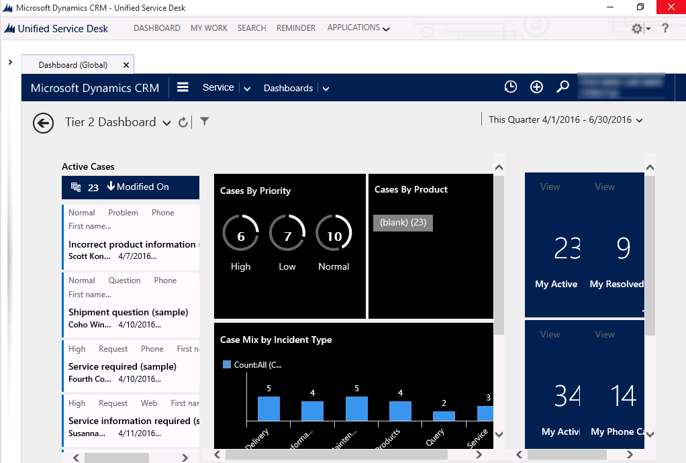

# Interactive service hub sample application package

[!INCLUDE[pn_unified_service_desk](../../includes/pn-unified-service-desk.md)] is a desktop application that helps your customer service agents provide phone, email, and chat support to your customers. [!INCLUDE[pn_unified_service_desk](../../includes/pn-unified-service-desk.md)] provides a configurable framework to quickly build an Agent Desktop application that’s integrated with Microsoft Dataverse. With [!INCLUDE[pn_unified_service_desk](../../includes/pn-unified-service-desk.md)] you can quickly make a customized Agent Desktop application by leveraging the User Interface Integration (UII) framework. 

> [!Note]
> The Interactive service hub sample application is deprecated.
  
 This package is best used in the following situations:  
  
- Power Platform environments that want to evaluate  interactive service hub integration with [!INCLUDE[pn_unified_service_desk](../../includes/pn-unified-service-desk.md)]. [!INCLUDE[proc_more_information](../../includes/proc-more-information.md)] [User's guide for the new interactive service hub](../../customer-service/customer-service-hub-user-guide-basics.md)  
  
- Power Platform environments that are already using the interactive service hub.  
  
  With the Unified Service Desk interactive service hub sample application package, the following components are installed:  
  
- User Interface Integration solution  
  
- Unified Service Desk solution  
  
- Configuration for integrating interactive service hub with [!INCLUDE[pn_unified_service_desk](../../includes/pn-unified-service-desk.md)]  
  
- Data required for Dataverse and customizations  
  
- The following sample hosted controls  
  
  -   KPI Custom Control  
  
  -   Customer Information system  
  
> [!IMPORTANT]
>  The sample applications are not supported for production use.  
    
  
 Here’s what you’ll see when you install the interactive service hub package:  
  
- **Dashboard** tab: Opens the customer service dashboard.  
  
- **My Work** tab: Shows a list of all active cases assigned to a service rep.  
  
- **search** tab: Opens search for navigating through various entities. For this package you can search for accounts and contacts.  
  
- **Reminder** tab: View and dismiss activity reminders.  
  
- Several dashboards are available.  Here's what you can do with this sample package.  
  
  - Click a chart or an item in a list to drillthrough and view the records behind the visualization.  
  
  - Select a common date range, such as **Today**, **Yesterday**, **Last Month**, or **This Quarter** or enter your own date range.  
  
  - Switch between list and chart views by selecting the view type, either stream or tile, located in the lower right.  
  
    Select from the following service dashboards:  
  
  - **Knowledge Manager**. Displays lists or visualizations of key knowledge article  data, such as proposed articles, draft articles needs review, expired articles needs review, most popular, and highest rated.  
  
  - **My Knowledge Dashboard**. Displays lists or  visualizations for several knowledge article key performance indicators associated with the agent, such as active articles, by subject, by owner, view by subject, by status reason, and agent totals for published articles, expired articles, and articles expiring this month.  
  
  - **Tier 1 Dashboard**. Displays lists or visualizations of agent key service data, such as  active cases, resolved cases, draft emails, and activities.  
  
  - **Tier 2 Dashboard**.  Displays lists or visualizations for several service key performance indicators associated with the agent, such as active cases, cases by priority, cases by product, case mix by incident type, and agent totals for active cases, resolved cases, activities, and phone calls.  
  
    

  ## See also  
  [Unified Service Desk Overview](../../unified-service-desk/admin/overview-unified-service-desk.md)

[!INCLUDE[footer-include](../../includes/footer-banner.md)]
