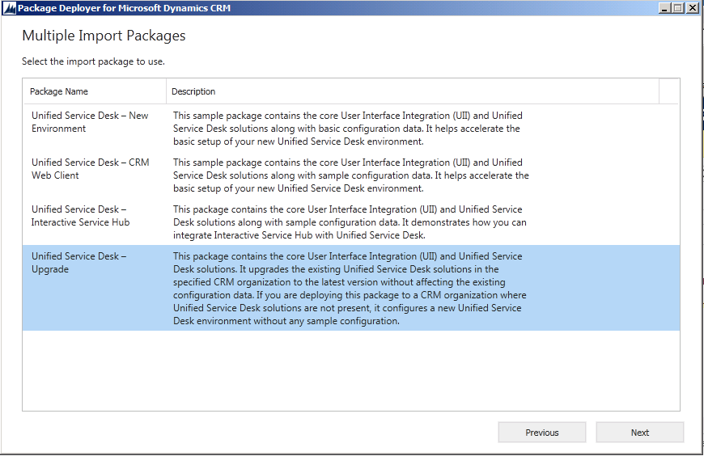
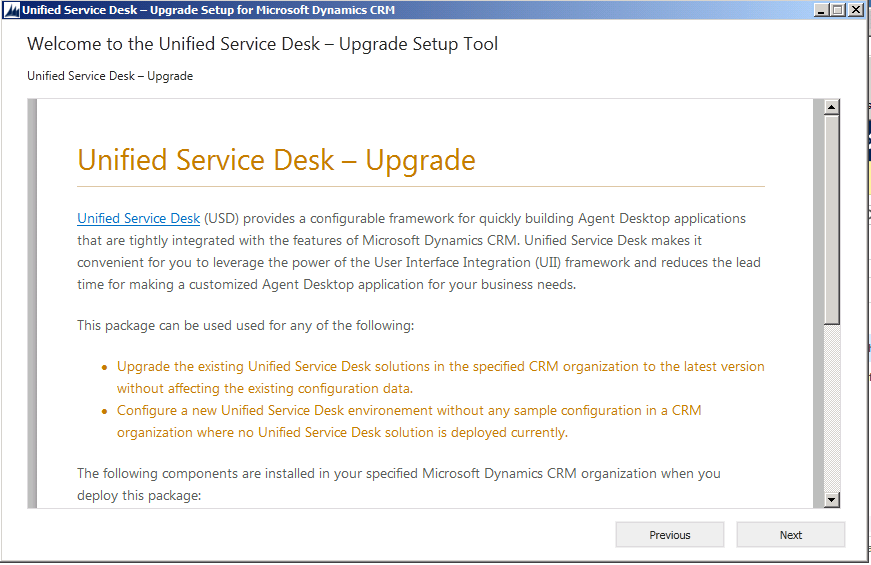
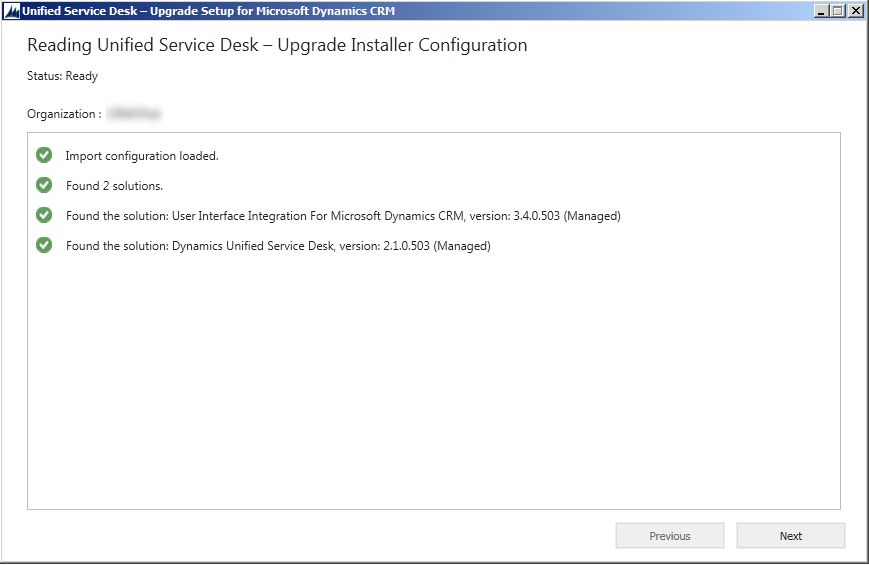

# Upgrading the solution
You can upgrade a Unified Service Desk 1.x or [!INCLUDE[pn_unified_service_desk_20](../../includes/pn-unified-service-desk-20.md)] sample application package to [!INCLUDE[pn_unified_service_desk_3_2](../../includes/pn-unified-service-desk-3-2.md)] by importing the Upgrade sample application package. The upgrade will not affect the configuration data associated with the existing solution.  
  
## Upgrade procedure  
 To upgrade a [!INCLUDE[pn_unified_service_desk](../../includes/pn-unified-service-desk.md)] solution, follow these steps.  
  
1. [Download](http://go.microsoft.com/fwlink/p/?LinkID=867343) the [!INCLUDE[pn_unified_service_desk](../../includes/pn-unified-service-desk.md)] sample application packages and [!INCLUDE[pn_package_deployer_long](../../includes/pn-package-deployer-long.md)] tool.  
  
2. Start [!INCLUDE[pn_package_deployer_long](../../includes/pn-package-deployer-long.md)], that will be used  to import the Upgrade sample application package. Alternatively, you can use [!INCLUDE[pn_PowerShell](../../includes/pn-powershell.md)] commands. [!INCLUDE[proc_more_information](../../includes/proc-more-information.md)] [Import-CrmPackage](https://technet.microsoft.com/library/dn756301.aspx)  
  
3. In the Package Deployer window, click **Continue**.  
  
4. On the Connect to Microsoft Dynamics 365 for Customer Engagement page, connect to the organization that you want to upgrade the current [!INCLUDE[pn_unified_service_desk](../../includes/pn-unified-service-desk.md)] solution.  
  
5. Under Select the import package to use, click **Unified Service Desk – Upgrade**, and then click **Next**.  
  
     
  
6. The Welcome to the Unified Service Desk – Upgrade Setup Tool page appears. Review the information about the components that will be upgraded, and then click **Next**.  
  
     
  
7. On the Ready to Install page, click **Next** to verify the components to upgrade.  
  
8. On the Reading Unified Service Desk – Upgrade Installer Configuration page, information about what will be upgraded is listed. Click **Next** to begin the upgrade.  
  
     
  
9. The Executing Install Actions page appears. Updating one or more solutions can take several minutes.  
  
10. The upgrade complete page appears. Click **Finish** to complete the upgrade.  
  
## See also  
 [Install, upgrade, and deploy Unified Service Desk](../../unified-service-desk/admin/install-upgrade-deploy-unified-service-desk.md)
