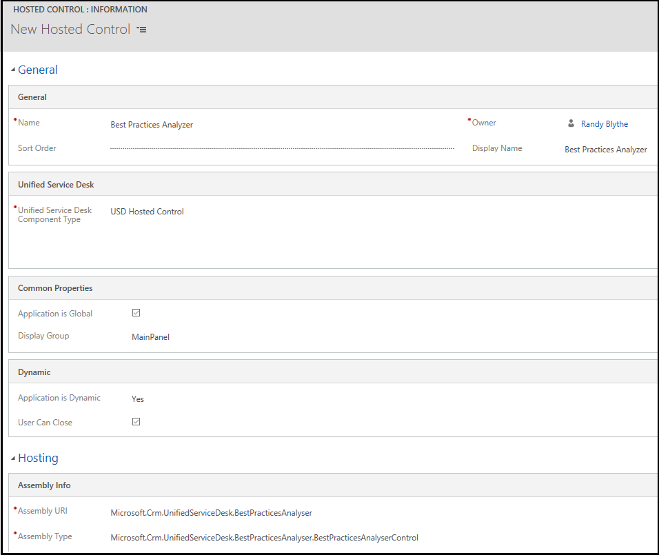
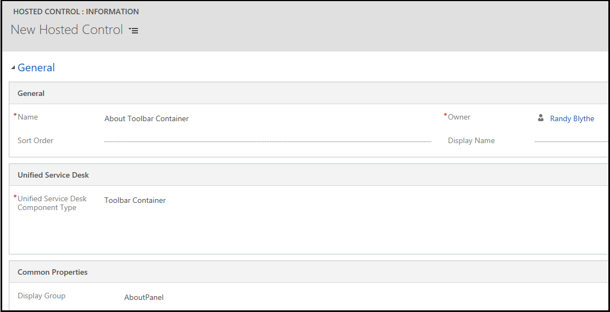
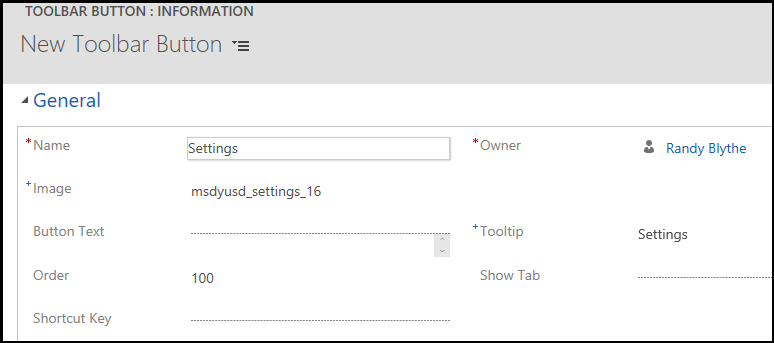
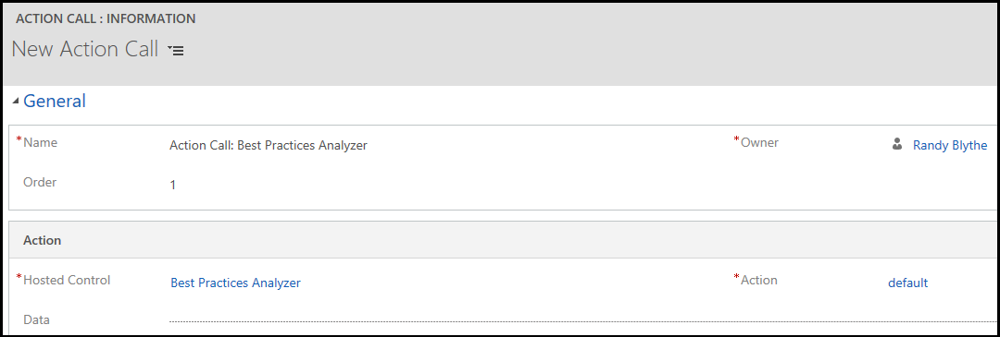
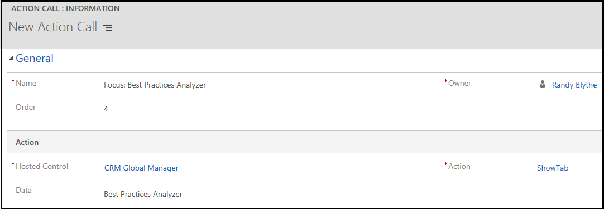

# Walkthrough: Configure [!INCLUDE[pn-best-practices-analyzer](../../includes/pn-best-practices-analyzer.md)] in [!INCLUDE[pn_unified_service_desk](../../includes/pn-unified-service-desk.md)]

This walkthrough demonstrates how to configure and setup [!INCLUDE[pn-best-practices-analyzer](../../includes/pn-best-practices-analyzer.md)] in your agent application.

   
## Step 1: Create a [!INCLUDE[pn-best-practices-analyzer](../../includes/pn-best-practices-analyzer.md)] and toolbar container hosted control

In this step, you will create a [!INCLUDE[pn-best-practices-analyzer](../../includes/pn-best-practices-analyzer.md)] and toolbar container hosted control.

1. Sign in to [!INCLUDE[pn_microsoftcrm](../../includes/pn-microsoftcrm.md)].
  
2. [!INCLUDE[proc_settings_usd](../../includes/proc-settings-usd.md)]
  
3. Click **Hosted Controls**.  
  
4. Click **New**.  
  
5. On the **New Hosted Control** page, specify the following values:  
  
    |Field|Value|  
    |-----------|-----------|  
    |Name|[!INCLUDE[pn-best-practices-analyzer](../../includes/pn-best-practices-analyzer.md)]|  
    |Display Name|[!INCLUDE[pn-best-practices-analyzer](../../includes/pn-best-practices-analyzer.md)]|  
    |USD Component Type|USD Hosted Control|
    |Application is Global|Checked|  
    |Display Group|MainPanel|  
    |Application is Dynamic|Checked|  
    |User Can Close|Checked|
    |Assembly URI|`Microsoft.Crm.UnifiedServiceDesk.BestPracticesAnalyser`|
    |Assembly Type|`Microsoft.Crm.UnifiedServiceDesk.BestPracticesAnalyser.BestPracticesAnalyserControl`| 

    
  
6. Click **Save**.
  
7. Click **New**.  
  
8.  On the **New Hosted Control** page, specify the following values  
  
    |Field|Value|  
    |-----------|-----------|
    |Name|About Toolbar Container|
    |USD Component Type|Toolbar Container|
    |Display Group|ToolbarPanel|

     
  
9.  Click **Save**.

   
## Step 2: Add a toolbar and attach it to the toolbar container

 In this step, you’ll create a toolbar, and attach the toolbar to the toolbar container hosted control created in step 1.
  
1. Sign in to [!INCLUDE[pn_microsoftcrm](../../includes/pn-microsoftcrm.md)].  
  
2. [!INCLUDE[proc_settings_usd](../../includes/proc-settings-usd.md)]
  
3. Click **Toolbars**.  
  
4. Click **New**.
  
5. On the **New Toolbar** page, type **About Toolbar** in the **Name** box, and then click **Save**.  
  
6. Attach the toolbar to the toolbar container hosted control created in step 1. On the nav bar, click the down arrow next to **About Toolbar**, and click **Hosted Controls**.  
  
7. On the next page, click **Add Existing Hosted Control**, type `About Toolbar Container` in the search bar, and then press **ENTER** or click the search icon.
  
8. From the search result, click **About Toolbar Container** to add.

     
  
9. Click **Save**.

   
## Step 3: Add toolbar button

 In this step, you’ll create two buttons - **Settings** and **[!INCLUDE[pn-best-practices-analyzer](../../includes/pn-best-practices-analyzer.md)]**, and **[!INCLUDE[pn-best-practices-analyzer](../../includes/pn-best-practices-analyzer.md)]** button under **Settings** button.
  
1. After you save the toolbar in step 2, the **Buttons** area becomes available. In the **Buttons** area, click **+** on the right corner to add a button.  
  
2. On the **New Toolbar Button** page, specify the following values:  
  
    |Field|Value|  
    |-----------|-----------|  
    |Name|Settings|
    |Image|msdyusd_settings_16|
    |Tooltip|Settings|  
    |Order|100|

     

3. Click **Save**.

4. After you save the **Settings** toolbar button, Click **New** to create another button called **[!INCLUDE[pn-best-practices-analyzer](../../includes/pn-best-practices-analyzer.md)]**.

5. On the **New Toolbar Button** page, specify the following values:  
  
    |Field|Value|  
    |-----------|-----------|  
    |Name|[!INCLUDE[pn-best-practices-analyzer](../../includes/pn-best-practices-analyzer.md)]|
    |Button Text|[[$Resources.BestPracticesAnalyzer]]|
    |Tooltip|[!INCLUDE[pn-best-practices-analyzer](../../includes/pn-best-practices-analyzer.md)]|  
    |Order|4|

    

6. Attach the  **[!INCLUDE[pn-best-practices-analyzer](../../includes/pn-best-practices-analyzer.md)]** button under **Settings** button. On the nav bar, click the down arrow next to **Settings**, and click **Toolbar Buttons**.  

7. On the next page, click **Add Existing Toolbar Button**, type `Best Practices Analyzer` in the search bar, and then press **ENTER** or click the search icon.

Click **Save**.

   
## Step 4: Add action calls to display the [!INCLUDE[pn-best-practices-analyzer](../../includes/pn-best-practices-analyzer.md)]

In this step, you'll add actions calls the to **[!INCLUDE[pn-best-practices-analyzer](../../includes/pn-best-practices-analyzer.md)]** toolbar button so that when you click on it, **[!INCLUDE[pn-best-practices-analyzer](../../includes/pn-best-practices-analyzer.md)]** tab is displayed in the hosted control that you created in step 1.

1. In the **Settings** toolbar button page, on the nav bar, click the down arrow next to **Settings**, and click **Toolbar Buttons**.

2. Select **Best Practices Analyzer** toolbar button from the list.
  
3. In the **Actions** area, click **+** on the right corner to add a button, and press **ENTER** or click the search icon.  
  
4. In the search results box, click **New** in the lower right corner to create an action call for this toolbar button.
  
5. On the **New Action Call** page, specify the following values:
  
    |Field|Value|  
    |-----------|-----------|  
    |Name|Action Call: [!INCLUDE[pn-best-practices-analyzer](../../includes/pn-best-practices-analyzer.md)]|  
    |Order|1|  
    |Hosted Control| [!INCLUDE[pn-best-practices-analyzer](../../includes/pn-best-practices-analyzer.md)] |  
    |Action|default|

    
  
6. Click **Save**.

7. In the **Actions** area, click **+** on the right corner and type **Action Call: [!INCLUDE[pn-best-practices-analyzer](../../includes/pn-best-practices-analyzer.md)]** in the text box and Press **ENTER** or click on the search icon.

8. Select the **Action Call: [!INCLUDE[pn-best-practices-analyzer](../../includes/pn-best-practices-analyzer.md)]**.  
The new action call is added to the **[!INCLUDE[pn-best-practices-analyzer](../../includes/pn-best-practices-analyzer.md)]** button.

9. You’ll add another action call to the button to set the focus on the hosted control that show the [!INCLUDE[pn-best-practices-analyzer](../../includes/pn-best-practices-analyzer.md)] in the client application. In the **Actions** area, click **+** on the right corner to add an action call.
  
10. In the search results box, click **New** in the lower right corner to create an action call for this toolbar button.  
  
11. On the **New Action Call** page, specify the following values.
  
    |Field|Value|  
    |-----------|-----------|  
    |Name|Focus: [!INCLUDE[pn-best-practices-analyzer](../../includes/pn-best-practices-analyzer.md)]|  
    |Order|4|  
    |Hosted Control|CRM Global Manager|  
    |Action|ShowTab|  
    |Data|[!INCLUDE[pn-best-practices-analyzer](../../includes/pn-best-practices-analyzer.md)]|

        

12. Click **Save**.

13. In the **Actions** area, click **+** on the right corner and type **Focus: [!INCLUDE[pn-best-practices-analyzer](../../includes/pn-best-practices-analyzer.md)]** in the text box and Press **ENTER** or click on the search icon.

14. Select the **Focus: [!INCLUDE[pn-best-practices-analyzer](../../includes/pn-best-practices-analyzer.md)]**. 
The new action call is added to the **[!INCLUDE[pn-best-practices-analyzer](../../includes/pn-best-practices-analyzer.md)]** button.

   
## Step 5: Add the controls to the configuration  
 In this step, you’ll add the action call, hosted control, toolbar, toolbar buttons, and action calls that were created in this walkthrough to **Contoso Configuration** to display these controls to the user who is assigned to the configuration. If you have not created **Contoso Configuration**. Visit, [Walkthrough 1: Build a simple agent application](../../unified-service-desk/walkthrough-1-build-a-simple-agent-application.md).
  
 Add the following to **Contoso Configuration**.

|Control name|Control type|  
|------------------|------------------|  
|Action Call: [!INCLUDE[pn-best-practices-analyzer](../../includes/pn-best-practices-analyzer.md)]|Action Call|
|Focus: [!INCLUDE[pn-best-practices-analyzer](../../includes/pn-best-practices-analyzer.md)]|Action Call| 
|About Toolbar Container|Hosted Control|
|[!INCLUDE[pn-best-practices-analyzer](../../includes/pn-best-practices-analyzer.md)]|Hosted Control|
|About Toolbar|Toolbar|
  
 To add a control to the configuration:  
  
1.  Sign in to [!INCLUDE[pn_microsoftcrm](../../includes/pn-microsoftcrm.md)].  
  
2. [!INCLUDE[proc_settings_usd](../../includes/proc-settings-usd.md)]
  
3.  Click **Configuration**.  
  
4.  Click **Contoso Configuration** to open the definition.  
  
5.  On the nav bar, click the down arrow next to **Contoso Configuration**, and select **Action Calls**.  
  
6.  On the next page, click **Add Existing Action Call**, type **Action Call: [!INCLUDE[pn-best-practices-analyzer](../../includes/pn-best-practices-analyzer.md)]** in the search bar, and then press **ENTER** or click the search icon.  
  
7.  The action call listed earlier are displayed in the search results. Add these action call.
  
8.  Similarly, add the hosted control and the toolbar by clicking the down arrow next to **Contoso Configuration**, and clicking **Hosted Controls** and **Toolbars** respectively.
  
9. Click **Save**.

   
## Step 6: Test [!INCLUDE[pn-best-practices-analyzer](../../includes/pn-best-practices-analyzer.md)] in your agent application

[!INCLUDE[pn-best-practices-analyzer](../../includes/pn-best-practices-analyzer.md)] is a hosted control that helps you analyze the various parameters of your local computer (system configurations and [!INCLUDE[pn_unified_service_desk](../../includes/pn-unified-service-desk.md)]), [!INCLUDE[pn_unified_service_desk](../../includes/pn-unified-service-desk.md)] configurations in Dynamics
365, and Internet Explorer settings in your local computer. After the analysis, [!INCLUDE[pn-best-practices-analyzer](../../includes/pn-best-practices-analyzer.md)] displays a report that recommends mitigation steps in case of a warning or error.

[!INCLUDE[pn_unified_service_desk](../../includes/pn-unified-service-desk.md)] works best when you handle the warning and error as recommended—this helps you to serve your customers without interruption.

To analyze parameters on your computer, [!INCLUDE[pn_unified_service_desk](../../includes/pn-unified-service-desk.md)] configurations, and internet settings, against the best practices rules:

1.  Sign in to the [!INCLUDE[pn_unified_service_desk](../../includes/pn-unified-service-desk.md)] client application.

2.  On the toolbar, select the **Settings** list.

3. Select **[!INCLUDE[pn-best-practices-analyzer](../../includes/pn-best-practices-analyzer.md)]**.

    

4. Select **Start Analysis**. 
[!INCLUDE[pn-best-practices-analyzer](../../includes/pn-best-practices-analyzer.md)] displays the report—it can help you determine your next steps.

> [!Note]
> When you relaunch [!INCLUDE[pn_unified_service_desk](../../includes/pn-unified-service-desk.md)] and select **[!INCLUDE[pn-best-practices-analyzer](../../includes/pn-best-practices-analyzer.md)]**, the last report that was generated appears in the report area.

## See also

[Analyze best practices in Unified Service Desk](../admin/analyze-best-practices-unified-service-desk.md)

[Download and install Best Practices Analyzer](../admin/download-install-best-practices-analyzer.md)

[Read Best Practices Analyzer report](../admin/read-best-practices-analyzer-report.md)

[Best practice rule categories and parameters](../admin/compliance-categories-parameters-bpa.md)

[System configurations](../admin/system-configurations-bpa.md)

[Internet Explorer settings](../admin/internet-explorer-settings-bpa.md)

[Unified Service Desk configurations](../admin/unified-service-desk-configurations-bpa.md)