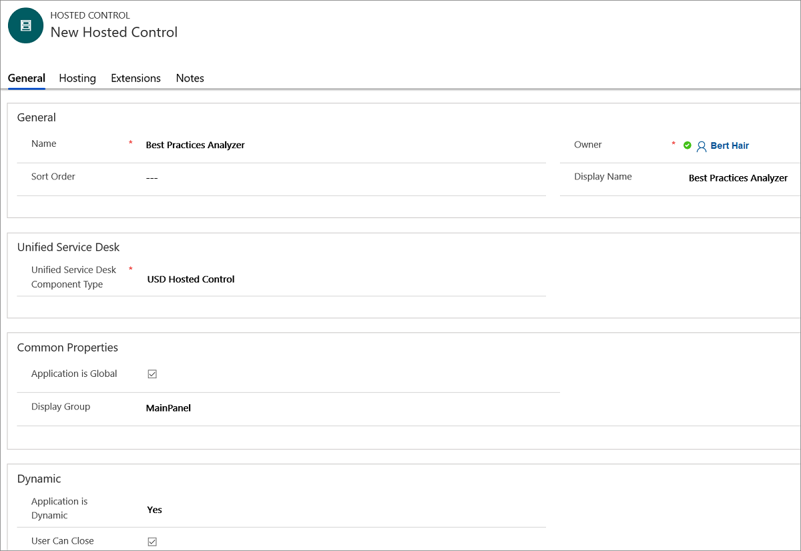
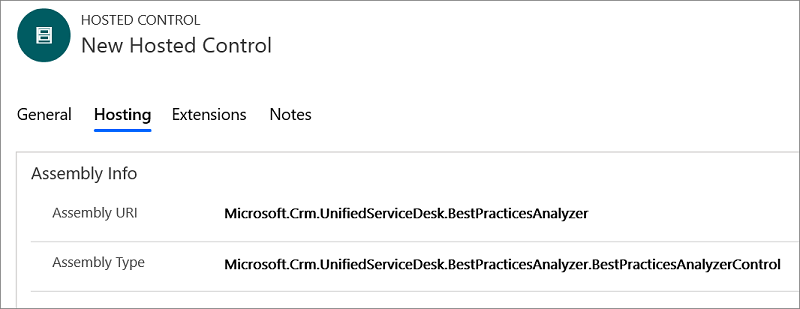
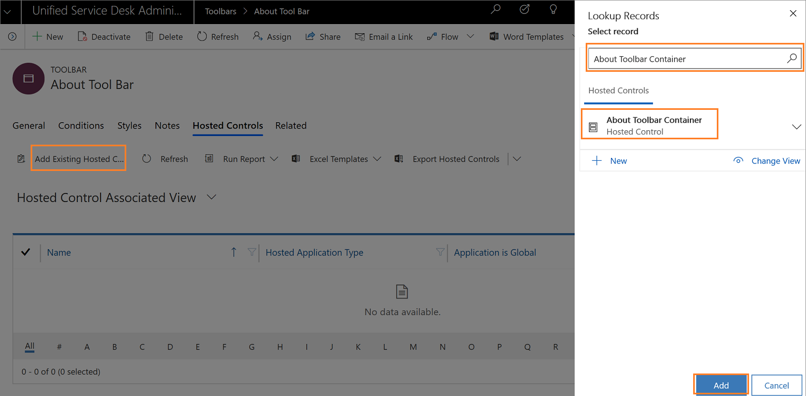
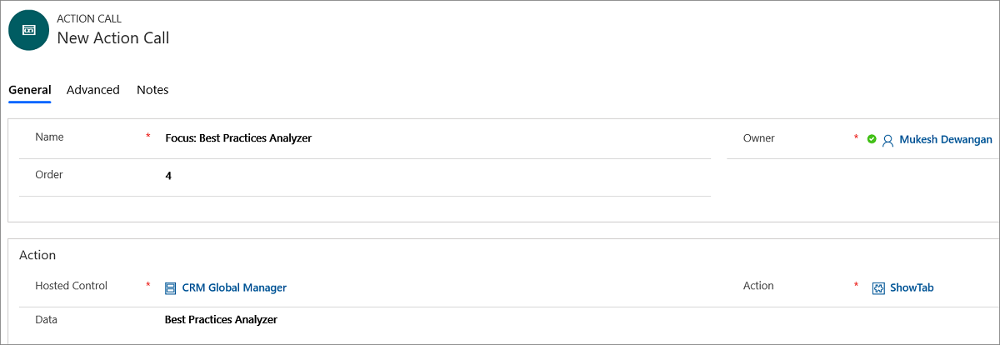

# Walkthrough: Configure [!INCLUDE[pn-best-practices-analyzer](../../includes/pn-best-practices-analyzer.md)] in [!INCLUDE[pn_unified_service_desk](../../includes/pn-unified-service-desk.md)]

This walkthrough demonstrates how you can configure and set up [!INCLUDE[pn-best-practices-analyzer](../../includes/pn-best-practices-analyzer.md)] in your agent application.

   
## Step 1: Create a [!INCLUDE[pn-best-practices-analyzer](../../includes/pn-best-practices-analyzer.md)] and toolbar container hosted control

In this step, you'll create a [!INCLUDE[pn-best-practices-analyzer](../../includes/pn-best-practices-analyzer.md)] and toolbar container hosted control.

1. Sign in to the Dynamics 365 instance.

2. Select the down arrow next to Dynamics 365.

3. Select **Unified Service Desk Administrator**.

4. Select **Hosted Controls** under **Basic Settings**.

5. Select **New** in the **Active Hosted Controls** page.  

6. Specify the following values on the **New Hosted Control** page:

   | Tab     | Field                  |     Value                |
   |---------|------------------------|--------------------------|
   | General |  Name                  | Best Practices Analyzer  |
   | General |  Display Name          | Best Practices Analyzer  |
   | General | USD Component Type     | USD Hosted Control       |
   | General | Application is Global  | Checked                  |
   | General |     Display Group      | MainPanel                |
   | General | Application is Dynamic | Checked                  |
   | General |     User Can Close     | Checked                  |
   | Hosting |      Assembly URI      |  `Microsoft.Crm.UnifiedServiceDesk.BestPracticesAnalyser`                |
   | Hosting |     Assembly Type      | `Microsoft.Crm.UnifiedServiceDesk.BestPracticesAnalyser.BestPracticesAnalyserControl` |

    

    

7. Select **Save**.

8. Select **+ New**.  

9. Specify the following values on the **New Hosted Control** page: 

   |Field|Value|  
   |-----|-----------|
   |Name|About Toolbar Container|
   |USD Component Type|Toolbar Container|
   |Display Group|AboutPanel|

    

10. Select **Save**.

   
## Step 2: Add a toolbar and attach it to the toolbar container

 In this step, you’ll create a toolbar, and attach the toolbar to the toolbar container hosted control created in step 1.

1. Sign in to the Dynamics 365 instance.

2. Select the down arrow next to Dynamics 365.

3. Select **Unified Service Desk Administrator**.

4. Select **Toolbars** under **Basic Settings**.

5. Select **New** in the **Active Toolbars** page.  

6. Type **About Toolbar** in the **Name** box, and then select **Save**. 

7. Attach the toolbar to the toolbar container hosted control created in step 1. Select the **Related** tab and select **Hosted Controls**. The **Hosted Controls** tab appears.

8. Select **Add Existing Hosted Control**. The **Lookup Records** pane appears.

9. Type **About Toolbar Container** in the search box, and select the search icon. The record appears, choose the hosted control and select **Add**.

     

10. Select **Save**.

   
## Step 3: Add toolbar button

 In this step, you’ll create two buttons - **Settings** and **[!INCLUDE[pn-best-practices-analyzer](../../includes/pn-best-practices-analyzer.md)]**, and **[!INCLUDE[pn-best-practices-analyzer](../../includes/pn-best-practices-analyzer.md)]** button under **Settings** button.

1. After you save the toolbar in step 2, select the **Related** tab and select **Buttons**. The **Buttons** tab appears. 

2. Select **+ Add New Toolbar Button**. A new toolbar button page appears.

3. Specify the following values on the **New Toolbar Button** page:  

    |Field|Value|  
    |-----|-----------|  
    |Name|Settings|
    |Image|msdyusd_settings_16|
    |Tooltip|Settings|  
    |Order|100|

     

4. Select **Save**.

5. After you save the **Settings** toolbar button, select **+ New** to create another button called **Best Practices Analyzer**.

6. Specify the following values on the **New Toolbar Button** page: 

   |    Field   |                                        Value                                         |
   |------------|--------------------------------------------------------------------------------------|
   |    Name     | Best Practices Analyzer |
   | Button Text |                         [[$Resources.BestPracticesAnalyzer]]                         |
   |   Tooltip   | Best Practices Analyzer |
   |    Order    |                                          4                                           |

    

7. Attach the  **Best Practices Analyzer** button under **Settings** button. Select the **Settings** button, select the **Related** tab, and then select **Toolbar Buttons**. The **Toolbar Buttons** tab appears.

8. Select **Add Existing Toolbar Button**. The **Lookup Records** pane appears. 

9. Type **Best Practices Analyzer** in the search box, and select the search icon. The record appears. Select the record and then select **Add**.

10. Select **Save**.

   
## Step 4: Add action calls to display the [!INCLUDE[pn-best-practices-analyzer](../../includes/pn-best-practices-analyzer.md)]

In this step, you'll add actions calls the to **[!INCLUDE[pn-best-practices-analyzer](../../includes/pn-best-practices-analyzer.md)]** toolbar button so that when you click on it, **[!INCLUDE[pn-best-practices-analyzer](../../includes/pn-best-practices-analyzer.md)]** tab is displayed in the hosted control that you created in step 1.

1. Select **Action Calls** in the site map.

2. Select **+ New** in the **Active Action Calls** page.

3. Specify the following values on the **New Action Call** page.

   |     Field      |                                               Value                                               |
   |----------------|---------------------------------------------------------------------------------------------------|
   |      Name      | Action Call: Best Practices Analyzer |
   |     Order      |                                                 1                                                 |
   | Hosted Control |       Best Practices Analyzer        |
   |     Action     |                                              default                                              |

    

6. Select **Save**.

7. Create another action call. Select **+ New**.

8. Specify the following values on the **New Action Call** page.

    |     Field      |                                            Value                                            |
    |----------------|---------------------------------------------------------------------------------------------|
    |      Name      | Focus: Best Practices Analyzer |
    |     Order      |                                              4                                              |
    | Hosted Control |                                     CRM Global Manager                                      |
    |     Action     |                                           ShowTab                                           |
    |      Data      |    Best Practices Analyzer     |

    

9. Select **Save**. 

10. Select **Toolbars** in the site map.

11. Select **About Tool Bar** in the **Active Action Calls** page, and then select **Settings** under the buttons section.

12. Select **Add Existing Action Call** in the **Actions** section. The **Lookup Records** pane appears.

13. Type **Action Call: Best Practices Analyzer** in the search box and select the search icon. The record appears. Select the action call and select **Add**. The new action call is added to the  button.

14. You’ll add another action call to the button to set the focus on the hosted control that show the Best Practices Analyzer in the client application. Select **Add Existing Action Call** in the **Actions** section. The **Lookup Records** pane appears.

15. Type the **Focus: Best Practices Analyzer** action call in the search box and select the search icon. The record appears. Select the action call and select **Add**. The new action call is added to the  button. 

16. Select **Save**.

   
## Step 5: Add the controls to the configuration  
 In this step, you’ll add the action call, hosted control, toolbar, toolbar buttons, and action calls that were created in this walkthrough to **Contoso Configuration** to display these controls to the user who is assigned to the configuration. If you have not created **Contoso Configuration**. Visit, [Walkthrough 1: Build a simple agent application](../../unified-service-desk/walkthrough-1-build-a-simple-agent-application.md).

 Add the following to **Contoso Configuration**.

|                                           Control name                                            |  Control type  |
|---------------------------------------------------------------------------------------------------|----------------|
| Action Call: [!INCLUDE[pn-best-practices-analyzer](../../includes/pn-best-practices-analyzer.md)] |  Action Call   |
|    Focus: [!INCLUDE[pn-best-practices-analyzer](../../includes/pn-best-practices-analyzer.md)]    |  Action Call   |
|                                      About Toolbar Container                                      | Hosted Control |
|       [!INCLUDE[pn-best-practices-analyzer](../../includes/pn-best-practices-analyzer.md)]        | Hosted Control |
|                                           About Toolbar                                           |    Toolbar     |

 To add a control to the configuration:  

1. Sign in to the Dynamics 365 instance.

2. Select the down arrow next to Dynamics 365.

3. Select **Unified Service Desk Administrator**.

4. Select **Configuration** under **Advanced Settings**. 

5. Select **Contoso Configuration** to open the definition.

6. Select the **Hosted Controls, Events and Action Calls** tab.  

7. Select the ellipsis **...** (more commands option) in the **Action Calls** section.

8. Select **Add Existing Action Call**. The **Lookup Records** pane appears. 

9. Type **Action Call: Best Practices Analyzer** in the search box, and then select the search icon. The action call listed earlier are displayed in the search results. Select the action and then select **Add**.

10. Follow the steps  7 to 9 to add the **Focus: Best Practices Analyzer** action call.

11. Select the ellipsis **...** (more commands option) in the **Hosted Controls** section.

12. Select **Add Existing Hosted Control**. The **Lookup Records** pane appears. 

13. Type **Best Practices Analyzer** in the search box, and then select the search icon. The hosted control listed earlier are displayed in the search results. Select the action and then select **Add**.

14. Follow the steps 11 to 13 to add the **About Toolbar Container** hosted control.

15. Select the **Toolbars, Window Navigation Rules and Entity Searches** tab.

16. Select the ellipsis **...** (more commands option) in the **Toolbars** section.

17. Select **Add Existing Toolbar**. The **Lookup Records** pane appears. 

18. Type **About Toolbar** in the search box, and then select the search icon. The hosted control listed earlier are displayed in the search results. Select the action and then select **Add**.

19. Select **Save** to save the changes.

   
## Step 6: Test [!INCLUDE[pn-best-practices-analyzer](../../includes/pn-best-practices-analyzer.md)] in your agent application

[!INCLUDE[pn-best-practices-analyzer](../../includes/pn-best-practices-analyzer.md)] is a hosted control that helps you analyze the various parameters of your local computer (system configurations and [!INCLUDE[pn_unified_service_desk](../../includes/pn-unified-service-desk.md)]), [!INCLUDE[pn_unified_service_desk](../../includes/pn-unified-service-desk.md)] configurations in Dynamics
365, and Internet Explorer settings in your local computer. After the analysis, [!INCLUDE[pn-best-practices-analyzer](../../includes/pn-best-practices-analyzer.md)] displays a report that recommends mitigation steps in case of a warning or error.

[!INCLUDE[pn_unified_service_desk](../../includes/pn-unified-service-desk.md)] works best when you handle the warning and error as recommended—this helps you to serve your customers without interruption.

To analyze parameters on your computer, [!INCLUDE[pn_unified_service_desk](../../includes/pn-unified-service-desk.md)] configurations, and internet settings, against the best practices rules:

1. Sign in to the [!INCLUDE[pn_unified_service_desk](../../includes/pn-unified-service-desk.md)] client application.

2. Select the **Settings** list on the toolbar.

3. Select **Best Practices Analyzer**.

    

4. Select **Start Analysis**. 
   Best Practices Analyzer displays the report—it can help you determine your next steps.

> [!Note]
> When you relaunch [!INCLUDE[pn_unified_service_desk](../../includes/pn-unified-service-desk.md)] and select **Best Practices Analyzer**, the last report that was generated appears in the report area.

## See also

[Analyze best practices in Unified Service Desk](../admin/analyze-best-practices-unified-service-desk.md)

[Download and install Best Practices Analyzer](../admin/download-install-best-practices-analyzer.md)

[Read Best Practices Analyzer report](../admin/read-best-practices-analyzer-report.md)

[List of rule categories and parameters](../admin/compliance-categories-parameters-bpa.md)

[System configurations](../admin/system-configurations-bpa.md)

[Internet Explorer settings](../admin/internet-explorer-settings-bpa.md)

[Unified Service Desk configurations](../admin/unified-service-desk-configurations-bpa.md)

[!INCLUDE[footer-include](../../includes/footer-banner.md)]
