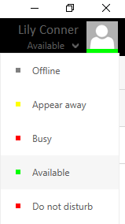

# Introduction to the agent interface in Omnichannel for Customer Service

[!INCLUDE[cc-data-platform-banner](../../includes/cc-data-platform-banner.md)]

[!INCLUDE[cc-use-with-omnichannel](../../includes/cc-use-with-omnichannel.md)]

When you sign in to Omnichannel for Customer Service through Unified Service Desk, the Omnichannel for Customer Service interface has the following components:

 - Omnichannel toolbar

 - Session management toolbar

 - Application management toolbar

 > [!div class=mx-imgBorder]
 >  

## Default global toolbar

The Omnichannel toolbar also called as default global toolbar as the components are

 - Search

 - Create

 - Settings

 - Presence

 > [!div class=mx-imgBorder]
 >   

### Search

The **Search** button lets you search for records and open them in a new active session. You can use the **Search** button to search for the following types of records:

 - Case

 - Contact

 - Account

 - Phone call

 - Task Email
 
 > [!div class=mx-imgBorder]
 >   

### Create

The **Create** button provides a list of related options (entities) so that you can access existing entities and create new entities.

### Settings

The **Settings** menu has **Debugger** and **About** options. These options provide insight into code runs and Unified Service Desk, respectively. There is also an option that opens the Best Practices Analyzer.

 > [!div class=mx-imgBorder]
 >   

#### Debugger

Use the **Debugger** option to gain insight into the process and code runs in the agent application.

#### About

Use the **About** option to view information about the user (agent), the agent's email ID, Microsoft Dataverse, Shell Version, and much more.

#### Best Practices Analyzer

Best practices are the guidelines about system configurations, Unified Service Desk, browser settings, and Unified Service Desk configurations in Dynamics 365 instance and Dataverse. Consider these guidelines our recommended way to use Unified Service Desk and serve your customers.

### Presence

Presence is the indication of your (agent) availability or status.

Presence status is updated in two ways: 
- **Manually** - You can change the status manually according to your availability. Select on the presence text to view all the presence statuses and update your status manually. 

  > [!div class=mx-imgBorder]
  > 

Out of the box, you see the following presence statuses:

  - Offline
  - Appear away
  - Busy
  - Available
  - Do Not Disturb

Also, you may see any other additional presence statuses that your administrator configured for you.

- **Automatically** - The status is set automatically based on the work item assignment. That is, when a conversation (work item) is assigned to you, the status is updated based on the capacity.

  a. When your capacity is completely utilized the presence is set to **BusyDND**. 
  b. When your capacity is partially utilized the presence is set to **Busy**.  
  c. When your capacity is not utilized the presence is set to **Available**. 

## Session management toolbar

Each session in the Unified Service Desk client is shown on the session tab toolbar on the main page. You can identify a session by the session name that is shown on the tab. You can switch between sessions to handle cases without affecting key performance indicators (KPIs).

> [!div class=mx-imgBorder]
>   

## Application management toolbar

The application management toolbar lets you see all the related information for a session. For example, you can use this toolbar to open the **Omnichannel Agent Dashboard** page, search, use Customer summary, view a knowledge base (KB) article, or view case details. You can also switch between the application and session tab toolbars to effectively manage your sessions and related applications.

> [!div class=mx-imgBorder]
>  

> [!div class="nextstepaction"]
> [Next topic: View agent dashboard and agent work items](introduction-agent-dashboard.md)

### See also

[Sign in to Unified Service Desk – Omnichannel for Customer Service](signin-unified-service-desk-omnichannel.md)  
[View alert and toast notifications](notifications.md)  
[View customer summary and know everything about customers](customer-summary.md)  
[View communication panel](left-control-panel.md)  
[View call scripts, take notes, and search knowledge articles](right-control-panel.md)  
[View customer summary for an incoming conversation request](view-customer-summary-incoming-conversation-request.md)
