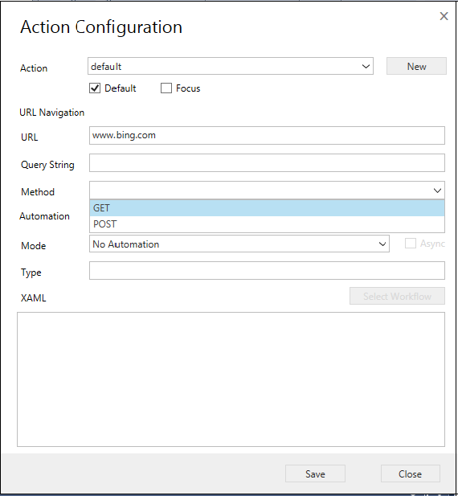

# Configure an action for the hosted application
After you have configured your application using the Hosted Application Toolkit (HAT), you must configure actions for the application. The application along with the actions is deployed using the HAT Software Factory.  
  
1. Open the HAT application project in [!INCLUDE[pn_Visual_Studio_short](../includes/pn-visual-studio-short.md)], if it’s not already open. For information about creating a HAT application, see [Use HAT Software Factory to create a hosted application](../unified-service-desk/use-hat-software-factory-create-hosted-application.md).  
  
2. In Solution Explorer, right-click the HAT application name, and then click **Action Configuration**.  
  
     
  
3. In the **Action Configuration** dialog box, select the **Default** check box if you want the action to be a default action. Otherwise, click **New** to create a new action.  
  
4. Select the **Focus** check box to return focus to the application after the action is completed.  
  
5. Under the **URL Navigation** area:  
  
   1.  Enter the navigation URL and query string for the web application.  
  
   2.  In the **Method** drop-down list, click **Get** or **Post**.  
  
   > [!NOTE]
   >  For an external application, fields under the **URL Navigation** area are unavailable.  
  
6. Select one of the following from the **Automation Mode** drop-down list:  
  
   - **No Automation**: Select this option if you do not want the action to automate the hosted application.  
  
   - **Use Workflow Assembly**: Select this option if want the action to use a workflow assembly to automate the hosted application. [!INCLUDE[proc_more_information](../includes/proc-more-information.md)] [Configure an action to run the automation](../unified-service-desk/create-hat-automation.md#action)  
  
   - **Use Workflow XAML**: Select this option if want the action to use workflow XAML to automate the hosted application. [!INCLUDE[proc_more_information](../includes/proc-more-information.md)] [Configure an action to run the automation](../unified-service-desk/create-hat-automation.md#action)  
  
7. Click **Save** to save the configurations.  
  
     
  
### See also
 [Integrate with external applications and web applications](../unified-service-desk/integrate-external-applications-web-applications.md)   
 [Create a HAT hosted application project](../unified-service-desk/use-hat-software-factory-create-hosted-application.md#Create)   
 [Using UII inspector to create bindings](../unified-service-desk/use-uii-inspector-create-bindings-hosted-application.md)   
 [Configure the hosted application](../unified-service-desk/configure-hosted-application.md)   
 [Deploy your hosted application to Unified Service Desk](../unified-service-desk/deploy-hosted-application-unified-service-desk.md#deploy)   
 [Import the hosted application from Unified Service Desk](../unified-service-desk/import-hosted-application-from-unified-service-desk.md)
s
[!INCLUDE[footer-include](../includes/footer-banner.md)]
