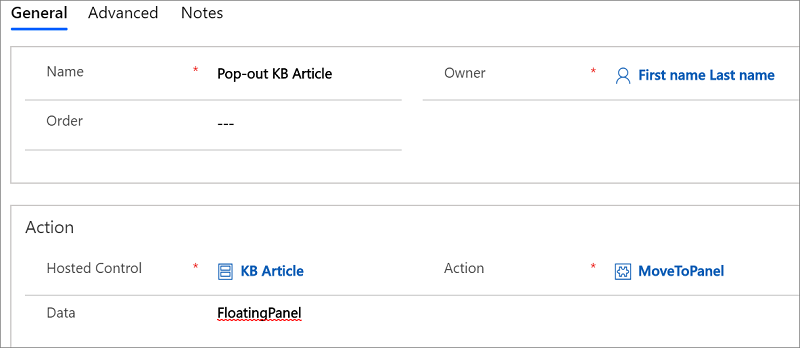
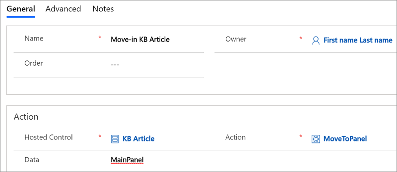

# Configure Unified Service Desk to use Dynamics 365
The **KM Control** and **Unified Interface KM Control** type of hosted controls expose a bunch of events and action calls to configure an integrated experience for your agents to easily search for knowledge base articles in [!INCLUDE[pn_crm_shortest](../includes/pn-crm-shortest.md)] from within [!INCLUDE[pn_unified_service_desk](../includes/pn-unified-service-desk.md)], and then perform various actions on the search result items.  
  
 Create an instance of the **KM Control** or **Unified Interface KM Control** type of hosted control to begin with your configuration. After you have created an instance of the hosted control, you can configure things mentioned later in this topic.  
  
<a name="Search"></a>   
## Configure knowledge base search options  
 Use the `Search` action on the hosted control to define how you want the search results to be performed and displayed. For example, you can specify the number of results to be returned, the knowledge base article type to be displayed in the search result, or the sorting option for the search results. You can also use the replacement parameters to specify the query string for the search. For example, here is the data parameter for the `Search` action to configure an action call to automatically search knowledge bases based on the case (incident) title, display five results, and return only published knowledge bases from [!INCLUDE[pn_crm_shortest](../includes/pn-crm-shortest.md)] or [!INCLUDE[pn_parature](../includes/pn-parature.md)] when your agent performs a search in [!INCLUDE[pn_unified_service_desk](../includes/pn-unified-service-desk.md)]:  
  
```  
query=[[incident.title]+]  
results=5  
filter=3  
  
```  
  
 For information about the `Search` action and its parameters, see [Search](../unified-service-desk/km-control-hosted-control.md#Search). For information on how to define an action call for searching the knowledge base, see [Step 4: Configure an action call to automatically search knowledge base using the incident (case) title](../unified-service-desk/walkthrough-8-use-dynamics-365-knowledge-base-within-agent-application.md#Step4) in the walkthrough.  
  
<a name="SetContext"></a>   
## Set the knowledge base article context  
 The knowledge base article returned in the search result contains the metadata of the article, such as article name, private URL, public URL, and unique ID. You can use this information in [!INCLUDE[pn_unified_service_desk](../includes/pn-unified-service-desk.md)], through replacement parameters, in other hosted controls where the article will be displayed to dynamically set the tab name, or to provide contextual actions (copy link, associate or dissociate to current case (incident) article) for the current knowledge base article. To use the metadata information of an article, use the [SetArticleContext](../unified-service-desk/km-control-hosted-control.md#SetArticleContext) action to set the context of the article and pass it on to the hosted control where it will be used.  
  
 Additionally, you must include the `SetArticleContext` action in the `ResultOpen` event of the hosted control if you’re displaying a knowledge base article in another hosted control to be able to use the context information in the target hosted control. You must include the action in the `SelectionChange` event if you’ll be configuring contextual actions for a selected knowledge base article in the KM Control itself. Include it in both the events if you’ll be configuring both the functionalities in your agent application. [!INCLUDE[proc_more_information](../includes/proc-more-information.md)] [Predefined events](../unified-service-desk/km-control-hosted-control.md#events)  
  
 For information on how to define an action call for setting the article context and include it in an event, see [Step 5: Configure hosted controls and action calls to display an article in a tab](../unified-service-desk/walkthrough-8-use-dynamics-365-knowledge-base-within-agent-application.md#Step5) in the walkthrough.  
  
<a name="AssociateDisassociate"></a>   
## Associate and disassociate a knowledge base article with a case (incident)  
 You can use the knowledge base article context to associate and disassociate a knowledge base article with a case record from within [!INCLUDE[pn_unified_service_desk](../includes/pn-unified-service-desk.md)]. Use the [Associate](../unified-service-desk/km-control-hosted-control.md#Associate) and [Disassociate](../unified-service-desk/km-control-hosted-control.md#Disassociate) actions to do so.  
  
 The following syntax shows the data parameter you can use with the `Associate` action on the `KM Control` (say `KB Search`) to associate an article with an incident record.  
  
```  
entitytypename=incident  
recordid =[[incident.Id]]  
articleuniqueid=[[KB Search.articleUId]]  
articletitle=[[KB Search.question]]  
articleprivateurl=[[KB Search.serviceDeskUri]]  
articlepublicurl=[[KB Search.publicUrl]]  
```  
  
> [!NOTE]
>  If you are using the [!INCLUDE[pn_crm_shortest](../includes/pn-crm-shortest.md)] knowledge base, the `articleprivateurl` parameter isn’t applicable, and therefore the respective replacement parameter (in this case, `[[KB Search.serviceDeskUri]]` will always be null. So, you should use `articleprivateurl=[[KB Search.serviceDeskUri]+]` instead of `articleprivateurl=[[KB Search.serviceDeskUri]]` to ensure that a null or non-existent key is replaced with a blank string, or use conditions if you plan to use both [!INCLUDE[pn_crm_shortest](../includes/pn-crm-shortest.md)] and Parature knowledge. Also, the replacement parameter for `articlepubliceurl` (in this case `[[KB Search.publicUrl]]`) will contain data only if the [!INCLUDE[pn_crm_shortest](../includes/pn-crm-shortest.md)] knowledge article is already published to an external portal (**Use an external portal** option is selected in the **Knowledge Base management Settings** dialog box in [!INCLUDE[pn_crm_shortest](../includes/pn-crm-shortest.md)]).  
  
 The following syntax shows the data parameter you can use with the `Disassociate` action on the `KM Control` (say `KB Search`) to disassociate an article from an incident record.  
  
```  
articleuniqueid=[[KB Search.articleUId]]  
relatedentityrecordid=[[incident.Id]]  
articletitle=[[KB Search.question]]  
entitytypename=incident  
```  
  
 For information on how to use the `Associate` action to associate an article with an incident record, see [Step 6: Configure contextual actions for the knowledge base article in the tab](../unified-service-desk/walkthrough-8-use-dynamics-365-knowledge-base-within-agent-application.md#Step6) in the walkthrough.  
  
<a name="PopInOut"></a>   
## Configure the pop-in and pop-out feature for knowledge base articles  
 You can configure to display a knowledge base article in a tab when you click the article title in the KB search panel. You can further use the `FloatingPanel` in [!INCLUDE[pn_unified_service_desk](../includes/pn-unified-service-desk.md)] to pop out a knowledge base article from the main panel so that users can display the article on another monitor in a multi-monitor environment. To implement the pop-out feature for a knowledge base article, use the `MoveToPanel` action on the hosted control that displays the article in the main panel tab, and set the data parameter as `FloatingPanel`. This moves the hosted control that displays the article from `MainPanel` to `FloatingPanel`. You can call this action from a toolbar button on the hosted control.  
  
   
  
> [!NOTE]
>  In these examples, the name of the hosted control that displays the article is `KB Article`. You must use the appropriate hosted control name as per your configuration.  
  
 To configure the pop-in feature, again use the `MoveToPanel` action, but set the data parameter to `MainPanel`. This moves the hosted control that displays the article from `FloatingPanel` to `MainPanel`.  
  
   
  
 You can call this action from a toolbar button on the hosted control. However, you must configure the pop-in toolbar button to be visible only when the hosted control is in `FloatingPanel`. You can do so by specifying the following condition in the **Visible Condition** field of the pop-in toolbar button definition.  
  
```  
"[[$Panel.KB Article]+]"=="FloatingPanel"  
```  
  
<a name="Events"></a>   
## Use the events to configure various tasks  
 Use the following three events specific to the knowledge hosted control to configure various tasks related to the knowledge base articles.  
  
- Use the `SearchComplete` event to add action calls that you want to be executed when the search for knowledge base articles is complete and the results get loaded in the KM Control hosted control (KB search pane).  
  
- Use the `ResultOpen` event to add action calls that you want to be executed when the title of a knowledge base article is clicked in the search results in the KM Control hosted control (KB search pane) to open the article.  
  
- Use the `SelectionChange` event to add action calls that you want to be executed when a knowledge base article is selected in the search results in the KM Control hosted control (KB search pane).  
  
  [!INCLUDE[proc_more_information](../includes/proc-more-information.md)] [Predefined events for KM Control](../unified-service-desk/km-control-hosted-control.md#events)  and [Predefined events for Unified Interface KM Control (Hosted Control)](../unified-service-desk/unified-interface-km-control-hosted-control.md#events)
  
<a name="Other"></a>   
## Configure other tasks for knowledge base articles  
 You can configure other tasks for the knowledge base articles such as copy the link of an article or send an email with pre-populated values as the case title in the email subject and knowledge base article link in the email body. These tasks are available when you deploy the **Knowledge Management** sample application, and you can view the configuration for these tasks in your [!INCLUDE[pn_microsoftcrm](../includes/pn-microsoftcrm.md)] instance under **Settings** > **Unified Service Desk** ([How do I get there?](http://go.microsoft.com/fwlink/p/?LinkId=525636)).  
  
### See also  
 [Use Dynamics 365 knowledge for effective customer engagement](../unified-service-desk/use-dynamics-365-knowledge-effective-customer-engagement.md) 

 [KM Control (Hosted Control)](../unified-service-desk/km-control-hosted-control.md)  

 [Unified Interface KM Control (Hosted Control)](../unified-service-desk/unified-interface-km-control-hosted-control.md) 

 [Walkthrough 8: Use Dynamics 365 knowledge within your agent application](../unified-service-desk/walkthrough-8-use-dynamics-365-knowledge-base-within-agent-application.md)
