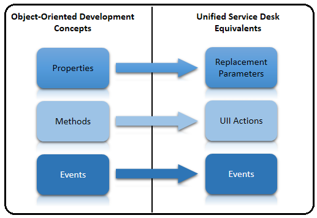

# Core concepts for configuring Unified Service Desk
[!INCLUDE[pn_unified_service_desk](../includes/pn-unified-service-desk.md)] provides an object-oriented kind of configuration and development experience through its *hosted control implementation* where the hosted control is equivalent to the object in a typical object-oriented development, and is used throughout [!INCLUDE[pn_unified_service_desk](../includes/pn-unified-service-desk.md)] to provide its loose coupling of components. [!INCLUDE[proc_more_information](../includes/proc-more-information.md)] [Hosted Controls](../unified-service-desk/unified-service-desk-hosted-controls.md)  
  
 The following diagram depicts the object-oriented development concepts and the [!INCLUDE[pn_unified_service_desk](../includes/pn-unified-service-desk.md)] equivalents.  
  
   
  
 However, there are some important differences between [!INCLUDE[pn_unified_service_desk](../includes/pn-unified-service-desk.md)] implementations and the typical object-oriented design:  
  
- **Replacement parameters**, unlike properties, are stored external to the object (hosted control in the case of [!INCLUDE[pn_unified_service_desk](../includes/pn-unified-service-desk.md)]) itself. This has a distinct advantage in [!INCLUDE[pn_unified_service_desk](../includes/pn-unified-service-desk.md)] that the properties persist longer than the life of the object, thereby allowing action calls to access the properties for use in parameters or logic long after the hosted control that exposed the parameter has been closed. [!INCLUDE[proc_more_information](../includes/proc-more-information.md)] [Replacement parameters](../unified-service-desk/replacement-parameters.md)  
  
- **[!INCLUDE[pn_uii_acronym](../includes/pn-uii-acronym.md)] actions** are equivalent to the method declaration. The action must first be defined by the underlying object that implements the action, and then it can be declared in [!INCLUDE[pn_crm_shortest](../includes/pn-crm-shortest.md)] as a usable action. Action calls in [!INCLUDE[pn_unified_service_desk](../includes/pn-unified-service-desk.md)] are essentially calls to these [!INCLUDE[pn_uii_acronym](../includes/pn-uii-acronym.md)] actions and typically use replacement parameters as the parameters to the specific UII actions. So while UII actions represent the declaration of the action that can be executed, the action calls represent the actual call to the action. [!INCLUDE[proc_more_information](../includes/proc-more-information.md)] [UII actions](../unified-service-desk/uii-actions.md), [Action calls](../unified-service-desk/action-calls.md)  
  
- **Events** in [!INCLUDE[pn_unified_service_desk](../includes/pn-unified-service-desk.md)] make one or more action calls, which internally call UII actions on other objects. [!INCLUDE[proc_more_information](../includes/proc-more-information.md)] [Events](../unified-service-desk/events.md)  
  
## Reference  
 [Hosted control types and action/event reference](../unified-service-desk/hosted-control-types-action-event-reference.md)  
    
  
## Related Sections  
 [Learn to use Unified Service Desk](../unified-service-desk/learn-to-use-unified-service-desk.md)  
  
 [Get started with configuring your agent application](../unified-service-desk/get-started-configuring-agent-application.md)  
  
 [Unified Service Desk Configuration Walkthroughs](../unified-service-desk/unified-service-desk-configuration-walkthroughs.md)
