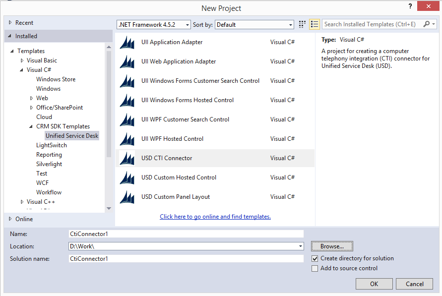

# Create a CTI Connector

[!INCLUDE[cc-data-platform-banner](../includes/cc-data-platform-banner.md)]

The [!INCLUDE[pn_cti_connector](../includes/pn-cti-connector.md)] component in your custom CTI adapter contains the logic to connect to and communicate with an external CTI system. [!INCLUDE[pn_cti_connector](../includes/pn-cti-connector.md)] consists of the [ICtiControl](/dotnet/api/microsoft.uii.desktop.cti.core.icticontrol) interface, which includes the [CtiHostedControl](/dotnet/api/microsoft.uii.desktop.cti.controls.ctihostedcontrol) class containing methods and events that will be called and listened to by the [!INCLUDE[pn_cti_desktop_manager](../includes/pn-cti-desktop-manager.md)] component.

 [!INCLUDE[pn_cti_connector](../includes/pn-cti-connector.md)] supports two models of interaction with CTI systems:

- The first model is a service-based polling system. In this model, the developer defines a service connection to an upstream CTI interaction source and polls that source for updates and events. This model is preferred for CTI sources that provide access to events and CTI actions via web services. In this model, consideration must be given to a proper threading model to support asynchronous communications with the upstream CTI web service.

- The second model uses an instanced or static object that uses a callback or event notification system. This model is preferred for CTI sources that provide an API. As in the polling model, consideration should be given to providing asynchronous support via threading to prevent an impact to [!INCLUDE[pn_unified_service_desk](../includes/pn-unified-service-desk.md)].

  The UII CTI framework supports only one instance of the [!INCLUDE[pn_cti_connector](../includes/pn-cti-connector.md)] component.

## Define a CTI Connector
 [!INCLUDE[pn_cti_connector](../includes/pn-cti-connector.md)] implements the [ICtiControl](/dotnet/api/microsoft.uii.desktop.cti.core.icticontrol) interface. To define a [!INCLUDE[pn_cti_connector](../includes/pn-cti-connector.md)], use the CRM SDK [!INCLUDE[pn_Visual_Studio](../includes/pn-visual-studio.md)] project template. [Download](https://go.microsoft.com/fwlink/p/?LinkId=400925) the **CRM SDK Templates** from the Visual Studio gallery, and double-click the CRMSDKTemplates.vsix file to install the template in [!INCLUDE[pn_Visual_Studio_short](../includes/pn-visual-studio-short.md)].

> [!NOTE]
>  The template works if you have [!INCLUDE[pn_Microsoft_.Net_Framework](../includes/pn-microsoft-net-framework.md)] 4.6.2 and [!INCLUDE[pn_microsoft_visual_studio_2012](../includes/pn-microsoft-visual-studio-2012.md)], [!INCLUDE[pn_visual_studio_2013](../includes/pn-visual-studio-2013.md)], or [!INCLUDE[pn_visual_studio_2015](../includes/pn-visual-studio-2015.md)]. Additionally, you must have [!INCLUDE[tn_nuget_package_manager](../includes/tn-nuget-package-manager.md)] for [Visual Studio 2012](https://visualstudiogallery.msdn.microsoft.com/27077b70-9dad-4c64-adcf-c7cf6bc9970c), [Visual Studio 2013](https://visualstudiogallery.msdn.microsoft.com/4ec1526c-4a8c-4a84-b702-b21a8f5293ca), or [Visual Studio 2015](https://visualstudiogallery.msdn.microsoft.com/5d345edc-2e2d-4a9c-b73b-d53956dc458d).

 The [!INCLUDE[pn_cti_connector](../includes/pn-cti-connector.md)] template provides pre-wired events and methods that help you define a [!INCLUDE[pn_cti_connector](../includes/pn-cti-connector.md)].

1. Start Visual Studio, and create a new project.

2. In the **New Project** dialog box:

   1.  From the list of installed templates, expand **Visual C#**, and select **CRM SDK Templates** > **Unified Service Desk** > **USD CTI Connector**.

   2.  Specify the name and location of the project, and click **OK**.

   

3. In **Solution Explorer**, right-click the CtiConnector.cs file, and select **View Code** to display the code.

4. Implement the required methods and events. For sample code that demonstrates how to create a [!INCLUDE[pn_cti_connector](../includes/pn-cti-connector.md)], [download and install the UII SDK](https://go.microsoft.com/fwlink/p/?LinkId=395257), and then browse to the UII\SampleCode\UII\CCA\Source Code\Cti Root folder. For more information about the methods and events to implement for a [!INCLUDE[pn_cti_connector](../includes/pn-cti-connector.md)], see the [ICtiControl](/dotnet/api/microsoft.uii.desktop.cti.core.icticontrol) interface.

5. Save your project, and build it (**Build** > **Build Solution**). After the project builds successfully, an assembly (.dll file) is generated with the same names as your project (unless you changed it in the project properties) in the \bin\debug folder of your project.

   > [!NOTE]
   >  Note the name of the class that is used to build your CTI control in the `CtiConnector.cs` file. You’ll need this information in the next step.

6. Copy this file to your [!INCLUDE[pn_unified_service_desk](../includes/pn-unified-service-desk.md)] client application installation directory (typically C:\Program Files\Microsoft Dynamics CRM USD\USD). This file is required for testing and for using the [!INCLUDE[pn_cti_connector](../includes/pn-cti-connector.md)] from your [!INCLUDE[pn_unified_service_desk](../includes/pn-unified-service-desk.md)] client application.

## Configure a hosted control for CTI Connector in Unified Service Desk
 After you have built your [!INCLUDE[pn_cti_connector](../includes/pn-cti-connector.md)] control, you must configure it in [!INCLUDE[pn_unified_service_desk](../includes/pn-unified-service-desk.md)].

> [!NOTE]
>  The [!INCLUDE[pn_cti_connector](../includes/pn-cti-connector.md)] project also lets you define your [!INCLUDE[pn_cti_desktop_manager](../includes/pn-cti-desktop-manager.md)] component. You have to create two separate hosted controls, one each for the [!INCLUDE[pn_cti_connector](../includes/pn-cti-connector.md)] and [!INCLUDE[pn_cti_desktop_manager](../includes/pn-cti-desktop-manager.md)], in [!INCLUDE[pn_unified_service_desk](../includes/pn-unified-service-desk.md)] after you have added the code for the latter in the [!INCLUDE[pn_Visual_Studio_short](../includes/pn-visual-studio-short.md)]. [!INCLUDE[proc_more_information](../includes/proc-more-information.md)] [Create a CTI Desktop Manager](../unified-service-desk/create-cti-desktop-manager.md)

1. Sign in to the Dynamics 365 instance.  

2. On the nav bar, choose **Dynamics 365** > **Settings** > **Unified Service Desk**.  

3. On the **Unified Service Desk** page, choose **Hosted Controls**.

4. On the **Hosted Controls** page, choose **New**.

5. On the **New Hosted Control** page, specify the following values

   |         Field         |                                                                                                                                                                              Value                                                                                                                                                                               |
   |-----------------------|------------------------------------------------------------------------------------------------------------------------------------------------------------------------------------------------------------------------------------------------------------------------------------------------------------------------------------------------------------------|
   |         Name          |                                                                                                                                                                           CTIConnector                                                                                                                                                                           |
   |  USD Component Type   |                                                                                                                                                                      CCA Hosted Application                                                                                                                                                                      |
   |  Hosted Application   |                                                                                                                                                                          Hosted Control                                                                                                                                                                          |
   | Application is Global |                                                                                                                                                                             Checked                                                                                                                                                                              |
   |     Display Group     |                                                                                                                                                                           HiddenPanel                                                                                                                                                                            |
   |        Adapter        |                                                                                                                                                                          Use No Adapter                                                                                                                                                                          |
   |     Assembly URI      |                                                                                                                                        This is the name of the assembly file (.dll) that you built in the previous step.                                                                                                                                         |
   |     Assembly Type     | This is the name of the assembly file (.dll) followed by a dot, and then the class name of your [!INCLUDE[pn_cti_connector](../includes/pn-cti-connector.md)]. For example, if your .dll file name is `MyCtiConnector`, and the name of the class of your CTI project is `CtiConnector`, type the following value in this field:  `MyCtiConnector.CtiConnector`. |

6. Choose **Save** to create the hosted control.

### See also
 [Create a CTI Desktop Manager](../unified-service-desk/create-cti-desktop-manager.md)
 [Create a CTI Control](../unified-service-desk/create-cti-control.md)
 [UII Computer Telephony Integration (CTI) framework](../unified-service-desk/uii-computer-telephony-integration-cti-framework.md)
 [Walkthrough: Use generic listener adapter for CTI events](../unified-service-desk/walkthrough-use-the-generic-listener-adapter-for-cti-event-routing.md)

[!INCLUDE[footer-include](../includes/footer-banner.md)]
