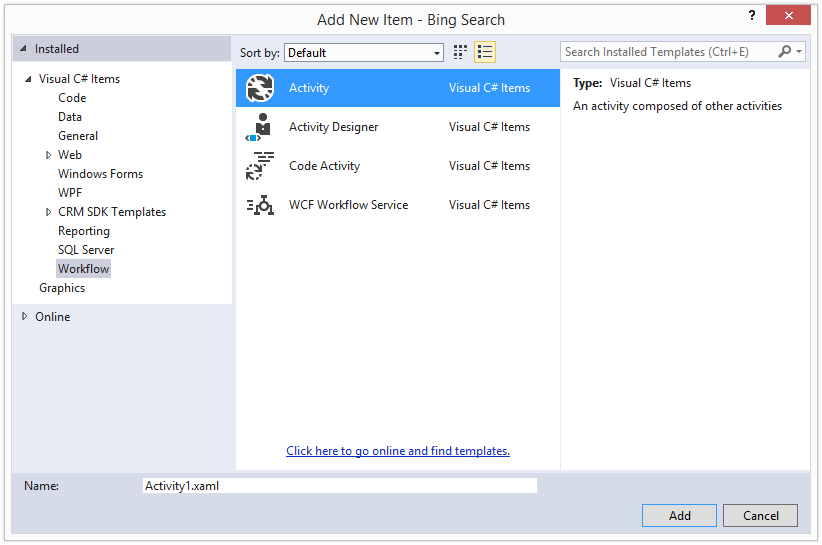
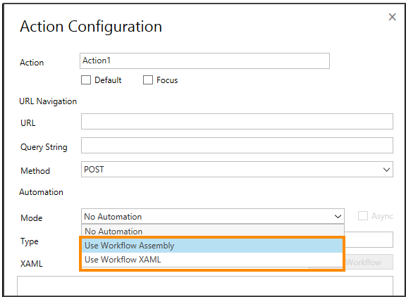
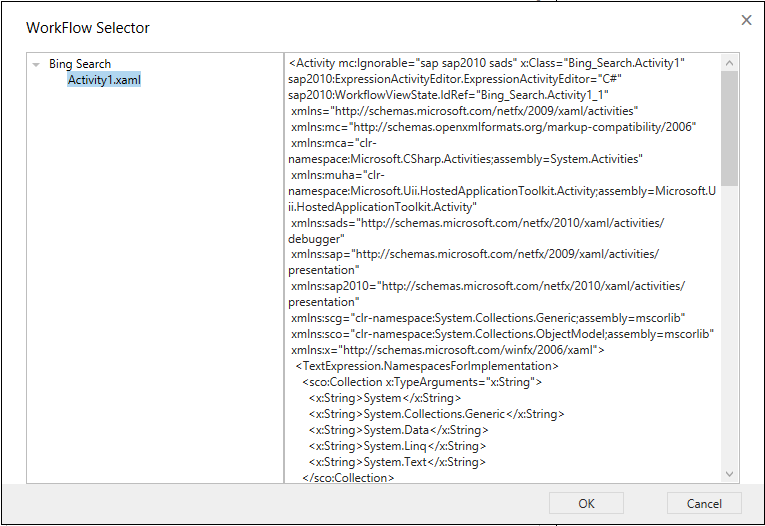
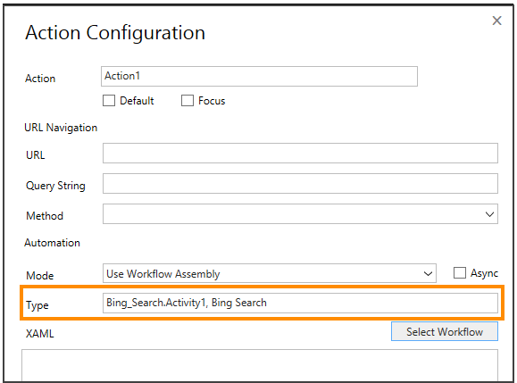
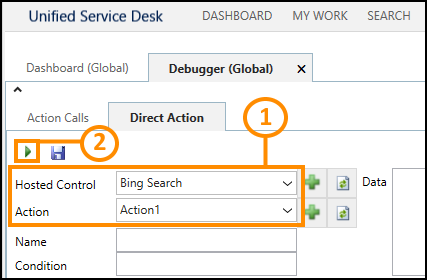

# Create HAT automation in Unified Service Desk
You can use the [!INCLUDE[pn_hosted_application_toolkit_hat](../includes/pn-hosted-application-toolkit-hat.md)] automation activities to create automations for your hosted application project. You can use [!INCLUDE[pn_user_inteface_integration_uii](../includes/pn-user-interface-integration-uii.md)] inspector to make the controls of an application available for use in automation. Although an automation is started by an action defined on an application, it can access defined controls in all applications that run in the session. Automations can also interact with non-automation enabled applications through activities such as `DoAction` or `Apppplication Integration Framework (AIF)` context activities. [!INCLUDE[proc_more_information](../includes/proc-more-information.md)] [Types of HAT automation activities](../unified-service-desk/types-of-hat-automation-activities.md)  
  
 Before you add automation to your application, ensure that you have inspected all the required controls in your application. To do so, see [Use UII inspector to create bindings for the hosted application](../unified-service-desk/use-uii-inspector-create-bindings-hosted-application.md).  
  
   
## Create HAT automation  
  
1.  Open the application project that you created earlier using [!INCLUDE[pn_hat](../includes/pn-hat.md)] where you want to add automations. [!INCLUDE[proc_more_information](../includes/proc-more-information.md)] [Use HAT Software Factory to create a hosted application](../unified-service-desk/use-hat-software-factory-create-hosted-application.md). You can also create a workflow in a separate project, and then add it to your existing hosted application created using [!INCLUDE[pn_hat](../includes/pn-hat.md)].  
  
2.  In **Solution Explorer**, right-click the project name, and select **Add** > **New Item**.  
  
3.  In the **Add New Item** dialog box, select **Visual C#** > **Workflow** in the left pane, select **Activity** as the project type, specify an appropriate name, and then click **Add**.  
  
   
  
4.  This adds the activity workflow (XAML) in your project, and opens up the XAML in the workflow activity designer area where you can drop the [!INCLUDE[pn_hat](../includes/pn-hat.md)] automation activities as well as other activities to design your automation.  
  
   
  
5.  Create your automation using the [!INCLUDE[pn_hat](../includes/pn-hat.md)] activities, save your project, and then build it.  
  
     The next step is to configure an action for the [!INCLUDE[pn_hat](../includes/pn-hat.md)] application that you created earlier, and then associate the action with the automation that you just created.  
  
   
## Configure an action to run the automation  
 In this section, we will configure an action on the application to associate it with the automation that we created in the previous section.  
  
1.  Open the [!INCLUDE[pn_hat](../includes/pn-hat.md)] application project in [!INCLUDE[pn_Visual_Studio_short](../includes/pn-visual-studio-short.md)], if it’s not already open. [!INCLUDE[proc_more_information](../includes/proc-more-information.md)] [Use HAT Software Factory to create a hosted application](../unified-service-desk/use-hat-software-factory-create-hosted-application.md).  
  
2.  In **Solution Explorer**, right-click the [!INCLUDE[pn_hat](../includes/pn-hat.md)] application project name, and select **Action Configuration**.  
  
3.  In the **Action Configuration** dialog box, specify the action name and other details, as required. For information about these fields, see [Configure an action for the hosted application](../unified-service-desk/configure-action-hosted-application.md).  
  
4.  Under **Automation**, from the **Mode** list, select **Use Workflow Assembly** or **Use Workflow XAML** to associate an automation with the action.  
  
   
  
5.  Click **Select Workflow** to specify the automation.  
  
6.  In the **Workflow Selector** dialog box, expand your project name, and then select the workflow (.xaml) to be associated with the action, and then click **OK**.  
  
   
  
7.  If you selected:  
  
    1. **Use Workflow Assembly** in step 4, the type information is populated in the **Type** field for the selected automation (workflow).  
  
   
  
        > [!NOTE]
        >  As the absolute path to the workflow assembly is not mentioned in the **Type** field, you must copy the workflow assembly file in the [!INCLUDE[pn_unified_service_desk](../includes/pn-unified-service-desk.md)] client installation directory to test and use the hosted application and the automation.  
  
    2. **Use Workflow XAML** in step 4, the workflow XAML is populated in the XAML field for the selected automation (workflow).  
  
   
  
8.  If you want the run automation in an asynchronous mode, select the **Async** check box. Automation can be executed *synchronously* or *asynchronously*.  
  
    -   In synchronous mode, the automation runs in the [!INCLUDE[pn_unified_service_desk](../includes/pn-unified-service-desk.md)] user interface (UI) thread, and blocks the UI until it is finished. Blocking the UI can be useful as it allows the application UI state to be updated in isolation. To prevent the UI from appearing unresponsive, keep automation run times as short as possible.  
  
    -   In asynchronous mode, the automation doesn’t run in the [!INCLUDE[pn_unified_service_desk](../includes/pn-unified-service-desk.md)] UI thread until it needs to interact with the UI.  
  
9. Select **Save** to create the action to trigger the automation.  
  
10. Save the project, and build (**Build** > **Build Solution**) it.  
  
   
## Verify the HAT hosted control with automation  
  
1.  Deploy the [!INCLUDE[pn_hat](../includes/pn-hat.md)] application to [!INCLUDE[pn_unified_service_desk](../includes/pn-unified-service-desk.md)] on the [!INCLUDE[pn_microsoftcrm](../includes/pn-microsoftcrm.md)] server. [!INCLUDE[proc_more_information](../includes/proc-more-information.md)] [Deploy the hosted application to Unified Service Desk](../unified-service-desk/deploy-hosted-application-unified-service-desk.md)  
  
2.  Copy the required files (workflow and [!INCLUDE[pn_hat](../includes/pn-hat.md)] application assemblies) to the [!INCLUDE[pn_unified_service_desk](../includes/pn-unified-service-desk.md)] client application directory (typically C:\Program Files\Microsoft Dynamics CRM USD\USD).  
  
3.  Run the [!INCLUDE[pn_unified_service_desk](../includes/pn-unified-service-desk.md)] client, and use Debugger to test your [!INCLUDE[pn_hat](../includes/pn-hat.md)] hosted application and the action with automation. In the **Debugger** tab, click the down arrow above the **Action Calls** tab to display the area where you can test action calls and [!INCLUDE[pn_user_inteface_integration_uii](../includes/pn-user-interface-integration-uii.md)] actions.  
  
4.  Click the **Direct Action** tab:  
  
    1.  Select your hosted control and action that you want to verify.  
  
    2.  Click the run icon to test it.  
  
   
  
     For more information about using the Debugger hosted control, see [Debug issues in Unified Service Desk](http://go.microsoft.com/fwlink/p/?LinkId=518149) in the [!INCLUDE[pn_unified_service_desk](../includes/pn-unified-service-desk.md)] Administration Guide.  
  
> [!TIP]
>  To debug the automation, start [!INCLUDE[pn_Visual_Studio_short](../includes/pn-visual-studio-short.md)] as administrator, open your [!INCLUDE[pn_hat](../includes/pn-hat.md)] application project, and set the [!INCLUDE[pn_unified_service_desk](../includes/pn-unified-service-desk.md)] client executable file (UnifiedServiceDesk.exe) as the external startup program in the properties of the project. Also, set the build output path of the project to [!INCLUDE[pn_unified_service_desk](../includes/pn-unified-service-desk.md)] client installation directory. Every time you debug the project, the assemblies will be copied over to the [!INCLUDE[pn_unified_service_desk](../includes/pn-unified-service-desk.md)] client installation directory, and the client will start.  
  
   
## View sample automations  
  
1.  [Download the UII SDK](http://go.microsoft.com/fwlink/p/?LinkId=519179), and extract it.  
  
2.  In the *\<ExtractedFolder>*\UII\SampleCode\UII\Hat\QsAutomationProject folder, open the Microsoft.Uii.QuickStarts.QsAutomationProject.csproj file in [!INCLUDE[pn_Visual_Studio](../includes/pn-visual-studio.md)].  
  
3.  Fix the missing assembly references in the project by setting the reference path of your project (**Project** > **[Project] Properties** > **Reference Paths**) to the *\<ExtractedFolder>*\UII\Bin\UII folder or to the [!INCLUDE[pn_unified_service_desk](../includes/pn-unified-service-desk.md)] client application directory (typically C:\Program Files\Microsoft Dynamics CRM USD\USD).  
  
4.  Build the project (**Build** > **Build Solution**) to view the sample automations (XAML). After the project is built successfully, double-click a XAML file in Solution Explorer to view the automation definition.  
  
### See also  
 [Use HAT automation activities](../unified-service-desk/use-hat-automation-activities.md)   
 [Types of HAT automation activities](../unified-service-desk/types-of-hat-automation-activities.md)   
 [Configure an action for the hosted application](../unified-service-desk/configure-action-hosted-application.md)