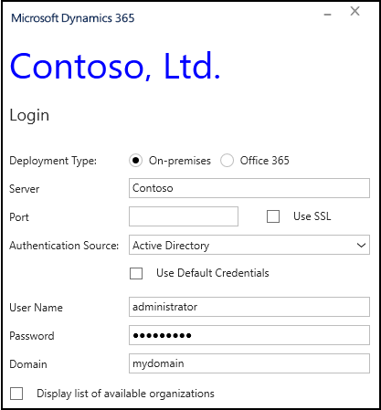
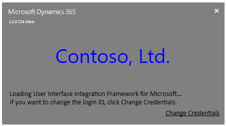

# Customize login and splash screens in Unified Service Desk
You can customize the branding of [!INCLUDE[pn_unified_service_desk](../includes/pn-unified-service-desk.md)] login and splash screens to change the name and appearance of the application name on the login screen and change the application name, appearance, foreground and background colors of the splash screen by modifying XAML styles.  
  
<a name="What"></a>   
## What you can customize?  
 The following XAML is used to customize the branding of login and splash screens in [!INCLUDE[pn_unified_service_desk](../includes/pn-unified-service-desk.md)]:  
  
```xaml  
<ResourceDictionary xmlns="http://schemas.microsoft.com/winfx/2006/xaml/presentation"  
                    xmlns:x="http://schemas.microsoft.com/winfx/2006/xaml"  
                    xmlns:resx1="clr-namespace:Microsoft.Crm.UnifiedServiceDesk.Properties">  
  
  <Style x:Key="FormAppNameStyle" TargetType="TextBlock">  
    <Setter Property="Foreground" Value="Black"></Setter>  
    <Setter Property="FontFamily" Value="Segoe UI"></Setter>  
    <Setter Property="FontSize" Value="30"></Setter>  
    <Setter Property="Background" Value="White"></Setter>  
    <Setter Property="Text" Value="Unified Service Desk"></Setter>  
  </Style>  
  
  <Style x:Key="SplashAppNameStyle" TargetType="Label">  
    <Setter Property="Foreground" Value="White"></Setter>  
    <Setter Property="FontFamily" Value="/UnifiedServiceDesk;component/Fonts/#Segoe UI"></Setter>  
    <Setter Property="FontSize" Value="40"></Setter>  
    <Setter Property="Content" Value="Unified Service Desk"></Setter>  
  </Style>  
  
  <Style x:Key="SplashScreenDefaultFontStyle" TargetType="TextBlock">  
    <Setter Property="FontSize" Value="12px"/>  
    <Setter Property="Foreground" Value="White"/>  
    <Setter Property="TextWrapping" Value="Wrap"/>  
    <Setter Property="TextTrimming" Value="WordEllipsis"/>  
    <Setter Property="FontFamily" Value="Segoe UI"/>  
  </Style>  
  
  <Style x:Key="SplashGridBgColor" TargetType="Grid">  
    <Setter Property="Background" Value="Blue"></Setter>  
  </Style>  
  
</ResourceDictionary>  
```  
  
 The XAML file contains the following four styles for which you must specify appropriate values in the `Setter Property`:  
  
|XAML Style|Description|  
|----------------|-----------------|  
|FormAppNameStyle|Change the content and appearance of application name on login screen.|  
|SplashAppNameStyle|Change the content and appearance of application name on splash screen.|  
|SplashScreenDefaultFontStyle|Change the appearance of status text on splash screen.|  
|SplashGridBgColor|Change the background color of splash screen.|  
  
<a name="How"></a>   
## How you can customize?  
 You can customize the  branding of login and splash screens in [!INCLUDE[pn_unified_service_desk](../includes/pn-unified-service-desk.md)] by following the steps below.  
  
1. Open Notepad, and copy the entire contents of the XAML file mentioned in the previous section.  
  
2. Under the appropriate XAML style block, change the `Value` of appropriate `Setter Property`.  
  
    For example, to modify the font size of the app name displayed on the splash screen, change the value of the `FontSize` setter property under the `SplashAppNameStyle` style.  
  
    You can modify values for multiple setter properties under a XAML style or across multiple XAML styles.  
  
3. If you haven't changed setter property values under a XAML style, remove the style block from the Notepad file.  
  
    For example, if you just changed setter properties for `SplashAppNameStyle`, remove the other styles to prevent the settings under those styles being applied to your client application. See examples later in this topic.  
  
4. Save the file as "CustomerSplashStyles.xaml".  
  
5. Copy the "CustomerSplashStyles.xaml" to the [!INCLUDE[pn_unified_service_desk](../includes/pn-unified-service-desk.md)] client directory, typically "C:\Program Files\Microsoft Dynamics CRM USD\USD". You must have system administrator privileges to copy the file to the client directory.  
  
6. If you are running the [!INCLUDE[pn_unified_service_desk](../includes/pn-unified-service-desk.md)] client, restart it for the changes to take effect.  
  
<a name="Examples"></a>   
## Customization examples  
 Here are some customization examples.  
  
### Change the application name of login screen  
 Update the contents of the `CustomerSplashStyles.xaml` file to the following:  
  
```  
<ResourceDictionary xmlns="http://schemas.microsoft.com/winfx/2006/xaml/presentation"  
                    xmlns:x="http://schemas.microsoft.com/winfx/2006/xaml"  
                    xmlns:resx1="clr-namespace:Microsoft.Crm.UnifiedServiceDesk.Properties">  
  
  <Style x:Key="FormAppNameStyle" TargetType="TextBlock">  
    <Setter Property="Foreground" Value="Blue"></Setter>  
    <Setter Property="FontFamily" Value="Segoe UI"></Setter>  
    <Setter Property="FontSize" Value="40"></Setter>  
    <Setter Property="Background" Value="White"></Setter>  
    <Setter Property="Text" Value="Contoso, Ltd."></Setter>  
  </Style>  
  
</ResourceDictionary>  
```  
  
 This will be the customization outcome:  
  
   
  
### Change the application name and appearance of splash screen  
 Update the contents of the `CustomerSplashStyles.xaml` file to the following:  
  
```xaml  
<ResourceDictionary xmlns="http://schemas.microsoft.com/winfx/2006/xaml/presentation"  
                    xmlns:x="http://schemas.microsoft.com/winfx/2006/xaml"  
                    xmlns:resx1="clr-namespace:Microsoft.Crm.UnifiedServiceDesk.Properties">  
  
  <Style x:Key="SplashAppNameStyle" TargetType="Label">  
    <Setter Property="Foreground" Value="Blue"></Setter>  
    <Setter Property="FontFamily" Value="/UnifiedServiceDesk;component/Fonts/#Segoe UI"></Setter>  
    <Setter Property="FontSize" Value="40"></Setter>  
    <Setter Property="Content" Value="Contoso, Ltd."></Setter>  
  </Style>  
  
  <Style x:Key="SplashScreenDefaultFontStyle" TargetType="TextBlock">  
    <Setter Property="FontSize" Value="14px"/>  
    <Setter Property="Foreground" Value="Black"/>  
    <Setter Property="TextWrapping" Value="Wrap"/>  
    <Setter Property="TextTrimming" Value="WordEllipsis"/>  
    <Setter Property="FontFamily" Value="Calibri"/>  
  </Style>  
  
  <Style x:Key="SplashGridBgColor" TargetType="Grid">  
    <Setter Property="Background" Value="Gray"></Setter>  
  </Style>  
  
</ResourceDictionary>  
```  
  
 This will be the customization outcome:  
  
   
  
### See also  
 [Customize themes in Unified Service Desk](../unified-service-desk/customize-themes-in-unified-service-desk.md)
