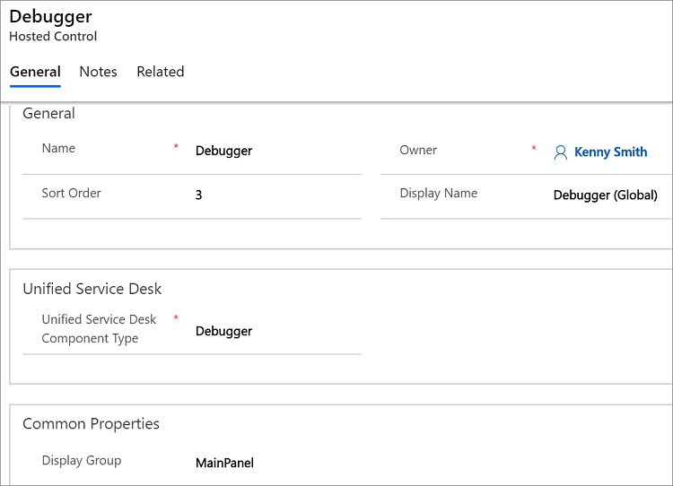

# Debugger (Hosted Control)
Use **Debugger** hosted control type in Unified Service Desk to configure a debugger control in [!INCLUDE[pn_unified_service_desk](../includes/pn-unified-service-desk.md)] to provide you with insights about the process and code executions in the agent application. All the three sample applications in [!INCLUDE[pn_unified_service_desk](../includes/pn-unified-service-desk.md)] come with a preconfigured Debugger hosted control. For more information, see [Debug issues in Unified Service Desk](http://go.microsoft.com/fwlink/p/?LinkId=518149) in the Unified Service Desk Administration Guide.  
  
   
## Create a Debugger hosted control  
 While creating a new hosted control, the fields in the **New Hosted Control** screen vary based on the type of hosted control you want to create. This section provides information about the specific fields that are unique to the **Debugger** hosted control type. For detailed information about creating a hosted control, see [Create or edit a hosted control](../unified-service-desk/create-edit-hosted-control.md).  
  
   
  
 In the **New Hosted Control** screen:  
  
- Under **Unified Service Desk** area, select **Debugger** from the **USD Component Type** drop-down list.  
  
- The **Display Group** field displays the panel where this hosted control will be displayed. **MainPanel** is the most common for this hosted control type. For information about various panels available in [!INCLUDE[pn_unified_service_desk](../includes/pn-unified-service-desk.md)], see [Panels, panel types, and panel layouts in Unified Service Desk](../unified-service-desk/panels-panel-types-panel-layouts.md). For information about other **General** fields, see [Create or edit a hosted control](../unified-service-desk/create-edit-hosted-control.md).  
  
   
## Predefined UII actions  
 These are the predefined actions for this hosted control type.  
  
   
### Close  
 This action is used to close the hosted control.  
  
### FireEvent  
 Fires a user-defined event from this hosted control.  
  
|Parameter|Description|  
|---------------|-----------------|  
|name|Name of the user-defined event.|  
  
 All subsequent name=value pairs become the parameters to the event. For more information about creating a user-defined event, see [Create a user-defined event](../unified-service-desk/create-user-defined-event.md).  
  
   
### MoveToPanel  
 This action is used to move hosted controls between panels at runtime.  
  
|Parameter|Description|  
|---------------|-----------------|  
|app|Name of the hosted control to be moved.|  
|panel|Target panel for the hosted control.|  
  
### New_CRM_Page  
 Creates a page for creating a new [!INCLUDE[pn_crm_shortest](../includes/pn-crm-shortest.md)] apps record of the entity specified, and treats the page as a popup from the specified hosted control. The window navigation rules are evaluated to determine the location where the page to create the entity record is displayed.  
  
|Parameter|Description|  
|---------------|-----------------|  
|LogicalName|The logical name of the entity for creating a new instance.|  
  
> [!NOTE]
>  The rest of the parameters should consist of name=value pairs. These are the additional pre-populated values in the form for creating a new record for the specified entity. For more information about using this action, see step 4 in [Walkthrough 7: Configure agent scripting in your agent application](../unified-service-desk/walkthrough-configure-agent-scripting-agent-application.md).  
  
### Open_CRM_Page  
 Opens an existing instance of the entity specified and identified by the ID, and treats the page as a popup from the specified hosted control. The window navigation rules are evaluated to determine the location where the popup should be displayed.  
  
|Parameter|Description|  
|---------------|-----------------|  
|LogicalName|The logical name of the entity to open.|  
|id|The ID of the entity record to open.|  
  
### Popup  
 Pops up a URL from the hosted control and runs the window navigation rules against it for routing the popup to the appropriate location.  
  
|Parameter|Description|  
|---------------|-----------------|  
|url|Routes a popup from this hosted control using this URL as if it were a popup requested from the displayed control.|  
|frame|The frame from which this popup originated.|  
  
   
### RealignWindow  
[!INCLUDE[cc_RealignWindow_Action](../includes/cc-realignwindow-action.md)]
  
   
### SetSize  
 This action explicitly sets the width and height of the hosted control. This is particularly useful when using "auto" in your panel layouts.  
  
|Parameter|Description|  
|---------------|-----------------|  
|width|The width of the hosted control.|  
|height|The height of the hosted control.|  
  
### SetReplacementParameter  
 Sets an arbitrary replacement parameter value to a specified value.  
  
|Parameter|Description|  
|---------------|-----------------|  
|appname|The hosted control name or key field for the replacement parameter.|  
|param|The replacement parameter sub key name.|  
|value|The value to set.|  
|global|Set this to **true** to set the value in the global session.   Set this to **false** to set the value in the active session.|  
  
### TestScriptlet  
 Runs the specified JavaScript as if it were a scriptlet. Upon successful execution, the result is displayed in a message box.  
  
   
## Predefined events  
 There aren’t any predefined events available for this hosted control type.  
  
### See also  
 [Walkthrough 6: Configure the Debugger hosted control in your agent application](../unified-service-desk/walkthrough-configure-debugger-hosted-control-agent-application.md)   
 [Hosted control types and action/event reference](../unified-service-desk/hosted-control-types-action-event-reference.md)   
 [Administration Guide for Unified Service Desk for Microsoft Dynamics CRM](http://go.microsoft.com/fwlink/p/?LinkID=394402)
