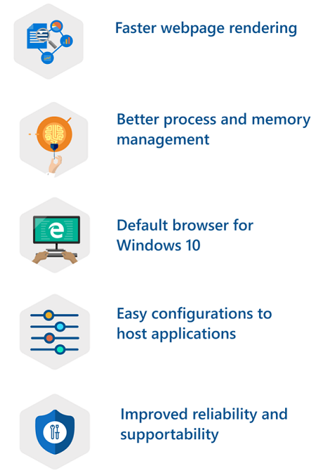

# Use Edge WebView2 Process to host web applications

[!INCLUDE[cc-data-platform-banner](../includes/cc-data-platform-banner.md)]

The Edge WebView2 Process browser control hosts your controls in isolated Edge WebView2 Process instances and displays them in tabs in the Unified Service Desk client application. Edge WebView2 Process is based on *CefSharp*, an open source framework that uses the Chromium core that powers many modern browsers.  More information: [CefSharp](https://cefsharp.github.io/)

> [!IMPORTANT] - <need to check with Karthik>
> - Unified Service Desk version 4.1.1.1429 supports Chromium version 84.

The advantages of using the Edge WevView2 Process hosting method are as follows:

- Webpages, including model-driven app pages, render faster in Microsoft Edge.
- Microsoft Edge is a modern browser with better process and memory management.
- Microsoft Edge is the default browser for the Windows 10 operating system.
- It provides easy configurations to host the applications in Unified Service Desk.
- It provides improved reliability and supportability for browser-specific issues.

> [!NOTE]
> To use **Edge WebView2 Process**, you must have the latest Windows 10 operating system (Windows 10 October 2018 release).

## Edge WebView2 Process settings

You can set the **Edge WebView2 Process** on the hosted controls (existing hosted controls and new hosted controls) to host applications. This allows you to choose the hosted controls that uses **Edge WebView2 Process** based on your requirements. More information: [Create a hosted control with hosting type as Edge WebView2](edge-webview2-process.md#create-a-hosted-control-with-hosting-type-as-edge-webview2)

If you want to set the **Edge WebView2 Process** to host the applications for an entire organization, then use the **GlobalBrowserMode** Global UII option and specify the value as **Edge WebView2**. More information: [Enable Edge WebView2 for Unified Service Desk on client desktop](edge-webview2-process.md#enable-edge-webview2-for-unified-service-desk-on-client-desktop)

If you want to set the **Edge WebView2 Process** only for some agents in your organization, then in the **UnifiedServiceDesk.exe.config** file, add the **GlobalBrowserMode** key with the value as **Edge WebView2**. More information: [Enable Edge WebView2 for an entire organization](edge-webview2-process.md#enable-edge-webview2-for-an-entire-organization)