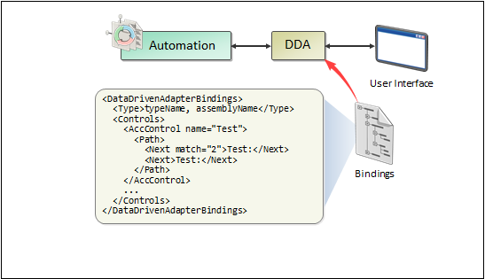

# Hosted Application Toolkit (HAT) architecture
This topic illustrates the components of [!INCLUDE[pn_hosted_application_toolkit_hat](../includes/pn-hosted-application-toolkit-hat.md)] and the application startup process.  
  
## HAT components  
  
- **Data-driven adapters (DDAs)**: DDAs are generic assemblies that interact with the hosted application's user interface (UI). The [!INCLUDE[pn_uii_acronym](../includes/pn-uii-acronym.md)] SDK ships with four types of DDAs:  
  
  - **UIADataDrivenAdapter** – This DDA uses the UI Automation framework that shipped with [!INCLUDE[pn_NET_Framework_4_long](../includes/pn-net-framework-4-long.md)] to interact with Windows-based applications, [!INCLUDE[pn_ms_Windows_Presentation_Foundation](../includes/pn-ms-windows-presentation-foundation.md)], [!INCLUDE[pn_Silverlight_short](../includes/pn-silverlight-short.md)], and web applications.  
  
  - **WinDataDrivenAdapter** – This DDA uses the Microsoft Active Accessibility (MSAA) framework to interact with Windows-based applications.  
  
  - **WebDataDrivenAdapter** – This DDA uses the Document Object Model (DOM) (MSHTML) to interact with web applications.  
  
  - **JavaDataDrivenAdapter** – This DDA uses the [!INCLUDE[pn_Java](../includes/pn-java.md)] Access Bridge (JDK 1.7 or later) to interact with [!INCLUDE[pn_Java](../includes/pn-java.md)] applications.  
  
- **Bindings**: Bindings describe the UI elements with a hosted application and are leveraged by the DDAs.  
  
- **Automations**: Automations are [!INCLUDE[pn_windows_workflow_foundation_wf](../includes/pn-windows-workflow-foundation-wf.md)] workflows that host the business logic. The [!INCLUDE[pn_hosted_application_toolkit_hat](../includes/pn-hosted-application-toolkit-hat.md)] Software Factory provides a set of WF activities to interact with hosted applications. [!INCLUDE[proc_more_information](../includes/proc-more-information.md)] [Using HAT automation activities](../unified-service-desk/automate-hosted-applications-using-hat-automation-activities.md)  
  
  The following illustration shows the [!INCLUDE[pn_hat](../includes/pn-hat.md)] architecture.  
  
    architecture")  
  
## Application startup process  
 The DDA uses bindings and easily identified control names to provide an application’s UI controls to automations. Automations use these names to manage the UI controls. Bindings are provided as part of the initialization string procedure during application startup. The Application Integration Framework extracts these bindings from the initialization string and provides them to the DDA. The following illustration shows the typical process that occurs when an application starts.  
  
   
  
### See also  
 [UII Application Integration Framework](../unified-service-desk/uii-application-integration-framework.md)   
 [Work with HAT Software Factory](../unified-service-desk/work-with-hat-software-factory.md)   
 [Use Data Driven Adapters](../unified-service-desk/use-data-driven-adapters-ddas.md)
