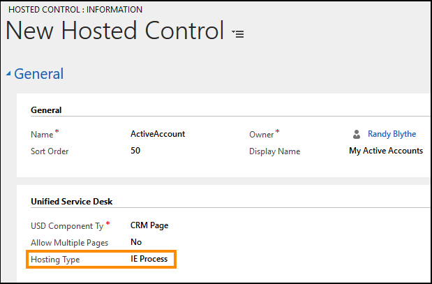

# Use IE Process to host web applications 

> [!Note]
>
> Starting 2022 release wave 1, Internet Explorer and classic Microsoft Edge browsers will be blocked from opening Unified Interface. This will let us further improve the experience by adding browser enhancements that aren't possible on these deprecated browsers. Leading up to the blocked experience, an error message will be shown to users of Internet Explorer.

> [!Note]
>
> Because support for Internet Explorer 11 is deprecated, support for IE Process has also been deprecated in Unified Service Desk. For information: [Deprecation announcement](../customer-service/deprecations-customer-service.md#internetexplorer11).

The `IE Process` browser control hosts your controls in individual [!INCLUDE[pn_Internet_Explorer](../includes/pn-internet-explorer.md)] process instances, and displays them in tabs in the [!INCLUDE[pn_unified_service_desk](../includes/pn-unified-service-desk.md)] client application. It facilitates predictable page rendering by making sure that if your web application works in [!INCLUDE[pn_Internet_Explorer](../includes/pn-internet-explorer.md)], it will work in [!INCLUDE[pn_unified_service_desk](../includes/pn-unified-service-desk.md)]. You can select **IE Process** as the hosting method for the **CRM Dialog**, **CRM Page**, **KM Control**, **Unified Interface Page**, **Unified Interface KM Control** and **Standard Web Application** type of hosted controls.

 

> [!NOTE]
> To use the **IE Process** browser control, you must select the **Enable Protected Mode** check box for the **Local Intranet** security zone in Internet Explorer. More information: [What does Internet Explorer protected mode do?](https://windows.microsoft.com/windows-vista/What-does-Internet-Explorer-protected-mode-do)
>
>  If enabling protected mode for intranet sites is not feasible, you must instead add the following URLs to the **Restricted Sites** security zone in Internet Explorer:
>
> - `http://close`
> - `http://event`
> - `http://uii`
>
> [!INCLUDE[proc_more_information](../includes/proc-more-information.md)] [Security zones: adding or removing websites](https://windows.microsoft.com/windows/security-zones-adding-removing-websites#1TC=windows-7)
>
>  If you do not enable the protected mode for the **Local Intranet** security zone or add the above URLs to the **Restricted Sites** security zone, blank pages with `http://event?eventname=usdreload` in the address bar will pop up for users when they work in the [!INCLUDE[pn_unified_service_desk](../includes/pn-unified-service-desk.md)] client. [!INCLUDE[proc_more_information](../includes/proc-more-information.md)] [Blog: IE Process mode gives http://event popup](/archive/blogs/usd/ie-process-mode-gives-httpevent-popup)

## Memory and performance enhancements

The `IE Process` browser control offers significant memory and performance enhancements:

### Better memory management

[!INCLUDE[pn_Internet_Explorer](../includes/pn-internet-explorer.md)] process instances used for hosting your webpages are now hosted outside of the [!INCLUDE[pn_unified_service_desk](../includes/pn-unified-service-desk.md)] process instance. This significantly reduces the memory footprint of [!INCLUDE[pn_unified_service_desk](../includes/pn-unified-service-desk.md)] when you display or work with multiple controls at the same time within the client application.

### Improved stability and performance

The [!INCLUDE[pn_Internet_Explorer](../includes/pn-internet-explorer.md)] process instances used for hosting your webpages are isolated from each other so that when a hosted control becomes unresponsive in the client application, all the other hosted control tabs along with the [!INCLUDE[pn_unified_service_desk](../includes/pn-unified-service-desk.md)] client application continue to remain operational. Also, the [!INCLUDE[pn_unified_service_desk](../includes/pn-unified-service-desk.md)] Monitoring Process (usdmp.exe) service continuously monitors the health of [!INCLUDE[pn_unified_service_desk](../includes/pn-unified-service-desk.md)],  and terminates any browser process instances that are unresponsive and causing [!INCLUDE[pn_unified_service_desk](../includes/pn-unified-service-desk.md)] to freeze. If a browser process instance isn’t responding, but [!INCLUDE[pn_unified_service_desk](../includes/pn-unified-service-desk.md)] is responsive, the browser process instance won’t be terminated.

Use the `ProcessTerminationThreshold` option in [!INCLUDE[pn_unified_service_desk](../includes/pn-unified-service-desk.md)] to specify the timeout period for the duration (in milliseconds) that the [!INCLUDE[pn_unified_service_desk](../includes/pn-unified-service-desk.md)] Monitoring Process (usdmp.exe) service waits before terminating an unresponsive [!INCLUDE[pn_Internet_Explorer](../includes/pn-internet-explorer.md)] process that's causing [!INCLUDE[pn_unified_service_desk](../includes/pn-unified-service-desk.md)] to become unresponsive. Valid range is between 0 and 30000. If set to 0, the [!INCLUDE[pn_unified_service_desk](../includes/pn-unified-service-desk.md)] Monitoring Process (usdmp.exe) service won't start, and won't monitor [!INCLUDE[pn_unified_service_desk](../includes/pn-unified-service-desk.md)] for unresponsive behavior. If set to any other value within the range, [!INCLUDE[pn_unified_service_desk](../includes/pn-unified-service-desk.md)] automatically starts the monitoring process. The default value is 5000 milliseconds (5 seconds). For more information about setting this option, see [Manage Options for Unified Service Desk](admin/manage-options-unified-service-desk.md)

> [!NOTE]
>  When you create an instance of a **CRM Dialog**, **CRM Page**, **KM Control**, or **Standard Web Application** type of hosted control, the **Hosting Type** field in the `New Hosted Control` form is set to `IE Process` as the default option. Previously,  `Internal WPF` used to be the default hosting type option. You can select **Internal WPF** instead for your hosted control, if required.

### See also

[Create or edit a hosted control](../unified-service-desk/create-edit-hosted-control.md)  
[Hosted control types and action/event reference](../unified-service-desk/hosted-control-types-action-event-reference.md)  
[Manage hosted controls, actions, and events](../unified-service-desk/manage-hosted-controls-actions-events.md)  

[!INCLUDE[footer-include](../includes/footer-banner.md)]
