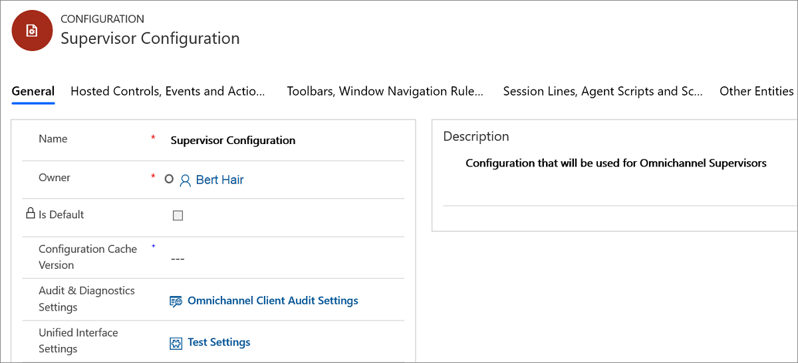

# Create agent and supervisor configurations in Unified Service Desk

[!INCLUDE[cc-data-platform-banner](../../includes/cc-data-platform-banner.md)]

[!INCLUDE[cc-use-with-omnichannel](../../includes/cc-use-with-omnichannel.md)]

A configuration in Unified Service Desk helps you filter access to components that are shown to users in the Omnichannel for Customer Service application. Follow these steps to create an agent configuration and a supervisor configuration.

1.  Sign in to the Dynamics 365 instance.

2.  Go to **Settings** > **Unified Service Desk**.

3.  Select **Configuration**.

4.  Select **New**.

5.  On the **New Configuration** page, in the **Name** field, type **Omnichannel Agent Configuration** and then select **Save**.

6.  Now, repeat the step 4 and 5 to create **Omnichannel Supervisor Configuration**.

Omnichannel Agent Configuration

 > [!div class=mx-imgBorder]
 >   

Omnichannel Supervisor Configuration

 > [!div class=mx-imgBorder]
 >   

> [!div class="nextstepaction"]
> [Next topic: Configure notification (Screen pop) for agents](configure-notification-screen-pop-agents.md)

## See also

- [Omnichannel system customizers](../../customer-service/omnichannel-customizer.md)
- [Customize Customer summary form](../../customer-service/customize-customer-summary.md)
- [Add or remove the fields in the form](../../customer-service/customize-quick-view-form.md)
- [Customize the conversation form](../../customer-service/customize-session-form.md)

[!INCLUDE[footer-include](../../includes/footer-banner.md)]