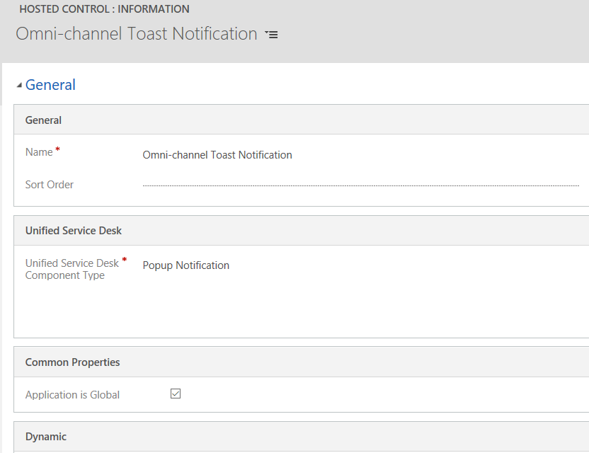

# Step 2: Create hosted control

[!INCLUDE[cc-data-platform-banner](../../includes/cc-data-platform-banner.md)]

[!INCLUDE[cc-use-with-omnichannel](../../includes/cc-use-with-omnichannel.md)]

This topic describes how to create Omnichannel Toast Notification hosted control.

## Prerequisites

- You must have required Dynamics 365 Customer Service permissions to configure [!INCLUDE[pn_unified_service_desk](../../includes/pn-unified-service-desk.md)] and access the required Dynamics 365 Customer Service entities. [!INCLUDE[proc_more_information](../../includes/proc-more-information.md)] [Access management in Unified Service Desk](/dynamics365/customer-engagement/unified-service-desk/admin/security-unified-service-desk)

- You must have completed [Create agent and supervisor configurations in Unified Service Desk](create-agent-supervisor-configurations-unified-service-desk.md) and [Step 1: Create forms to define notification layout](toastnotification-step1-create-forms-define-layout-behavior-notification.md). The configurations that you completed are required for this topic.

- You must be familiar with the following concepts in [!INCLUDE[pn_unified_service_desk](../../includes/pn-unified-service-desk.md)]:  
  
  - [Unified Service Desk Hosted Controls](/dynamics365/customer-engagement/unified-service-desk/unified-service-desk-hosted-controls)  
  
  - These three types of hosted controls: Connection Manager, Global Manager, and Panel Layout. [!INCLUDE[proc_more_information](../../includes/proc-more-information.md)] [Hosted control types, action, and event reference in Unified Service Desk](/dynamics365/customer-engagement/unified-service-desk/hosted-control-types-action-event-reference) 
  
  - Filter access using [!INCLUDE[pn_unified_service_desk](../../includes/pn-unified-service-desk.md)]. [!INCLUDE[proc_more_information](../../includes/proc-more-information.md)] [Manage access using Unified Service Desk configuration](/dynamics365/customer-engagement/unified-service-desk/admin/manage-access-using-unified-service-desk-configuration)

## Create hosted control

1. Sign in to the Dynamics 365 instance.

2. Select the Down arrow next to Dynamics 365.

3. Select **Unified Service Desk Administrator**.

4. Select **Hosted Controls** and select **+ New**.

5. On the page for the new hosted control, specify the following. 

    | Field                                | Value                            |
    |--------------------------------------|----------------------------------|
    | Name                                 | Omnichannel Toast Notification  |
    | Unified Service Desk Component Type  | Popup Notification               |
    | Application is Global                | Select the checkbox              |

 > [!div class=mx-imgBorder] 
 > 

5. Save the form.

> [!div class="nextstepaction"]
> [Next topic: Step 3: Create Omnichannel Toast Notification-related action calls](toastnotification-step3-create-action-call-display-notification.md)

## See also

- [Configure toast notification in Unified Service Desk](configure-toast-notification-unified-service-desk.md)
- [Step 1: Create forms to define layout and behavior of the notification](toastnotification-step1-create-forms-define-layout-behavior-notification.md)
- [Step 4: Attach Omnichannel Toast Notification-related action calls to the events](toastnotification-step4-add-action-calls-events.md)
- [Step 5: Add the hosted control, events, and action calls to the agent and supervisor configurations](toastnotification-step5-add-hosted-controls-events-action-callsagent-supervisor-configurations.md)
- [Configure alert notification in Unified Service Desk](configure-alert-notification-unified-service-desk.md)

[!INCLUDE[footer-include](../../includes/footer-banner.md)]
