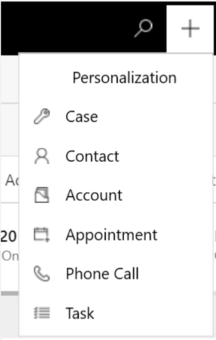
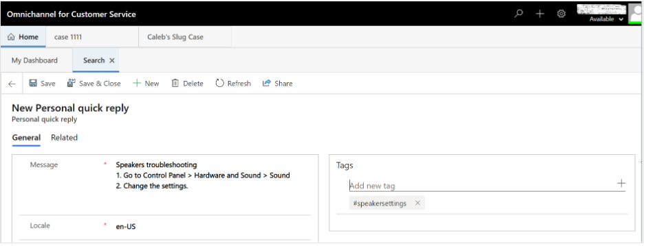

# Create personal quick replies in Omnichannel for Customer Service in Unified Service Desk

[!INCLUDE[cc-use-with-omnichannel](../../includes/cc-use-with-omnichannel.md)]

## Introduction

In Unified Service Desk, you can use the personalization menu that is accessible through the application tab to add *personal quick replies*, also known as *predefined messages*. You can create these quick replies for the common questions and scenarios that you need to address in your role. You can tag the replies with keywords that help you invoke the quick replies when you are interacting with customers.

## Prerequisite

Make sure that you have added a personalization tab. More information: [Add the personalization tab in Omnichannel for Customer Service](../add-personalization-tab.md). 

## Create personal quick replies

You can create, edit, and delete the personal quick replies you own. The quick replies that you create are available on the **Personal** tab in the **Quick replies** panel of the conversation window.

1. Sign in to Omnichannel for Customer Service through Unified Service Desk. 

2. On the home page, select the icon on the Omnichannel toolbar under which the personalization tab was created.

   > [!div class=mx-imgBorder] 
   > 

3. Select **Personalization**.

4. On the **Personal quick replies** tab, select **New Personal quick reply**, and do the following:

    - **Message:** Enter the text you want to use for your reply.

    - **Locale:** Select the locale for the language in which you want to create the quick reply.

        > [!NOTE]
        > Personal quick replies aren't localized in Omnichannel for Customer Service. To provide quick responses in multiple languages, create a separate quick response record for each language and select its corresponding locale.

    > [!div class=mx-imgBorder]
    > 

5. In the **Tags** area, enter the keyword you want to associate with the quick reply, and then select the plus sign (**+**).

6. Select **Save**.

It can take up to 15 minutes for the quick replies to be available for your use.

## Use personal quick replies

The quick replies you created are available on the **Personal** tab, and those created by the administrator are available on the **All** tab. Use personal quick replies when you are in a conversation with a customer by doing the following:

1. Select the quick responses icon  at the bottom of your conversation window. The **Quick replies** panel displays the available predefined messages on the **All** and **Personal** tabs.
2. Select the **Personal** tab, and then type the number sign (**#**) in the compose box to list the tags and search for the personal quick replies that are available for your use.
3. Use the **more** option to view the complete text of the quick reply.

### See also

[Send quick replies in the chat](left-control-panel.md#send-quick-replies-in-the-chat)  