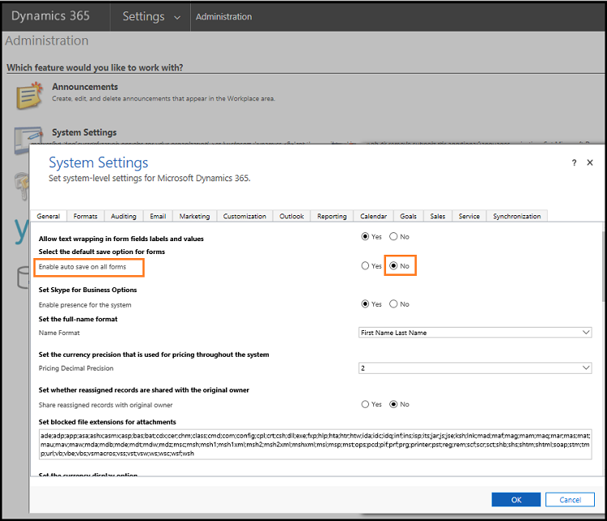

# Release notes of Unified Service Desk 4.0

This section describes the known issues and limitations in [!INCLUDE[pn-unified-service-desk-4-0](../includes/pn-unified-service-desk-4-0.md)]

## Known issues

This section describes the limitations in [!INCLUDE[pn_unified_service_desk](../includes/pn-unified-service-desk.md)]

### Toolbar shows Unified Blue theme instead Air theme

In the **Unified Interface Settings** record, select **Air** theme instead **Unified Blue** theme, and select an Unified Interface App. 

Now, if you login to [!INCLUDE[pn_unified_service_desk](../includes/pn-unified-service-desk.md)], the **About Tool Bar** and **Main** toolbar chooses to show **Unified Blue** theme colors instead **Air** theme.

#### Workaround

Remove the **Custom Styles** XAML from the **About Tool Bar** and **Main** toolbar so that toolbar picks the **Air** theme colors.

1. Sign in to [!INCLUDE[pn_microsoftcrm](../../includes/pn-microsoftcrm.md)]

2. Go to **Settings** > **My Apps** > **Unified Service Desk Administrator** app. 

3. Select **Site Map**. 

4. Choose **Toolbars** under the **Basic Settings**.

5. Select **About Tool Bar** from the list.

6. Choose the **Styles** tab.

7. Remove the content in the **Custom Styles** field.

8. Select **Save** to save the settings. 

Repeat the steps 5-8 for the **Main** toolbar.

Login to [!INCLUDE[pn_unified_service_desk](../includes/pn-unified-service-desk.md)] and toolbar chooses **Air** theme colors.

### Unified Interface form does not close the tab and navigates to Dashboard

Go to **Settings** > **Administration** > **System Settings** and set the **Enable auto save on all forms** to **No** in Dynamics 365 Unified Interface. 

Now, login to [!INCLUDE[pn_unified_service_desk](../includes/pn-unified-service-desk.md)], and open any Unified Interface page. For example, open a case. After completing your work on the case, if you select **Save & Close** on the Unified Interface page (form), the form saves and closes.

However, the tab does not close, and the Unified Interface page (form) navigates to **Dashboard** page.

#### Workaround

To close the tab, you need to select **User Can Close** in the hosted control so that you see **X** button the tab in [!INCLUDE[pn_unified_service_desk](../includes/pn-unified-service-desk.md)]. 

Now, login to [!INCLUDE[pn_unified_service_desk](../includes/pn-unified-service-desk.md)], and open the case. Now, select **Save & Close** on the Unified Interface page (form), the form saves and closes. The page navigates to the **Dashboard** page. To close the tab, you can select the **X** button.

## Limitations

This section describes the limitations in [!INCLUDE[pn_unified_service_desk](../includes/pn-unified-service-desk.md)]

> [!Note]
> There are no limitations in [!INCLUDE[pn_unified_service_desk](../includes/pn-unified-service-desk.md)]
