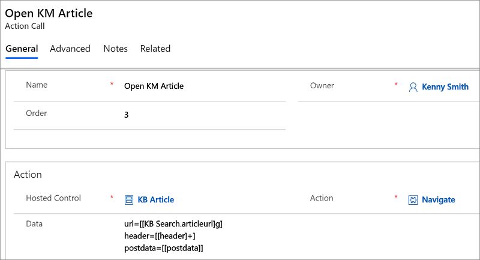

# Release notes of Unified Service Desk 4.0

This section describes the known issues and limitations in [!INCLUDE[pn-unified-service-desk-4-0](../includes/pn-unified-service-desk-4-0.md)]

## Known issues

This section describes the limitations in [!INCLUDE[pn_unified_service_desk](../includes/pn-unified-service-desk.md)]

### Manually remove data parameters in Unified Interface KM Control action call when using Web client - Unified Interface Migration Assistant

If you are using **Web client - Unified Interface Migration Assistant** to migrate your Unified Service Desk Configurations from Dynamics 365 Web Client to Dynamics 365 Unified Interface App, you must manually update a data parameter for the Unified Interface KM Control action call.

In the Dynamics 365 Web Client configurations, if you have configured an action call for opening the KM, the **Data** field may have certain data parameters like **url**, **postdata**, and **header**.

After migrating the configurations from Dynamics 365 Web Client to Dynamics 365 Unified Interface App using the migration assistant, go to the corresponding action call and remove the **postdata** and **header** from the **Data** field. 

To open an KB article, only the article url is sufficient. For example: `url=[[KB Search.articleurl]g]`

### Toolbar shows Unified Blue theme instead Air theme

In the **Unified Interface Settings** record, select **Air** theme instead **Unified Blue** theme, and select an Unified Interface App. 

Now, if you login to [!INCLUDE[pn_unified_service_desk](../includes/pn-unified-service-desk.md)], the **About Tool Bar** and **Main** toolbar chooses to show **Unified Blue** theme colors instead **Air** theme.

#### Workaround

Remove the **Custom Styles** XAML from the **About Tool Bar** and **Main** toolbar so that toolbar picks the **Air** theme colors.

1. Sign in to [!INCLUDE[pn_microsoftcrm](../includes/pn-microsoftcrm.md)]

2. Go to **Settings** > **My Apps** > **Unified Service Desk Administrator** app. 

3. Select **Site Map**. 

4. Choose **Toolbars** under the **Basic Settings**.

5. Select **About Tool Bar** from the list.

6. Choose the **Styles** tab.

7. Remove the content in the **Custom Styles** field.

8. Select **Save** to save the settings. 

Repeat the steps 5-8 for the **Main** toolbar.

Login to [!INCLUDE[pn_unified_service_desk](../includes/pn-unified-service-desk.md)] and toolbar chooses **Air** theme colors.

### Unified Interface form does not close the tab and navigates to Dashboard

Go to **Settings** > **Administration** > **System Settings** and set the **Enable auto save on all forms** to **No** in Dynamics 365 Unified Interface. 

Now, login to [!INCLUDE[pn_unified_service_desk](../includes/pn-unified-service-desk.md)], and open any Unified Interface page. For example, open a case. After completing your work on the case, if you select **Save & Close** on the Unified Interface page (form), the form saves and closes.

However, the tab does not close, and the Unified Interface page (form) navigates to **Dashboard** page.

#### Workaround

To close the tab, you need to select **User Can Close** in the hosted control so that you see **X** button the tab in [!INCLUDE[pn_unified_service_desk](../includes/pn-unified-service-desk.md)]. 

Now, login to [!INCLUDE[pn_unified_service_desk](../includes/pn-unified-service-desk.md)], and open the case. Now, select **Save & Close** on the Unified Interface page (form), the form saves and closes. The page navigates to the **Dashboard** page. To close the tab, you can select the **X** button.

## Limitations

This section describes the limitations in [!INCLUDE[pn_unified_service_desk](../includes/pn-unified-service-desk.md)]

### Support for Relevance Search (search technique) in Unified Interface KM Control

The Unified Interface KM Control supports [Full-Text search](https://docs.microsoft.com/en-us/sql/relational-databases/search/full-text-search?view=sql-server-2017) technique in Dynamics 365 and does not support the **Relevance Search**. For more information about the availability of the Relevance Search, see [Relevance search for knowledge management](https://docs.microsoft.com/en-us/business-applications-release-notes/October18/service/customer-service-core-release-notes/relevance-search-for-knowledge-management).

### Quick create in Unified Service Administrator app

Selecting the **New** button (quick create)  in the **Navigation** toolbar of the Unified Service Desk Administraor app does not display any option to create.

### Navigation and command bar configuration does not execute when Internet Explorer pooling is enabled

By default, when you a open Dynamics 365 page in [!INCLUDE[pn_unified_service_desk](../includes/pn-unified-service-desk.md)] client application, the navigation bar is hidden and command bar is displayed. 

However, when you enable Internet Explorer pooling and change the configurations in Dynamics 365 to hide the command bar and display the navigation bar, the Dynamics 365 page in [!INCLUDE[pn_unified_service_desk](../includes/pn-unified-service-desk.md)] client application does hide the command bar and display the navigation bar.

To execute the configuration, disable the Internet Explorer pooling.

## See Also

[Unified Interface KM Control (hosted control)](unified-interface-km-control-hosted-control.md)