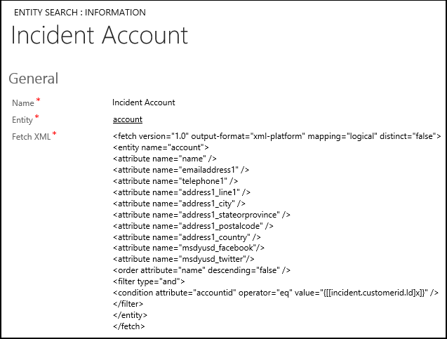

# Search data using entity searches in Unified Service Desk
Entity searches are FetchXML definitions that query the [!INCLUDE[pn_microsoftcrm](../includes/pn-microsoftcrm.md)] web services to return data. You can also use replacement parameters within the FetchXML queries in an entity search. Entity searches can be used in window navigation rules both as a source to access data which is not displayed on the form, and as a destination to look up the data using a web service call to [!INCLUDE[pn_crm_shortest](../includes/pn-crm-shortest.md)], and then populate the [!INCLUDE[pn_unified_service_desk](../includes/pn-unified-service-desk.md)] context data so that it can be used in replacement parameters. You can also use entity searches in the [DoSearch](../unified-service-desk/global-manager-hosted-control.md#DoSearch) action for the Global Manager hosted control to search for your data.  
  
 You define an entity search in the **Entity Searches** area (**Settings** > **Unified Service Desk** > **Entity Searches**) in [!INCLUDE[pn_crm_shortest](../includes/pn-crm-shortest.md)]. To define an entity search, you need to specify three things: a name, the entity that the search applies to, and the FetchXML query that represents the query to retrieve data from the server.  
  
 The following FetchXML query returns name and address details of an account based on a customer ID available from a case:  
  
```  
<fetch version="1.0" output-format="xml-platform" mapping="logical" distinct="false">  
  <entity name="account">  
    <attribute name="name" />  
    <attribute name="emailaddress1" />  
    <attribute name="telephone1" />     
    <attribute name="address1_line1" />  
    <attribute name="address1_city" />  
    <attribute name="address1_stateorprovince" />  
    <attribute name="address1_postalcode" />  
   <attribute name="address1_country" />  
   <attribute name="msdyusd_facebook"/>  
   <attribute name="msdyusd_twitter"/>  
    <order attribute="name" descending="false" />  
    <filter type="and">  
      <condition attribute="accountid" operator="eq" value="{[[incident.customerid.Id]x]}" />  
    </filter>  
  </entity>  
</fetch>  
```  
  
 This is how the entity search definition looks like:  
  
   
  
> [!IMPORTANT]
>  While defining FetchXML queries in an entity search, you should only return the fields that are required for the purpose. This minimizes the impact on the network by limiting the size of the request and the data being returned, thus optimizing the resource usage.  
  
 Developers can also reuse an existing entity search definition in their code to search for records in Dynamics 365. [!INCLUDE[proc_more_information](../includes/proc-more-information.md)] [Reuse Entity Search definition in your custom code](../unified-service-desk/reuse-entity-search-definition-custom-code.md)  
  
### See also  
 [Reuse Entity Search definition in your custom code](../unified-service-desk/reuse-entity-search-definition-custom-code.md)   
 [Use window navigation rules in Unified Service Desk](../unified-service-desk/use-window-navigation-rules-unified-service-desk.md)   
 [Action calls](../unified-service-desk/action-calls.md)   
 [Learn to configure Unified Service Desk](../unified-service-desk/learn-to-use-unified-service-desk.md)   
 [Walkthrough: Use the generic listener adapter for CTI event routing](../unified-service-desk/walkthrough-use-the-generic-listener-adapter-for-cti-event-routing.md)
