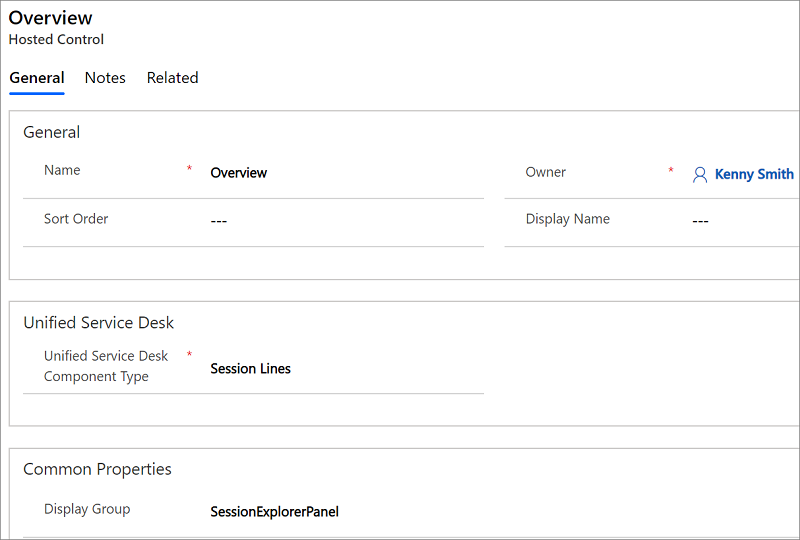

# Session Lines (Hosted Control)
Use **Session Lines** type of hosted control to configure session overview information for sessions in your agent application. This hosted control reads the overview information that you configure in your agent application using **Session Lines** (**Settings** > **Unified Service Desk** > **Session Lines**), and an instance of this hosted control type must be available in your agent application for the session overview information to be displayed. For more information about session overview, see [Session overview](../unified-service-desk/session-management-unified-service-desk.md#SessionOverview) and [Define session overview information](../unified-service-desk/configure-session-information.md#SessionOverview).  
  
   
## Create a Session Lines hosted control  
 While creating a new hosted control, the fields in the **New Hosted Control** screen vary based on the type of hosted control you want to create. This section provides information about the specific fields that are unique to the **Session Lines** hosted control type. For detailed information about creating a hosted control, see [Create or edit a hosted control](../unified-service-desk/create-edit-hosted-control.md).  
  
   
  
 In the New Hosted Control screen:  
  
- Under **[!INCLUDE[pn_unified_service_desk](../includes/pn-unified-service-desk.md)]** area, select **Session Lines** from the **Unified Service Desk Component Type** drop-down list.  
  
- The **Display Group** field displays the panel where this hosted control will be displayed. **SessionExplorerPanel** is the most common panel for this hosted control type. For information about various panels available in [!INCLUDE[pn_unified_service_desk](../includes/pn-unified-service-desk.md)], see [Panels in Unified Service Desk](../unified-service-desk/panels-panel-types-panel-layouts.md#Panels)  
  
  For information about **General** fields, see [Create or edit a hosted control](../unified-service-desk/create-edit-hosted-control.md).  
  
   
## Predefined UII actions  
 These are the predefined actions for this hosted control type.  
  
### FireEvent  
 Fires a user-defined event from this hosted control.  
  
|Parameter|Description|  
|---------------|-----------------|  
|name|Name of the user-defined event.|  
  
 All subsequent name=value pairs become the parameters to the event. For more information about creating a user-defined event, see [Create a user-defined event](../unified-service-desk/create-user-defined-event.md).  
  
### RealignWindow  
[!INCLUDE[cc_RealignWindow_Action](../includes/cc-realignwindow-action.md)]
  
   
## Predefined events  
 There aren’t any predefined events for this hosted control type.  
  
### See also  
 [Session management in Unified Service Desk](../unified-service-desk/session-management-unified-service-desk.md)   
 [Session Tabs (Hosted Control)](../unified-service-desk/session-tabs-hosted-control.md)   
 [Walkthrough 5: Display enhanced session information by displaying session name and overview data](../unified-service-desk/walkthrough-5-display-enhanced-session-information-displaying-session-name-overview-data.md)   
 [Hosted control types and action/event reference](../unified-service-desk/hosted-control-types-action-event-reference.md)
