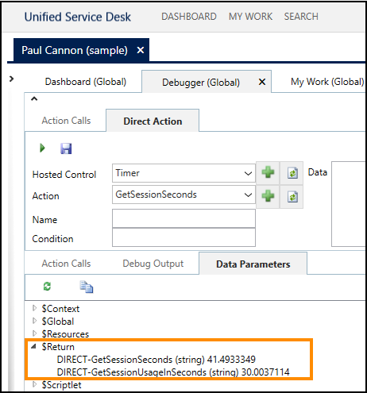

# Session Timer (Custom Hosted Control)
In [!INCLUDE[pn_unified_service_desk](../includes/pn-unified-service-desk.md)], the session timer (`Timer`) hosted control displays the elapsed time in seconds since a session was started, and uses different colors to specify the threshold time limits.  
  
 The `Timer` hosted control isn’t one of the predefined hosted controls; it’s a custom control that is available when you deploy one of the sample [!INCLUDE[pn_unified_service_desk](../includes/pn-unified-service-desk.md)] applications on your Common Data Service platform instance. The `Timer` hosted control is displayed in the status panel of your client application whenever a session is started.  
  
<a name="Actions"></a>   
## Actions for the Timer hosted control  
 The following actions are supported by the `Timer` control:  
  
- `GetSessionSeconds`: Returns the total time, in seconds, that the session lasted.  
  
- `GetSessionUsageInSeconds`: Returns the total time, in seconds, when the customer service rep was active in the current session.  
  
  You can use these two actions in your action calls to return session timer values. However, before you can use these actions in your action calls, you’ll have to manually add these UII actions to the `Timer` hosted control instance. [!INCLUDE[proc_more_information](../includes/proc-more-information.md)] [Add a UII action to a hosted control](../unified-service-desk/add-uii-action-hosted-control.md)  
  
  The values are returned and displayed under the `$Return` replacement parameter. To test the values returned by these two actions:  
  
1. Start [!INCLUDE[pn_unified_service_desk](../includes/pn-unified-service-desk.md)] client and connect to your Dynamics 365 Customer Engagement apps instance.  
  
2. Click the **My Work** menu, and then click a case record to open a session.  
  
3. Click **Settings** () at the top-right corner to display the `Debugger` control.  
  
4. On the **Direct Action** tab, select `Timer` from the **Hosted Control** list, the action name from the **Action** list, and click **Run Direct Action** (). Repeat this step for the other action.  
  
5. Click **Refresh** () to refresh the replacement parameter grid. Expand the `$Return` parameter to view the value (time in seconds) returned by the `GetSessionUsageInSeconds` and `GetSessionSeconds` actions.  
  
     
  
<a name="ConfigureThreshold"></a>   
## Configure threshold limits and colors for the Timer hosted control  
 You can configure the threshold time limits and colors for the `Timer` hosted control by specifying the values in an `XML` format in the `Extensions XML` field of the hosted control definition. The threshold color defines the color that the session timer is displayed in after the specified threshold time values have elapsed since the session started. Use hexadecimal color codes to specify the threshold color.  
  
 For example, the following XML defines the background color of the time string to be gray, the time string to change to orange when 60 seconds have elapsed, and then finally change to red when 90 seconds have elapsed since the current session started.  
  
```xml  
<thresholds>  
   <threshold backgroundcolor="#E4E4E4" />  
   <threshold foregroundcolor="#FF9900" seconds="60"/>  
   <threshold foregroundcolor="#FF0000" seconds="90"/>  
</thresholds>  
```  
  
 To configure threshold limits and colors for the `Timer` hosted control:  
  
1. [!INCLUDE[proc_settings_usd](../includes/proc-settings-usd.md)]  
  
2. Click **Hosted Controls**.  
  
3. Search for the `Timer` hosted control, and click the hosted control name to open its definition.  
  
4. In the `Timer` hosted control definition form, update the XML in the **Extensions XML** field to specify the threshold limit and corresponding colors.  
  
5. Save the hosted control definition.  
  
### See also  
 [USD Hosted Control (Hosted Control)](../unified-service-desk/usd-hosted-control-hosted-control.md)   
 [Hosted control types and action/event reference](../unified-service-desk/hosted-control-types-action-event-reference.md)
