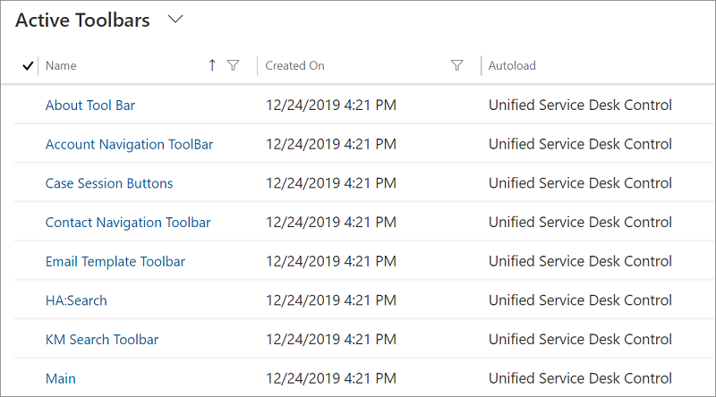
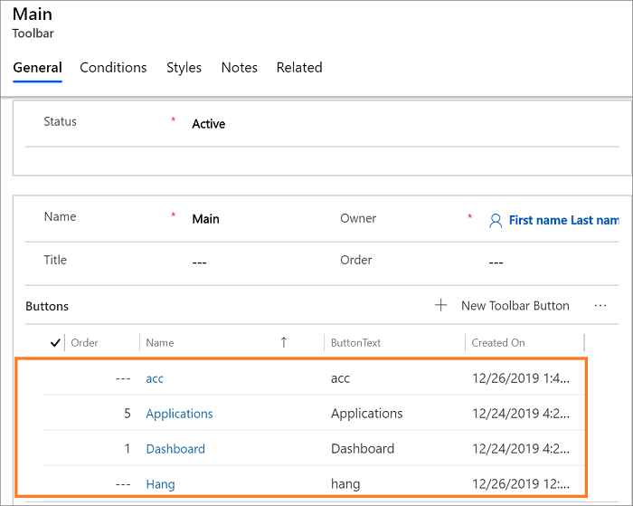
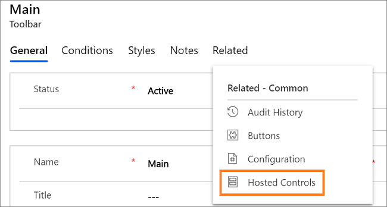
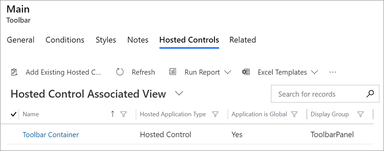

# Toolbars in Unified Service Desk
Toolbars in [!INCLUDE[pn_unified_service_desk_for_crm](../includes/pn-unified-service-desk-for-crm.md)] hold and display a list of buttons with images and text. Clicking or tapping the buttons can execute one or more actions.  
  
 Here is the **Main** toolbar in one of the [!INCLUDE[pn_unified_service_desk](../includes/pn-unified-service-desk.md)] sample applications.  
  
   
  
 You configure toolbars in [!INCLUDE[pn_microsoftcrm](../includes/pn-microsoftcrm.md)] in the **Settings** > **Unified Service Desk** > **Toolbars** area. Furthermore, each toolbar is attached to a **Toolbar Container** type of hosted control, which in turn is attached to a display area (panel) in [!INCLUDE[pn_unified_service_desk](../includes/pn-unified-service-desk.md)]. This is done to specify the panel where the toolbar will display in the client application.  
  
 The following image shows the existing toolbars in a [!INCLUDE[pn_unified_service_desk](../includes/pn-unified-service-desk.md)] sample application.  
  
   
  
## Understanding components in a toolbar  
 Click any toolbar name under the **Name** column to view the buttons inside the toolbar, action calls for each button, and the toolbar container that the toolbar is attached to.  
  
 For an example of how to do this, click **Main** on the toolbars page.  
  
- **Toolbar buttons**: The toolbar page displays the buttons in the **Main** toolbar. The order of the buttons determines the placement of buttons from left to right in an ascending order. You can add, remove, or edit an existing button. 
  
   
  
- **Properties of a toolbar button**: To view the properties of a button, such as name, image, button label, tooltip, shortcut key, and action calls associated with a button, click any of the button names. For example, clicking **Dashboard** displays the following information for the button.  
  
   
  
- **Toolbar Container**: To view the toolbar container hosted control associated with the **Main** toolbar, click the down arrow next to the **Main** toolbar on the nav bar, and select **Hosted Controls**.  
  
   
  
     The name of the toolbar container attached to the **Main** toolbar is displayed.  
  
 

 - **Custom styles in toolbar**: You can now customize the toolbar in [!INCLUDE[pn_unified_service_desk](../includes/pn-unified-service-desk.md)] using the custom styles field in the Toolbar configuration window.  The Custom Styles field supports Extensible Application Markup Language (XAML) that defines <xref:System.Windows.ResourceDictionary> of <xref:System.Windows.Style> and <xref:System.Windows.Media.Brush> resources.
 
The resources in the dictionary refers to other resources that are available on [!INCLUDE[pn_unified_service_desk](../includes/pn-unified-service-desk.md)] client application. Loading and parsing the XAML string is performed at runtime to create <xref:System.Windows.ResourceDictionary> and merge the resources of the toolbar control with the <xref:System.Windows.ResourceDictionary>. In addition, the <xref:System.Windows.ResourceDictionary> can have styles for button types inside a toolbar. Using the styles, you can customize the toolbars and buttons.

```XAML
<ResourceDictionary xmlns="http://schemas.microsoft.com/winfx/2006/xaml/presentation" 
xmlns:x="http://schemas.microsoft.com/winfx/2006/xaml" 
xmlns:usd="clr-namespace:Microsoft.Crm.UnifiedServiceDesk.Dynamics;assembly=Microsoft.Crm.UnifiedServiceDesk.Dynamics" 
xmlns:controlStyles="clr-namespace:Microsoft.Crm.UnifiedServiceDesk.Dynamics.Controls.Styles;assembly=Microsoft.Crm.UnifiedServiceDesk.Dynamics" 
xmlns:usdPanelLayouts="clr-namespace:Microsoft.Crm.UnifiedServiceDesk.Dynamics.PanelLayouts;assembly=Microsoft.Crm.UnifiedServiceDesk.Dynamics" 
xmlns:themes="clr-namespace:Microsoft.Windows.Themes;assembly=PresentationFramework.Luna" 
xmlns:control="clr-namespace:Microsoft.Crm.UnifiedServiceDesk.Dynamics.Controls;assembly=Microsoft.Crm.UnifiedServiceDesk.Dynamics"> 
 
  <Style x:Key="ToolBarMainPanelBorderStyle" TargetType="{x:Type Border}"> 
        <Setter Property="Margin" Value="0,0,0,0"/> 
        <Setter Property="CornerRadius" Value="3,3,3,3"/> 
        <Setter Property="KeyboardNavigation.TabNavigation" Value="Continue"/> 
        <Style.Triggers> 
            <DataTrigger Binding="{Binding Source={x:Static SystemParameters.HighContrast}}" Value="true"> 
                <Setter Property="CornerRadius" Value="0,0,0,0"/> 
            </DataTrigger> 
        </Style.Triggers> 
    </Style> 
 
 <Style x:Key="ToolBarThumbStyle" TargetType="{x:Type Thumb}"> 
        <Setter Property="Template"> 
            <Setter.Value> 
                <ControlTemplate TargetType="{x:Type Thumb}"> 
                    <Border Background="Transparent" Padding="{TemplateBinding Padding}" SnapsToDevicePixels="True"> 
                        <Rectangle> 
                            <Rectangle.Fill> 
                                <DrawingBrush TileMode="Tile" Viewbox="0,0,4,4" Viewport="0,0,4,4" ViewportUnits="Absolute" ViewboxUnits="Absolute"> 
                                    <DrawingBrush.Drawing> 
                                        <DrawingGroup> 
                                            <GeometryDrawing Brush="White" Geometry="M 1 1 L 1 3 L 3 3 L 3 1 z"/> 
                                            <GeometryDrawing Brush="{DynamicResource ToolBarGripper}" Geometry="M 0 0 L 0 2 L 2 2 L 2 0 z"/> 
                                        </DrawingGroup> 
                                    </DrawingBrush.Drawing> 
                                </DrawingBrush> 
                            </Rectangle.Fill> 
                        </Rectangle> 
                    </Border> 
                    <ControlTemplate.Triggers> 
                        <Trigger Property="IsMouseOver" Value="true"> 
                            <Setter Property="Cursor" Value="SizeAll"/> 
                        </Trigger> 
                    </ControlTemplate.Triggers> 
                </ControlTemplate> 
            </Setter.Value> 
        </Setter> 
    </Style> 
 
<Style x:Key="ToolBarHorizontalOverflowButtonStyle" TargetType="{x:Type ToggleButton}"> 
<Setter Property="Background" Value="Transparent"/> 
<Setter Property="MinHeight" Value="0"/> 
<Setter Property="MinWidth" Value="0"/> 
<Setter Property="KeyboardNavigation.TabNavigation" Value="Continue"/> 
<Setter Property="Template"> 
<Setter.Value> 
<ControlTemplate TargetType="{x:Type ToggleButton}"> 
<Border x:Name="Bd" Background="Transparent" CornerRadius="0" SnapsToDevicePixels="true"> 
<Image Source="{DynamicResource ImageMoreToolBarButtons}" Margin="7,5,7,5" Width="16" Height="16" VerticalAlignment="Bottom" HorizontalAlignment="Right" 
   AutomationProperties.Name="More Menu"></Image> 
</Border> 
<ControlTemplate.Triggers> 
<Trigger Property="IsMouseOver" Value="true"> 
<Setter Property="Background" TargetName="Bd" Value="{DynamicResource USDTabBackgroundBrush}"/> 
</Trigger> 
<Trigger Property="IsKeyboardFocused" Value="true"> 
<Setter Property="Background" TargetName="Bd" Value="{DynamicResource USDTabBackgroundBrush}"/> 
<Setter Property="KeyboardNavigation.TabNavigation" Value="Continue"/> 
</Trigger> 
<Trigger Property="IsEnabled" Value="false"> 
<Setter Property="Foreground" Value="{DynamicResource ToolBarGripper}"/> 
</Trigger> 
</ControlTemplate.Triggers> 
</ControlTemplate> 
</Setter.Value> 
</Setter> 
<Style.Triggers> 
<DataTrigger Binding="{Binding Source={x:Static SystemParameters.HighContrast}}" Value="true"> 
<Setter Property="Background" Value="Transparent"/> 
</DataTrigger> 
</Style.Triggers> 
</Style> 
 
<Style x:Key="MainToolBarFocusVisual"> 
    <Setter Property="Control.Template"> 
      <Setter.Value> 
        <ControlTemplate> 
          <Rectangle SnapsToDevicePixels="true" Stroke="White" 
                  StrokeDashArray="1 2" StrokeThickness="1"/> 
        </ControlTemplate> 
      </Setter.Value> 
    </Setter> 
  </Style> 
 
 
<Style x:Key="ToolBarVerticalOverflowButtonStyle" TargetType="{x:Type ToggleButton}"> 
<Setter Property="Background" Value="{DynamicResource NormalBrush}"/> 
<Setter Property="MinHeight" Value="0"/> 
<Setter Property="MinWidth" Value="0"/> 
<Setter Property="KeyboardNavigation.TabNavigation" Value="Continue"/> 
<Setter Property="KeyboardNavigation.DirectionalNavigation" Value="Continue"/> 
<Setter Property="Template"> 
<Setter.Value> 
<ControlTemplate TargetType="{x:Type ToggleButton}"> 
<Border x:Name="Bd" Background="Transparent" CornerRadius="0" SnapsToDevicePixels="true"> 
<Image Source="{DynamicResource ImageMoreToolBarButtons}" Margin="7,5,7,5" Width="16" Height="16" VerticalAlignment="Bottom" HorizontalAlignment="Right" 
   AutomationProperties.Name="More Menu"></Image> 
</Border> 
<ControlTemplate.Triggers> 
<Trigger Property="IsMouseOver" Value="true"> 
<Setter Property="Background" TargetName="Bd" Value="{DynamicResource USDTabBackgroundBrush}"/> 
</Trigger> 
<Trigger Property="IsKeyboardFocused" Value="true"> 
<Setter Property="Background" TargetName="Bd" Value="{DynamicResource USDTabBackgroundBrush}"/> 
<Setter Property="KeyboardNavigation.TabNavigation" Value="Continue"/> 
</Trigger> 
<Trigger Property="IsEnabled" Value="false"> 
<Setter Property="Foreground" Value="{DynamicResource ToolBarGripper}"/> 
</Trigger> 
</ControlTemplate.Triggers> 
</ControlTemplate> 
</Setter.Value> 
</Setter> 
<Style.Triggers> 
<DataTrigger Binding="{Binding Source={x:Static SystemParameters.HighContrast}}" Value="true"> 
<Setter Property="Background" Value="Transparent"/> 
</DataTrigger> 
</Style.Triggers> 
</Style> 
 
<Style TargetType="{x:Type ToolBar}"> 
<Setter Property="Background" Value="Transparent"/> 
<Setter Property="KeyboardNavigation.TabNavigation" Value="Local"/> 
<Setter Property="KeyboardNavigation.DirectionalNavigation" Value="Continue"/> 
<Setter Property="Template"> 
<Setter.Value> 
<ControlTemplate TargetType="{x:Type ToolBar}"> 
<Grid x:Name="Grid" Margin="0,0,0,0" SnapsToDevicePixels="true" Height="42"> 
<Grid x:Name="OverflowGrid" HorizontalAlignment="Right" Margin="0,0,-11,0"> 
<ToggleButton x:Name="OverflowButton" ClickMode="Press" FocusVisualStyle="{x:Null}" IsChecked="{Binding IsOverflowOpen, Mode=TwoWay, RelativeSource={RelativeSource TemplatedParent}}"  
  IsEnabled="{TemplateBinding HasOverflowItems}" Style="{StaticResource ToolBarHorizontalOverflowButtonStyle}" Visibility="Collapsed" 
  Margin="0,0,0,5"> 
</ToggleButton> 
<Popup x:Name="OverflowPopup" AllowsTransparency="true" Focusable="True" IsOpen="{Binding IsOverflowOpen, RelativeSource={RelativeSource TemplatedParent}}" PopupAnimation="{DynamicResource {x:Static SystemParameters.ComboBoxPopupAnimationKey}}" Placement="Bottom" StaysOpen="false"> 
<themes:SystemDropShadowChrome x:Name="Shdw" Color="Transparent"> 
<Border x:Name="ToolBarSubMenuBorder" BorderBrush="{DynamicResource ToolBarMenuBorder}" BorderThickness="1" Background="{DynamicResource ToolBarSubMenuBackground}" RenderOptions.ClearTypeHint="Enabled"> 
<ToolBarOverflowPanel x:Name="PART_ToolBarOverflowPanel" KeyboardNavigation.DirectionalNavigation="Continue" FocusVisualStyle="{x:Null}" Focusable="true" SnapsToDevicePixels="{TemplateBinding SnapsToDevicePixels}" KeyboardNavigation.TabNavigation="Cycle" WrapWidth="200"/> 
</Border> 
</themes:SystemDropShadowChrome> 
</Popup> 
</Grid> 
<Border x:Name="MainPanelBorder" BorderBrush="{TemplateBinding BorderBrush}" BorderThickness="{TemplateBinding BorderThickness}" Background="{TemplateBinding Background}" Padding="{TemplateBinding Padding}" Style="{StaticResource ToolBarMainPanelBorderStyle}"> 
<DockPanel KeyboardNavigation.TabIndex="1" KeyboardNavigation.TabNavigation="Local"> 
<Thumb x:Name="ToolBarThumb" Margin="-3,-1,0,0" Padding="6,5,1,6" Style="{StaticResource ToolBarThumbStyle}"/> 
<ContentPresenter x:Name="ToolBarHeader" ContentSource="Header" HorizontalAlignment="Center" Margin="4,0,4,0" SnapsToDevicePixels="{TemplateBinding SnapsToDevicePixels}" VerticalAlignment="Center"/> 
<ToolBarPanel x:Name="PART_ToolBarPanel" IsItemsHost="true" Margin="0" SnapsToDevicePixels="{TemplateBinding SnapsToDevicePixels}"/> 
</DockPanel> 
</Border> 
</Grid> 
<ControlTemplate.Triggers> 
<Trigger Property="HasOverflowItems" Value="true"> 
<Setter Property="Visibility" TargetName="OverflowButton" Value="Visible"/> 
</Trigger> 
<Trigger Property="IsOverflowOpen" Value="true"> 
<Setter Property="IsEnabled" TargetName="ToolBarThumb" Value="false"/> 
</Trigger> 
<Trigger Property="Header" Value="{x:Null}"> 
<Setter Property="Visibility" TargetName="ToolBarHeader" Value="Collapsed"/> 
</Trigger> 
<Trigger Property="ToolBarTray.IsLocked" Value="true"> 
<Setter Property="Visibility" TargetName="ToolBarThumb" Value="Collapsed"/> 
</Trigger> 
<Trigger Property="HasDropShadow" SourceName="OverflowPopup" Value="true"> 
<Setter Property="Margin" TargetName="Shdw" Value="0,0,5,5"/> 
<Setter Property="SnapsToDevicePixels" TargetName="Shdw" Value="true"/> 
<Setter Property="Color" TargetName="Shdw" Value="#71000000"/> 
</Trigger> 
<Trigger Property="Orientation" Value="Vertical"> 
<Setter Property="Margin" TargetName="Grid" Value="1,3,1,1"/> 
<Setter Property="Style" TargetName="OverflowButton" Value="{StaticResource ToolBarVerticalOverflowButtonStyle}"/> 
<Setter Property="Height" TargetName="ToolBarThumb" Value="10"/> 
<Setter Property="Width" TargetName="ToolBarThumb" Value="Auto"/> 
<Setter Property="Margin" TargetName="ToolBarThumb" Value="-1,-3,0,0"/> 
<Setter Property="Padding" TargetName="ToolBarThumb" Value="5,6,6,1"/> 
<Setter Property="Margin" TargetName="ToolBarHeader" Value="0,0,0,4"/> 
<Setter Property="Margin" TargetName="PART_ToolBarPanel" Value="1,0,2,2"/> 
<Setter Property="DockPanel.Dock" TargetName="ToolBarThumb" Value="Top"/> 
<Setter Property="DockPanel.Dock" TargetName="ToolBarHeader" Value="Top"/> 
<Setter Property="HorizontalAlignment" TargetName="OverflowGrid" Value="Stretch"/> 
<Setter Property="VerticalAlignment" TargetName="OverflowGrid" Value="Bottom"/> 
<Setter Property="Placement" TargetName="OverflowPopup" Value="Right"/> 
<Setter Property="Margin" TargetName="MainPanelBorder" Value="0,0,0,11"/> 
<Setter Property="Background" Value="Transparent"/> 
<Setter Property="KeyboardNavigation.TabNavigation" Value="Local"/> 
<Setter Property="KeyboardNavigation.DirectionalNavigation" Value="Continue"/> 
</Trigger> 
<Trigger Property="IsEnabled" Value="false"> 
<Setter Property="Foreground" Value="{DynamicResource {x:Static SystemColors.GrayTextBrushKey}}"/> 
</Trigger> 
</ControlTemplate.Triggers> 
</ControlTemplate> 
</Setter.Value> 
</Setter> 
<Style.Triggers> 
<DataTrigger Binding="{Binding Source={x:Static SystemParameters.HighContrast}}" Value="true"> 
<Setter Property="Background" Value="Transparent"/> 
</DataTrigger> 
</Style.Triggers> 
</Style> 
 
<Style x:Key="ToolBarButtonBaseStyle"> 
<Setter Property="Control.BorderThickness" Value="0"/> 
<Setter Property="Control.Padding" Value="0"/> 
<Setter Property="Control.Background" Value="Transparent"/> 
<Setter Property="Control.BorderBrush" Value="Transparent"/> 
<Setter Property="Control.Foreground" Value="{DynamicResource ToolBarFontColor}"/> 
<Setter Property="Control.FontFamily" Value="Segoe UI"/> 
<Setter Property="Control.FontSize" Value="12"/> 
</Style> 
 <Style x:Key="ToolbarButtonTemplate" TargetType="{x:Type control:ToolbarButton}" BasedOn="{StaticResource ToolBarButtonBaseStyle}"> 
        <Setter Property="HorizontalContentAlignment" Value="Center"/> 
        <Setter Property="VerticalContentAlignment" Value="Center"/> 
        <Setter Property="VerticalAlignment" Value="Center"/> 
        <Setter Property="FontFamily" Value="Segoe UI"/> 
        <Setter Property="FontSize" Value="14"/> 
        <Setter Property="FocusVisualStyle" Value="{DynamicResource MainToolBarFocusVisual}" /> 
        <Setter Property="Template"> 
            <Setter.Value> 
                <ControlTemplate TargetType="{x:Type control:ToolbarButton}"> 
                    <Border x:Name="Bd" Height="42"  BorderBrush="{TemplateBinding BorderBrush}" BorderThickness="{TemplateBinding BorderThickness}" Background="{TemplateBinding Background}" Padding="{TemplateBinding Padding}" SnapsToDevicePixels="true"> 
                        <StackPanel x:Name="AboutToolBarButtonStackPanel"  Orientation="Horizontal" Margin="7,0,7,0"> 
                            <Image Margin="0,0,7,0" x:Name="Icon" VerticalAlignment="Center" MaxWidth="16" MaxHeight="16" Source="{TemplateBinding Image}"/> 
                            <ContentPresenter Margin="0,7,0,7"  HorizontalAlignment="{TemplateBinding HorizontalContentAlignment}" SnapsToDevicePixels="{TemplateBinding SnapsToDevicePixels}" VerticalAlignment="{TemplateBinding VerticalContentAlignment}"/> 
                        </StackPanel> 
                    </Border> 
                    <ControlTemplate.Triggers> 
                        <Trigger Property="Text" Value="{x:Null}"> 
                            <Setter TargetName="Icon" Property="Margin" Value="0,0,0,0"/> 
                            <Setter TargetName="AboutToolBarButtonStackPanel" Property="Margin" Value="13,0,13,0"/> 
                        </Trigger> 
                        <Trigger Property="Image" Value="{x:Null}"> 
                            <Setter TargetName="Icon" Property="Visibility" Value="Collapsed"/> 
                        </Trigger> 
                        <Trigger Property="IsMouseOver" Value="true"> 
                            <Setter Property="Background" TargetName="Bd" Value="{DynamicResource ToolBarButtonHover}"/> 
                            <Setter Property="Foreground" Value="{DynamicResource ToolBarTextFontHighlightColor}"/> 
                        </Trigger> 
                        <Trigger Property="IsKeyboardFocused" Value="true"> 
                            <Setter Property="Background" TargetName="Bd" Value="{DynamicResource ToolBarButtonHover}"/> 
                            <Setter Property="Foreground" Value="{DynamicResource ToolBarTextFontHighlightColor}"/> 
                        </Trigger> 
                        <Trigger Property="IsEnabled" Value="false"> 
                            <Setter Property="Foreground" Value="{DynamicResource {x:Static SystemColors.GrayTextBrushKey}}"/> 
                        </Trigger> 
                    </ControlTemplate.Triggers> 
                </ControlTemplate> 
            </Setter.Value> 
        </Setter> 
    </Style> 
      <Style x:Key="ToolBarSplitButtonStyle" TargetType="{x:Type control:SplitButton}" BasedOn="{StaticResource ToolBarButtonBaseStyle}" > 
    <Setter Property="HorizontalAlignment" Value="Stretch"/> 
    <Setter Property="VerticalAlignment" Value="Stretch"/> 
    <Setter Property="HorizontalContentAlignment" Value="Stretch"/> 
    <Setter Property="VerticalContentAlignment" Value="Center"/> 
    <Setter Property="Height" Value="42"/> 
      <Setter Property="FocusVisualStyle" Value="{DynamicResource MainToolBarFocusVisual}"/> 
    <Setter Property="Template"> 
      <Setter.Value> 
        <ControlTemplate TargetType="{x:Type control:SplitButton}"> 
          <Border SnapsToDevicePixels="True" Background="{TemplateBinding Background}" BorderBrush="{TemplateBinding BorderBrush}" BorderThickness="{TemplateBinding BorderThickness}"> 
            <StackPanel Orientation="Horizontal" Margin="0,0,0,0"> 
              <Button x:Name="PART_Button"  Margin="0,0,0,0" Style="{DynamicResource ButtonStyle}" AutomationProperties.Name="{Binding Path=(AutomationProperties.Name), RelativeSource={RelativeSource Mode=FindAncestor, AncestorType={x:Type control:SplitButton}}}" FocusVisualStyle="{DynamicResource MainToolBarFocusVisual}" > 
                <StackPanel Orientation="Horizontal"> 
                  <Image x:Name="Icon"  Margin="7,0,7,0" VerticalAlignment="Center" MaxWidth="16" MaxHeight="16" Source="{TemplateBinding Image}"/> 
                  <ContentPresenter x:Name="ToolBarSplitButtonContent" Margin="0,7,7,7" HorizontalAlignment="{TemplateBinding HorizontalContentAlignment}" SnapsToDevicePixels="{TemplateBinding SnapsToDevicePixels}" VerticalAlignment="{TemplateBinding VerticalContentAlignment}"/> 
                </StackPanel> 
              </Button> 
              <Separator Style="{DynamicResource VerticalSeparatorStyle}" Height="1" Width="16" Background="{DynamicResource SeparatorBrush}" Margin="0,0,0,0"/> 
              <Border x:Name="SplitDropDown"> 
                <Path x:Name="DownArrow" Style="{DynamicResource DownArrowGeometryStyle}" Margin="4,4,4,0"/> 
              </Border> 
            </StackPanel> 
          </Border> 
          <ControlTemplate.Triggers> 
            <Trigger Property="Image" Value="{x:Null}"> 
              <Setter TargetName="Icon" Property="Visibility" Value="Collapsed"/> 
              <Setter TargetName="ToolBarSplitButtonContent" Property="Margin" Value="7,7,7,7"/> 
            </Trigger> 
            <Trigger Property="Text" Value="{x:Null}"> 
              <Setter TargetName="ToolBarSplitButtonContent" Property="Margin" Value="0,0,0,0"/> 
            </Trigger> 
            <Trigger SourceName="PART_Button" Property="IsMouseOver" Value="True"> 
              <Setter Property="Background" Value="Transparent" TargetName="SplitDropDown"/> 
              <Setter Property="Background" Value="{DynamicResource ToolBarButtonHover}" TargetName="PART_Button"/> 
            </Trigger> 
            <Trigger SourceName="PART_Button" Property="IsKeyboardFocused" Value="True"> 
              <Setter Property="Background" Value="{DynamicResource ToolBarButtonHover}" TargetName="PART_Button"/> 
            </Trigger> 
            <Trigger SourceName="SplitDropDown" Property="IsMouseOver" Value="True"> 
              <Setter Property="Background" Value="{DynamicResource ToolBarButtonHover}" TargetName="SplitDropDown"/> 
              <Setter Property="Background" Value="Transparent" TargetName="PART_Button"/> 
            </Trigger> 
            <Trigger Property="IsChecked" Value="True"> 
              <Setter Property="Background" Value="{DynamicResource ToolBarButtonHover}"/> 
            </Trigger> 
            <Trigger Property="IsKeyboardFocused" Value="True"> 
              <Setter Property="Background" Value="{DynamicResource ToolBarButtonHover}"/> 
            </Trigger> 
            <MultiTrigger> 
              <MultiTrigger.Conditions> 
                <Condition Property="IsMouseOver" Value="True"/> 
                <Condition Property="IsChecked" Value="True"/> 
              </MultiTrigger.Conditions> 
              <Setter Property="Background" Value="{DynamicResource ToolBarButtonHover}"/> 
            </MultiTrigger> 
            <MultiTrigger> 
              <MultiTrigger.Conditions> 
                <Condition Property="IsKeyboardFocused" Value="True"/> 
                <Condition Property="IsChecked" Value="True"/> 
              </MultiTrigger.Conditions> 
              <Setter Property="Background" Value="{DynamicResource ToolBarButtonHover}"/> 
            </MultiTrigger> 
            <Trigger Property="IsPressed" Value="True"> 
              <Setter Property="Background" Value="{DynamicResource ToolBarButtonHover}"/> 
            </Trigger> 
            <Trigger Property="IsEnabled" Value="False"> 
              <Setter Property="Foreground" Value="{DynamicResource {x:Static SystemColors.GrayTextBrushKey}}"/> 
            </Trigger> 
          </ControlTemplate.Triggers> 
        </ControlTemplate> 
      </Setter.Value> 
    </Setter> 
  </Style> 
</ResourceDictionary> 
```
  
### See also  
 [Configure toolbars in your application](../unified-service-desk/configure-toolbars-application.md)   
 [Walkthrough 2: Display an external webpage in your agent application](../unified-service-desk/walkthrough-2-display-an-external-webpage-in-your-agent-application.md)   
 [Walkthrough 3: Display Microsoft Dynamics 365 records in your agent application](../unified-service-desk/walkthrough-3-display-microsoft-dynamics-365-records-in-your-agent-application.md)