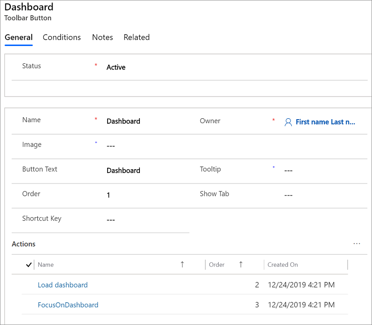

# Toolbars in Unified Service Desk
Toolbars in [!INCLUDE[pn_unified_service_desk_for_crm](../includes/pn-unified-service-desk-for-crm.md)] hold and display a list of buttons with images and text. Clicking or tapping the buttons can execute one or more actions.  
  
 Here is the **Main** toolbar in one of the [!INCLUDE[pn_unified_service_desk](../includes/pn-unified-service-desk.md)] sample applications.  
  
    
  
 You configure toolbars in [!INCLUDE[pn_microsoftcrm](../includes/pn-microsoftcrm.md)] in the **Settings** > **Unified Service Desk** > **Toolbars** area. Furthermore, each toolbar is attached to a **Toolbar Container** type of hosted control, which in turn is attached to a display area (panel) in [!INCLUDE[pn_unified_service_desk](../includes/pn-unified-service-desk.md)]. This is done to specify the panel where the toolbar will display in the client application.  
  
 The following image shows the existing toolbars in a [!INCLUDE[pn_unified_service_desk](../includes/pn-unified-service-desk.md)] sample application.  
  
    
  
## Understanding components in a toolbar  
 Click any toolbar name under the **Name** column to view the buttons inside the toolbar, action calls for each button, and the toolbar container that the toolbar is attached to.  
  
 For an example of how to do this, click **Main** on the toolbars page.  
  
- **Toolbar buttons**: The toolbar page displays the buttons in the **Main** toolbar. The order of the buttons determines the placement of buttons from left to right in an ascending order. You can add, remove, or edit an existing button. 
  
    
  
- **Properties of a toolbar button**: To view the properties of a button, such as name, image, button label, tooltip, shortcut key, and action calls associated with a button, click any of the button names. For example, clicking **Dashboard** displays the following information for the button.  
  
    
  
- **Toolbar Container**: To view the toolbar container hosted control associated with the **Main** toolbar, click the down arrow next to the **Main** toolbar on the nav bar, and select **Hosted Controls**.  
  
    
  
     The name of the toolbar container attached to the **Main** toolbar is displayed.  
  
   

- **Custom styles in toolbar**: You can now customize the toolbar in [!INCLUDE[pn_unified_service_desk](../includes/pn-unified-service-desk.md)] using the custom styles field in the Toolbar configuration window.  The Custom Styles field supports Extensible Application Markup Language (XAML) that defines <xref:System.Windows.ResourceDictionary> of <xref:System.Windows.Style> and <xref:System.Windows.Media.Brush> resources.  The resources in the dictionary refers to other resources that are available on [!INCLUDE[pn_unified_service_desk](../includes/pn-unified-service-desk.md)] client application. Loading and parsing the XAML string is performed at runtime to create <xref:System.Windows.ResourceDictionary> and merge the resources of the toolbar control with the <xref:System.Windows.ResourceDictionary>. In addition, the <xref:System.Windows.ResourceDictionary> can have styles for button types inside a toolbar. Using the styles, you can customize the toolbars and buttons. [!INCLUDE[proc_more_information](../includes/proc-more-information.md)] [Styles in toolbar](configure-toolbars-application.md#styles-in-toolbar)

  

### See also  
 [Configure toolbars in your application](../unified-service-desk/configure-toolbars-application.md)

 [Walkthrough 2: Display an external webpage in your agent application](../unified-service-desk/walkthrough-2-display-an-external-webpage-in-your-agent-application.md)   

 [Walkthrough 3: Display Microsoft Dynamics 365 records in your agent application](../unified-service-desk/walkthrough-3-display-microsoft-dynamics-365-records-in-your-agent-application.md)
