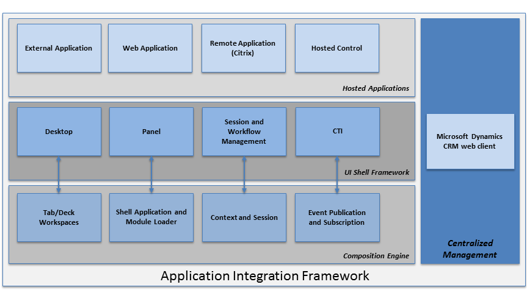
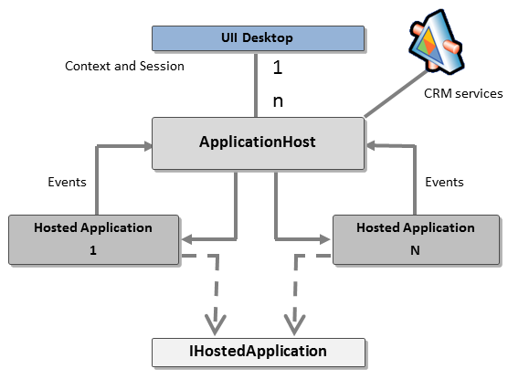

# UII Application Integration Framework
The [!INCLUDE[pn_application_integration_framework_aif](../includes/pn-application-integration-framework-aif-md.md)] in [!INCLUDE[pn_user_inteface_integration_uii](../includes/pn-user-inteface-integration-uii-md.md)] enables the integration and automation of applications. Through [!INCLUDE[pn_aif_acronym](../includes/pn-aif-acronym-md.md)], applications can be launched and automated for a variety of purposes, for example, to reduce copy and paste. It also provides session management capabilities, which allows applications to be isolated from each other based on a session key. This separation helps to enforce data security and easier application management for the user.  
  
 [!INCLUDE[pn_aif_acronym](../includes/pn-aif-acronym-md.md)] uses the [!INCLUDE[pn_composite_ui_application_block](../includes/pn-composite-ui-application-block-md.md)] tools and services for messaging, visual containment, application loading, and state management. For more information, and to download the application block, see [MSDN:  HYPERLINK "http://msdn.microsoft.com/en-us/library/aa480450.aspx" Smart Client – Composite UI Application Block](https://msdn.microsoft.com/library/aa480450.aspx).  
  
   
## AIF components  
 The following illustration shows the [!INCLUDE[pn_aif_acronym](../includes/pn-aif-acronym-md.md)] components.  
  
   
  
 As shown in the preceding illustration, the [!INCLUDE[pn_aif_acronym](../includes/pn-aif-acronym-md.md)] has the following major components:  
  
- **Hosted applications**: A hosted application is a line-of-business application that is hosted directly in the [!INCLUDE[pn_uii_acronym](../includes/pn-uii-acronym-md.md)] shell. Applications can be hosted controls, external applications (such as [!INCLUDE[pn_ms_VisualC_long](../includes/pn-ms-visualc-long-md.md)], [!INCLUDE[pn_ms_Visual_Basic_long](../includes/pn-ms-visual-basic-long-md.md)], or [!INCLUDE[pn_Java](../includes/pn-java-md.md)]), web applications, or [!INCLUDE[pn_citrix](../includes/pn-citrix-md.md)] hosted applications. Hosted controls are Windows Forms or [!INCLUDE[pn_ms_Windows_Presentation_Foundation](../includes/pn-ms-windows-presentation-foundation-md.md)] user controls that implement additional hooks to integrate into the [!INCLUDE[pn_aif_acronym](../includes/pn-aif-acronym-md.md)]. [!INCLUDE[proc_more_information](../includes/proc-more-information-md.md)] [UII Hosted Applications](uii-hosted-applications.md)  
  
- **UI Shell framework**: Provides a unified framework for developing unified desktop application shells by providing base UII services classes that simplify [!INCLUDE[pn_uii_acronym](../includes/pn-uii-acronym-md.md)] development. [!INCLUDE[proc_more_information](../includes/proc-more-information-md.md)] [UI Shell Framework](ui-shell-framework.md)  
  
- **Composition engine**: The [!INCLUDE[pn_aif_acronym](../includes/pn-aif-acronym-md.md)] uses the [!INCLUDE[pn_composite_ui_application_block](../includes/pn-composite-ui-application-block-md.md)] tools and services for messaging (event broker), visual containment (workspaces), application loading (module loader), and state management. Application Integration Framework leverages the Composite UI Application Block to provide functionality and guidance for constructing host environments that can combine and present the user interfaces for each hosted application. Application Integration Framework also allows applications to share information and events, so changes made in one pane can affect the other hosted applications.  
  
- **Centralized management**: The configuration of the hosted applications, actions, workflows, and security are managed through the [!INCLUDE[pn_microsoftcrm](../includes/pn-microsoftcrm-md.md)] web client.  
  
   
## AIF object model  
 [!INCLUDE[pn_aif_acronym](../includes/pn-aif-acronym-md.md)] exposes an object model to enable a shell application, such as [!INCLUDE[pn_unified_service_desk_for_crm](../includes/pn-unified-service-desk-for-crm-md.md)], to instantiate line-of-business applications. The object model also lets you use a session context object to implement interactions between applications and actions to pass messages between them.  
  
   
  
- `ApplicationHost`: The `ApplicationHost` acts as a broker between the [!INCLUDE[pn_uii_acronym](../includes/pn-uii-acronym-md.md)] desktop application (such as [!INCLUDE[pn_unified_service_desk](../includes/pn-unified-service-desk-md.md)]) and a hosted application. It can also play the role of a broker between multiple hosted applications, enabling them to send and receive actions or events. The `ApplicationHost` object enables hosted applications to raise events, which are referred to as actions in [!INCLUDE[pn_uii_acronym](../includes/pn-uii-acronym-md.md)]. The hosted applications pass actions to the `ApplicationHost` object, which in turn passes them to the target (hosted application) of the action. The `ApplicationHost` also provides hosted applications with access to the context object.  
  
- **Context**: Context is a collection of key-value pairs shared between hosted applications. Each Application Integration Framework session includes a context object that contains user-defined data. The context data is shared between the hosted applications and adapters in the session. One hosted application can write some data (such as a user ID) into the context, and the data is visible to other applications. The context can be persisted, which allows a session to be transferred to another agent or retrieved by the original agent.  
  
- **Session**: [!INCLUDE[pn_uii_acronym](../includes/pn-uii-acronym-md.md)] provides a session engine that contains both hosted application instances and context information for that session. A session is used as an organizational construct to allow the separation of groups of hosted applications and associated data. The data for a session can be grouped into two main categories:  
  
  - **Core support data**: This includes information that identifies the session, the primary data structure (usually customer data), the [!INCLUDE[pn_computer_telephony_integration_cti](../includes/pn-computer-telephony-integration-cti-md.md)] connection identifiers, and any applications hosted during the session.  
  
  - **Session context**: This is the shared information area between the hosted applications.  
  
    A session can be associated with any type of channel (such as a phone call, an email message, an instant messaging [IM] conversation, or another means of communication). [!INCLUDE[pn_uii_acronym](../includes/pn-uii-acronym-md.md)] can be configured to permit only one session at a time or multiple, concurrent sessions. Session management allows agents to handle multiple interactions simultaneously on different channels without losing or intermingling the context or state of each session.  
  
### See Also  
 [AifServices](https://docs.microsoft.com/dotnet/api/microsoft.uii.aifservices)   
 [IHostedApplication](https://docs.microsoft.com/dotnet/api/microsoft.uii.csr.aifinterfaces.ihostedapplication)   
 [UII Hosted Applications](uii-hosted-applications.md)   
 [Extend Unified Service Desk](extend-unified-service-desk.md)   
 [Session management in Unified Service Desk](session-management-unified-service-desk.md)
