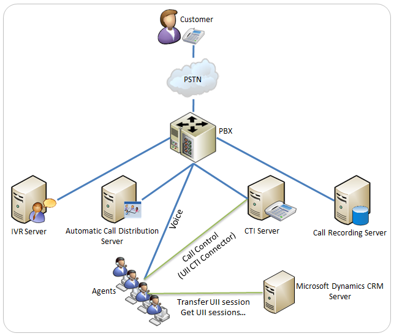
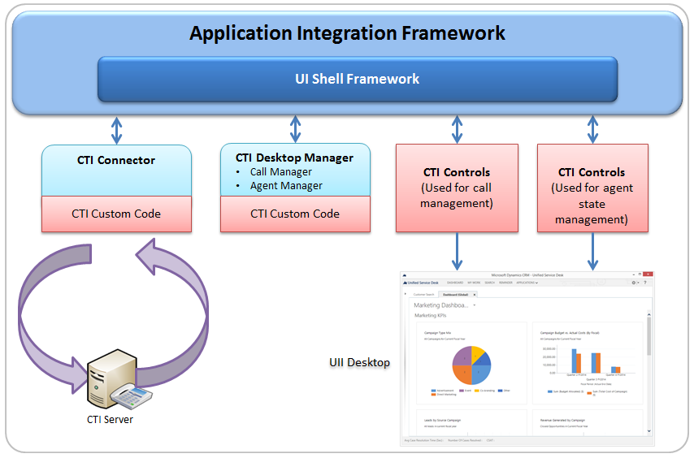

# UII computer telephony integration (CTI) framework
The [!INCLUDE[pn_user_inteface_integration_uii](../includes/pn-user-interface-integration-uii.md)][!INCLUDE[pn_computer_telephony_integration_cti](../includes/pn-computer-telephony-integration-cti.md)] framework allows businesses or organizations to connect [!INCLUDE[pn_uii_acronym](../includes/pn-uii-acronym.md)]-based desktops (such as [!INCLUDE[pn_unified_service_desk](../includes/pn-unified-service-desk.md)]) with their [!INCLUDE[pn_cti_acronym](../includes/pn-cti-acronym.md)] infrastructure. Although a [!INCLUDE[pn_cti_acronym](../includes/pn-cti-acronym.md)] system typically refers to telephony integration with software systems, the [!INCLUDE[pn_uii_acronym](../includes/pn-uii-acronym.md)][!INCLUDE[pn_cti_acronym](../includes/pn-cti-acronym.md)] framework can be used for any communications channel available to an organization.  
  
   
## UII CTI framework: Overview  
 In [!INCLUDE[pn_uii_acronym](../includes/pn-uii-acronym.md)], all communications over a particular channel—whether chat, email, telephone, or others—occur directly from the organization's [!INCLUDE[pn_cti_acronym](../includes/pn-cti-acronym.md)] system to the [!INCLUDE[pn_uii_acronym](../includes/pn-uii-acronym.md)] desktop (such as [!INCLUDE[pn_unified_service_desk](../includes/pn-unified-service-desk.md)]). [!INCLUDE[pn_microsoftcrm_server](../includes/pn-microsoftcrm-server.md)] isn’t involved in this process. The following illustration shows an example of this type of communication.  
  
   
  
   
## UII CTI framework components  
 The [!INCLUDE[pn_cti_acronym](../includes/pn-cti-acronym.md)] framework in [!INCLUDE[pn_uii_acronym](../includes/pn-uii-acronym.md)] contains the following three components or layers: [!INCLUDE[pn_cti_connector](../includes/pn-cti-connector.md)], [!INCLUDE[pn_cti_desktop_manager](../includes/pn-cti-desktop-manager.md)], and CTI controls.  
  
   
  
### CTI Connector  
 [!INCLUDE[pn_cti_connector](../includes/pn-cti-connector.md)] provides the logic to connect to and communicate with the external [!INCLUDE[pn_cti_acronym](../includes/pn-cti-acronym.md)] system. [!INCLUDE[pn_cti_connector](../includes/pn-cti-connector.md)] layer exposes the methods and events that will be called and listened to by the [!INCLUDE[pn_cti_desktop_manager](../includes/pn-cti-desktop-manager.md)] component. [!INCLUDE[pn_cti_connector](../includes/pn-cti-connector.md)] supports either a polling or instance-based connection model.  
  
 After the connection model is determined, a hosted control is developed that will implement the logic. [!INCLUDE[pn_cti_connector](../includes/pn-cti-connector.md)] is a specialized hosted control that is designed to exist in **HiddenPanel** in UII desktop (such as [!INCLUDE[pn_unified_service_desk](../includes/pn-unified-service-desk.md)]).  
  
 For more information, see [Create a CTI Connector](../unified-service-desk/create-cti-connector.md).  
  
### CTI Desktop Manager  
 [!INCLUDE[pn_cti_desktop_manager](../includes/pn-cti-desktop-manager.md)] provides the business logic for your CTI adapter. It responds to a call when it arrives in the UII desktop (such as [!INCLUDE[pn_unified_service_desk](../includes/pn-unified-service-desk.md)]), and performs the necessary steps to connect to the [!INCLUDE[pn_cti_connector](../includes/pn-cti-connector.md)] and create call management ([ICtiCallStateManager](https://docs.microsoft.com/dotnet/api/microsoft.uii.desktop.cti.core.icticallstatemanager)) and agent state management ([ICtiAgentStateManager](https://docs.microsoft.com/dotnet/api/microsoft.uii.desktop.cti.core.ictiagentstatemanager)) objects. The call state and agent state objects collectively manage the state and data of a call as a unique object to isolate information as there can be multiple or concurrent calls. [!INCLUDE[pn_cti_desktop_manager](../includes/pn-cti-desktop-manager.md)] is implemented as a hosted control that communicates between the [!INCLUDE[pn_uii_acronym](../includes/pn-uii-acronym.md)] desktop and the [!INCLUDE[pn_cti_acronym](../includes/pn-cti-acronym.md)] system to raise events and route calls appropriately in the [!INCLUDE[pn_uii_acronym](../includes/pn-uii-acronym.md)] desktop.  
  
 For more information, see [Create a CTI Desktop Manager](../unified-service-desk/create-cti-desktop-manager.md).  
  
### CTI controls  
 These are the user interface (UI) controls in a UII desktop that allow agents to interact with the [!INCLUDE[pn_cti_acronym](../includes/pn-cti-acronym.md)] system (manage calls) and manage the agent status.  
  
 For more information, see [Create a CTI Control](../unified-service-desk/create-cti-control.md).  
  
### See also  
 [Integrate with CTI systems](../unified-service-desk/integrate-cti-systems-cti-adapters.md)
