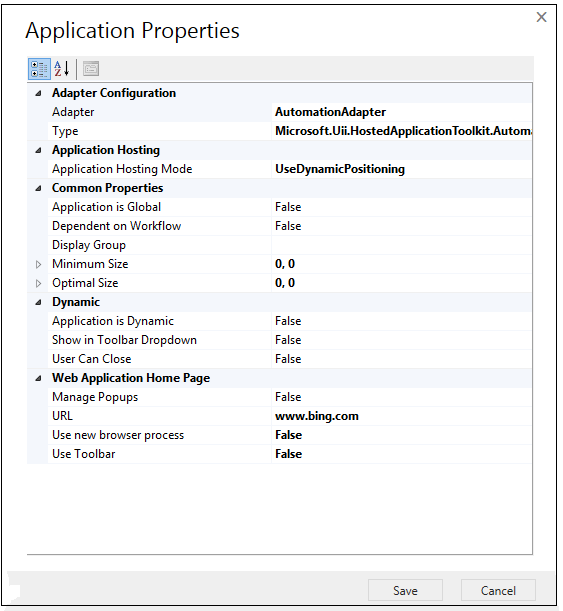

# Configure the hosted application
After you create the hosted application (see [Create a HAT hosted application project](../../unified-service-desk/use-hat-software-factory-create-hosted-application.md#Create)) you’ll want to configure it.  

1. Open the project in [!INCLUDE[pn_Visual_Studio_short](../../includes/pn-visual-studio-short.md)].  

2. In **Solution Explorer**, right-click the project name, and select **Application Configuration**.  

     

3. In the **Application Properties** dialog box, specify the required information. The following table describes the various application properties.  

   |                          |                                                                                                                                                                                                                                                                                                                                                                                                                                                                                                                   |
   |--------------------------|-------------------------------------------------------------------------------------------------------------------------------------------------------------------------------------------------------------------------------------------------------------------------------------------------------------------------------------------------------------------------------------------------------------------------------------------------------------------------------------------------------------------|
   |         Property         |                                                                                                                                                                                                                                                    Description                                                                                                                                                                                                                                                    |
   |         Adapter          |                                                        There are three adapter configurations to choose from the dropdown list:   1. **None** - Specifies that the hosted application does not require any automation 2.  `AutomationAdapter` - Specifies the default configuration used for the [!INCLUDE[pn_hosted_application_toolkit_hat](../../includes/pn-hosted-application-toolkit-hat.md)] Software Factory. 3.  `LegacyAdapter`                                                        |
   |           Type           |                                                                                                                                                                     The name of your assembly (dll) followed by a dot (.) and then the class name in your [!INCLUDE[pn_Visual_Studio_short](../../includes/pn-visual-studio-short.md)] project.                                                                                                                                                                      |
   | Application Hosting Mode | There are three modes of hosting an application:   1. **Host Outside** – Allows the application to be started outside of **Unified Service Desk** 2. **Use SetParent** – Sets the application’s root window as the child window of **Unified Service Desk**. 3. **Use Dynamic Positioning** – Monitors the size and position of the [!INCLUDE[pn_unified_service_desk](../../includes/pn-unified-service-desk.md)] application and dynamically adjusts the size and position of the application. |
   |  Application Is Global   |                                                                                                                                                                                                          When set to true, the application is run globally and is independent from the session context.                                                                                                                                                                                                           |
   |  Dependent on Workflow   |                                                                                                                                                                                                                     When set to true, the application is only loaded through a workflow step.                                                                                                                                                                                                                     |
   |      Display Group       |                                                                                                                                                                      Specifies where the application will be hosted in [!INCLUDE[pn_unified_service_desk](../../includes/pn-unified-service-desk.md)], for example, MainPanel or WorkflowPanel.                                                                                                                                                                      |
   |       Minimum Size       |                                                                                                                                                                            Specifies the minimum size of the application window in [!INCLUDE[pn_unified_service_desk](../../includes/pn-unified-service-desk.md)] along the X and Y axis.                                                                                                                                                                            |
   |       Optimal Size       |                                                                                                                                                                            Specifies the display size of the application window in [!INCLUDE[pn_unified_service_desk](../../includes/pn-unified-service-desk.md)] along the X and Y axis.                                                                                                                                                                            |
   |  Application is Dynamic  |                                                                                                                                                                                                                           When set to true, the application can be loaded dynamically.                                                                                                                                                                                                                            |
   | Show in Toolbar Dropdown |                                                                                                                                                                                                                     When set to true, the application shows up in the toolbar drop-down list.                                                                                                                                                                                                                     |
   |      User Can Close      |                                                                                                                                                                                                                               When set to true, the user can close the application.                                                                                                                                                                                                                               |
   |      Manage Popups       |                                                                                                                                                                                     When set to true, allows the pop-up windows to be managed in [!INCLUDE[pn_unified_service_desk](../../includes/pn-unified-service-desk.md)].                                                                                                                                                                                     |
   |           URL            |                                                                                                                                                                                                                                Specifies the URL where the application is running.                                                                                                                                                                                                                                |
   | Use new browser process  |                                                                                                                                                                                        When set to true, initiates the application in a new [!INCLUDE[pn_Internet_Explorer](../../includes/pn-internet-explorer.md)] process.                                                                                                                                                                                        |
   |       Use toolbar        |                                                                                                                                                                                                   When set to true, displays the [!INCLUDE[pn_Internet_Explorer](../../includes/pn-internet-explorer.md)] toolbar.                                                                                                                                                                                                   |

    The following illustration shows the **Application Properties** dialog box.  

     

4. Click **Save** to save the application configuration.  

### See also  
 [Create a HAT hosted application project](../../unified-service-desk/use-hat-software-factory-create-hosted-application.md#Create)   
 [Using UII inspector to create bindings](../../unified-service-desk/use-uii-inspector-create-bindings-hosted-application.md)   
 [Configure an action for the hosted application](../../unified-service-desk/configure-action-hosted-application.md)   
 [Deploy your hosted application to Unified Service Desk](../../unified-service-desk/deploy-hosted-application-unified-service-desk.md#deploy)   
 [Import the hosted application from Unified Service Desk](../../unified-service-desk/import-hosted-application-from-unified-service-desk.md)
