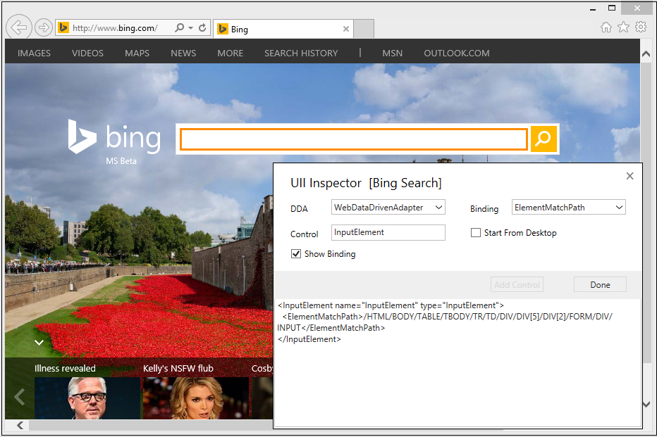

# Use UII inspector to create bindings for the hosted application in Unified Service Desk
After you create a hosted application, you can inspect it to create bindings. Inspecting an application means that you can select user interface (UI) controls for automating the hosted application. [!INCLUDE[proc_more_information](../includes/proc-more-information.md)] [Automate hosted applications using HAT automation activities](../unified-service-desk/automate-hosted-applications-using-hat-automation-activities.md)  
  
1. Right-click the application to view the **Application Context** menu, and then choose **Inspect**.  
  
     
  
2. The application selected is displayed and is ready to be inspected. This example uses the web application created in the previous section.  
  
     
  
3. Choose **UII Inspector** on the toolbar to display the **UII Inspector** dialog box. Make sure that the **Visual Studio Toolbox** is not in focus when you choose the **UII Inspector** button. If it is, the UII Inspector displays the following error message: "Active Window is not the UII Inspector."  
  
4. With the **UII Inspector** dialog box open, move the mouse over the control you want to capture, and then press the Ctrl key. The Inspector will provide a default control name and retrieve the component's binding information.  
  
     
  
   For the purpose of this example, add the following controls to the current project:  
  
-   `SearchText` – The text field on the home page.  
  
-   `Search` – The search button in the home page.  
  
-   `SearchText2` – The text field on the results page.  
  
-   `Search2` – The search button in the results page.  
  
### See also  
 [Create a HAT hosted application project](../unified-service-desk/use-hat-software-factory-create-hosted-application.md#Create)   
 [Using UII inspector to create bindings](../unified-service-desk/use-uii-inspector-create-bindings-hosted-application.md)   
 [Configure the hosted application](../unified-service-desk/configure-hosted-application.md)   
 [Configure an action for the hosted application](../unified-service-desk/configure-action-hosted-application.md)   
 [Deploy your hosted application to Unified Service Desk](../unified-service-desk/deploy-hosted-application-unified-service-desk.md#deploy)   
 [Import the hosted application from Unified Service Desk](../unified-service-desk/import-hosted-application-from-unified-service-desk.md)
