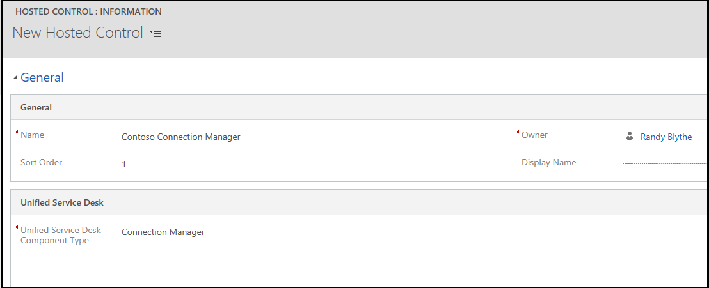
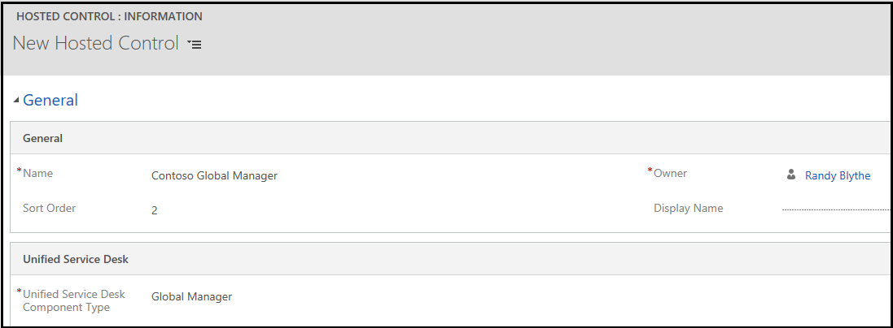
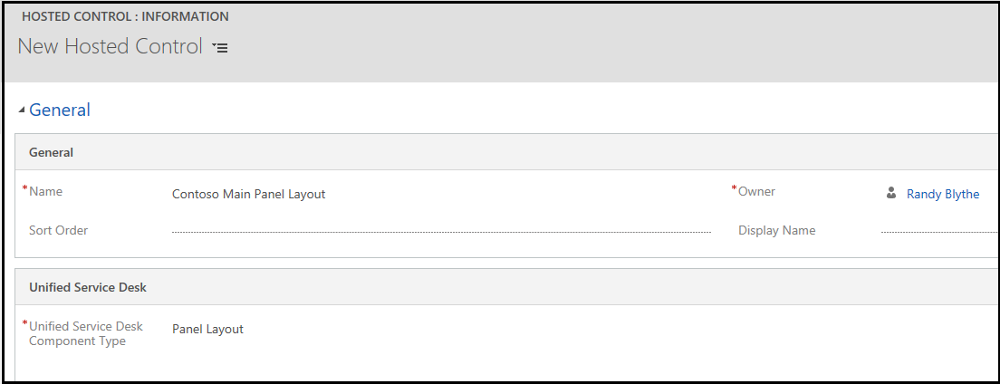
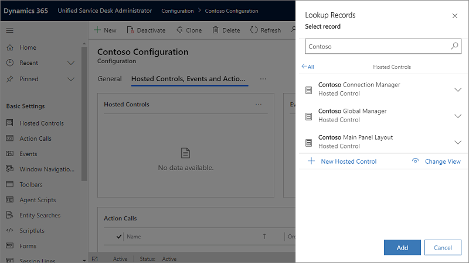

# Walkthrough 1: Build a simple agent application
This walkthrough demonstrates how to set up a basic agent application from scratch using [!INCLUDE[pn_unified_service_desk](../includes/pn-unified-service-desk.md)] that can connect to [!INCLUDE[pn_microsoftcrm](../includes/pn-microsoftcrm.md)] apps. This agent application provides you with an empty desktop without any functionality, and you can use it when you go through the rest of the walkthroughs in this section. In this walkthrough, you’ll use the [!INCLUDE[pn_unified_service_desk](../includes/pn-unified-service-desk.md)] configuration to filter out existing controls in the "New Environment" sample application package from appearing in your agent application.  
  
## Prerequisites  
  
- A [!INCLUDE[pn_unified_service_desk](../includes/pn-unified-service-desk.md)] package must be deployed on your [!INCLUDE[pn_crm_shortest](../includes/pn-crm-shortest.md)] apps instance, and the [!INCLUDE[pn_unified_service_desk](../includes/pn-unified-service-desk.md)] client application must already be installed to test the application at the end of the walkthrough. [!INCLUDE[proc_more_information](../includes/proc-more-information.md)] [Install, upgrade, and deploy Unified Service Desk](../unified-service-desk/admin/install-upgrade-deploy-unified-service-desk.md)  
  
- You must have required [!INCLUDE[pn_crm_shortest](../includes/pn-crm-shortest.md)] apps permissions to configure [!INCLUDE[pn_unified_service_desk](../includes/pn-unified-service-desk.md)] and access the required [!INCLUDE[pn_crm_shortest](../includes/pn-crm-shortest.md)] apps entities. [!INCLUDE[proc_more_information](../includes/proc-more-information.md)] [Access management in Unified Service Desk](../unified-service-desk/admin/security-unified-service-desk.md)  
  
- You must be familiar with the following concepts in [!INCLUDE[pn_unified_service_desk](../includes/pn-unified-service-desk.md)]:  
  
  - [Unified Service Desk Hosted Controls](../unified-service-desk/unified-service-desk-hosted-controls.md)  
  
  - These three types of hosted controls: Connection Manager, Global Manager, and Panel Layout. [!INCLUDE[proc_more_information](../includes/proc-more-information.md)] [Hosted control types and action/event reference](../unified-service-desk/hosted-control-types-action-event-reference.md)  
  
  - Filter access using [!INCLUDE[pn_unified_service_desk](../includes/pn-unified-service-desk.md)]. [!INCLUDE[proc_more_information](../includes/proc-more-information.md)] [Manage access using Unified Service Desk configuration](../unified-service-desk/admin/manage-access-using-unified-service-desk-configuration.md)  
  
   
## In This Walkthrough  
 [Step 1: Create the basic hosted controls](../unified-service-desk/walkthrough-1-build-a-simple-agent-application.md#Step1)  
  
 [Step 2: Add the hosted controls to a configuration](../unified-service-desk/walkthrough-1-build-a-simple-agent-application.md#Step2)  
  
 [Step 3: Assign users to the configuration](../unified-service-desk/walkthrough-1-build-a-simple-agent-application.md#Step3)  
  
 [Step 4: Test the application](../unified-service-desk/walkthrough-1-build-a-simple-agent-application.md#Step4)  
  
 [Conclusion](../unified-service-desk/walkthrough-1-build-a-simple-agent-application.md#Conclusion)  
  
   
## Step 1: Create the basic hosted controls  
 Create the following three types of hosted control so that the application can connect to an instance of [!INCLUDE[pn_crm_shortest](../includes/pn-crm-shortest.md)] apps: Connection Manager, Global Manager, and Panel Type.  
  
1. Sign in to [!INCLUDE[pn_microsoftcrm](../includes/pn-microsoftcrm.md)] apps.  
  
2. [!INCLUDE[proc_settings_usd](../includes/proc-settings-usd.md)]  
  
3. Click **Hosted Controls**.  
  
4. Click **New**.  
  
5. On the **New Hosted Control** page, specify the following values.  
  
   |Field|Value|  
   |-----------|-----------|  
   |Name|Contoso Connection Manager|  
   |Sort Order|1|  
   |USD Component Type|Connection Manager|  
  
     
  
6. Click **Save**.  
  
7. Click **New** to create another hosted control.  
  
8. On the **New Hosted Control** page, specify the following values.  
  
   |Field|Value|  
   |-----------|-----------|  
   |Name|Contoso Global Manager|  
   |Sort Order|2|  
   |USD Component Type|Global Manager|  
  
     
  
9. Click **Save**.  
  
10. Click **New** to create another hosted control.  
  
11. On the **New Hosted Control** page, specify the following values.  
  
    |Field|Value|  
    |-----------|-----------|  
    |Name|Contoso Main Panel Layout|  
    |USD Component Type|Panel Layout|  
    |Panel Type|Standard Main Panel|  
    |Application is Dynamic|No|  
    |User Can Close|Unchecked|  
  
      
  
12. Click **Save**.  
  
> [!IMPORTANT]
>  If you don’t create a **Panel Layout** type of hosted control in your agent application, the default panel layout, **Standard Main Panel**, is created automatically when you run the client application.  
  
   
## Step 2: Add the hosted controls to a configuration  
 A configuration in [!INCLUDE[pn_unified_service_desk](../includes/pn-unified-service-desk.md)] helps you filter access to components that are displayed in the agent application to a user. In this step, create a configuration, and then add the hosted controls created earlier to the configuration.  
  
1. Sign in to [!INCLUDE[pn_microsoftcrm](../includes/pn-microsoftcrm.md)] apps.  
  
2. [!INCLUDE[proc_settings_usd](../includes/proc-settings-usd.md)]  
  
3. Click **Configuration**.  
  
4. Click **New**.  
  
5. On the **New Configuration** page, type `Contoso Configuration` as the name of the configuration, and click **Save**.  
  
6. After the new configuration is saved, on the nav bar, click the down arrow next to the configuration name, and then select **Hosted Controls**.  
  
7. Click **Add Existing Hosted Control**, type `Contoso` in the search bar, and then press ENTER or click the search icon.  
  
8. The three hosted controls added earlier display in the search results. Click the **Look up more Records** link.  
  
9. Select the three hosted controls, click **Select**, and then click **Add**.  
  
     
  
10. The hosted controls are added to the configuration. Click **Save**.  
  
   
## Step 3: Assign users to the configuration  
 In this step, assign users to the configuration so that when they sign in using the [!INCLUDE[pn_unified_service_desk](../includes/pn-unified-service-desk.md)] client application, they can only access the three hosted controls that are added to this configuration. For this walkthrough, assign only a single user to the configuration who will be testing the application at the end of the walkthrough.  
  
1. On the nav bar, click the down arrow next to the **Contoso Configuration**, and then select **Assigned Users**.  
  
2. On the next page, click **Add Existing User**, type the name of the user in the search bar, and then press ENTER or click the search icon.  
  
3. From the search result, click the user name that you want to be assigned to the configuration. The user is added to the configuration. In this case, assign **Randy Blythe** to the configuration. Click **Save**.  
  
     
  
   
## Step 4: Test the application  
 Start the [!INCLUDE[pn_unified_service_desk](../includes/pn-unified-service-desk.md)] client application, and sign in to the [!INCLUDE[pn_crm_shortest](../includes/pn-crm-shortest.md)] apps instance where you configured [!INCLUDE[pn_unified_service_desk](../includes/pn-unified-service-desk.md)] using the same user credentials that you assigned to the **Contoso Configuration** in the previous step. [!INCLUDE[proc_more_information](../includes/proc-more-information.md)] [Connect to a Dynamics 365 for Customer Engagement apps instance using the Unified Service Desk client](../unified-service-desk/admin/connect-dynamics-365-instance-using-unified-service-desk-client.md).  
  
 Your agent application will look like the following.  
  
   
  
 The desktop in the agent application is empty because no other controls were added to **Contoso Configuration** apart from the hosted controls required for setting up a basic agent application. In the rest of the walkthroughs, you’ll see controls appear in the agent application as you progressively configure and add controls to **Contoso Configuration**.  
  
   
## Conclusion  
 In this walkthrough, you saw how to quickly build a basic agent application that can connect to an instance of [!INCLUDE[pn_crm_shortest](../includes/pn-crm-shortest.md)] apps. You also learned how to filter access to [!INCLUDE[pn_unified_service_desk](../includes/pn-unified-service-desk.md)] controls using configuration.  
  
### See also  
 [Walkthrough 2: Display an external webpage in your agent application](../unified-service-desk/walkthrough-2-display-an-external-webpage-in-your-agent-application.md)   
 [Walkthrough 3: Display Microsoft Dynamics 365 for Customer Engagement apps records in your agent application](../unified-service-desk/walkthrough-3-display-microsoft-dynamics-365-records-in-your-agent-application.md)   
 [Walkthrough 4: Display a Microsoft Dynamics 365 for Customer Engagement apps record in a session in your agent application](../unified-service-desk/walkthrough-display-dynamics-365-record-session-agent-application.md)   
 [Walkthrough 5: Display enhanced session information by displaying session name and overview data](../unified-service-desk/walkthrough-5-display-enhanced-session-information-displaying-session-name-overview-data.md)   
 [Walkthrough 6: Configure the Debugger hosted control in your agent application](../unified-service-desk/walkthrough-configure-debugger-hosted-control-agent-application.md)   
 [Walkthrough 7: Configure agent scripting in your agent application](../unified-service-desk/walkthrough-configure-agent-scripting-agent-application.md)   
 [Unified Service Desk Configuration Walkthroughs](../unified-service-desk/unified-service-desk-configuration-walkthroughs.md)   
 
