# Walkthrough 8: Use Customer Engagement knowledge base within your agent application
This walkthrough demonstrates how to configure a panel in [!INCLUDE[pn_unified_service_desk](../includes/pn-unified-service-desk.md)] using the **KM Control** hosted control that displays knowledge base records from your [!INCLUDE[pn_CRM_Online](../includes/pn-crm-online.md)] instance.  

 In this walkthrough, you’ll:  

- Display knowledge base articles from Dynamics 365 to appear in a search panel in context with your currently open case record in [!INCLUDE[pn_unified_service_desk](../includes/pn-unified-service-desk.md)]. Users can filter and sort the results based on various criteria. Moreover, the search panel automatically appears when you open a case session, and automatically hides when you close the session.  

- Display the article in a tab when you choose the article title in the search panel.  

- Configure contextual actions for the article in the tab where it is displayed, such as copy an article link or associate an article with the current case.  

  [!INCLUDE[proc_more_information](../includes/proc-more-information.md)] [Use Dynamics 365 knowledge for effective customer engagement](../unified-service-desk/use-dynamics-365-knowledge-effective-customer-engagement.md)  

> [!IMPORTANT]
>  This walkthrough doesn’t require you to complete other walkthroughs before you can use this one.  

## Prerequisites  

- Deploy the "New Environment" sample application package to your [!INCLUDE[pn_crm_online_shortest](../includes/pn-crm-online-shortest.md)] instance. The walkthrough uses some of the controls and configuration in the "New Environment" sample application package that are created in [!INCLUDE[pn_crm_shortest](../includes/pn-crm-shortest.md)] when you deploy the sample application. [!INCLUDE[proc_more_information](../includes/proc-more-information.md)] [Deploy sample Unified Service Desk applications to CRM server using Package Deployer](admin/deploy-sample-unified-service-desk-applications-using-package-deployer.md)    

- You must know about the following in [!INCLUDE[pn_unified_service_desk](../includes/pn-unified-service-desk.md)]:  

  - The `KM Control` and `Panel Layout` types of hosted controls:. [!INCLUDE[proc_more_information](../includes/proc-more-information.md)] [Hosted control types and action/event reference](../unified-service-desk/hosted-control-types-action-event-reference.md)  

  - Concepts about using the `KM Control` type of hosted control to configure knowledge management. [!INCLUDE[proc_more_information](../includes/proc-more-information.md)] [Configure Dynamics 365 knowledge in Unified Service Desk](../unified-service-desk/configure-unified-service-desk-use-dynamics-365-knowledge.md)  

  - How to configure action calls. [!INCLUDE[proc_more_information](../includes/proc-more-information.md)] [Action calls](../unified-service-desk/action-calls.md)  

  - Events. [!INCLUDE[proc_more_information](../includes/proc-more-information.md)] [Events](../unified-service-desk/events.md)  

   
## In This Walkthrough  
 [Step 1: Create a hosted control of type KM Control](../unified-service-desk/walkthrough-8-use-dynamics-365-knowledge-base-within-agent-application.md#Step1)  

 [Step 2: Configure an action call to display the knowledge base search](../unified-service-desk/walkthrough-8-use-dynamics-365-knowledge-base-within-agent-application.md#Step2)  

 [Step 3: Configure action calls to automatically display and hide the knowledge base search panel](../unified-service-desk/walkthrough-8-use-dynamics-365-knowledge-base-within-agent-application.md#Step3)  

 [Step 4: Configure an action call to automatically search knowledge base using the incident (case) title](../unified-service-desk/walkthrough-8-use-dynamics-365-knowledge-base-within-agent-application.md#Step4)  

 [Step 5: Configure hosted controls and action calls to display an article in a tab](../unified-service-desk/walkthrough-8-use-dynamics-365-knowledge-base-within-agent-application.md#Step5)  

 [Step 6: Configure contextual actions for the knowledge base article in the tab](../unified-service-desk/walkthrough-8-use-dynamics-365-knowledge-base-within-agent-application.md#Step6)  

 [Step 7: Test the application](../unified-service-desk/walkthrough-8-use-dynamics-365-knowledge-base-within-agent-application.md#Step7)  

 [Conclusion](../unified-service-desk/walkthrough-8-use-dynamics-365-knowledge-base-within-agent-application.md#Conclusion)  

   
## Step 1: Create a hosted control of type KM Control  
 In this step, you’ll create a hosted control of type **KM Control** to display the knowledge base search pane.  

1. Sign in to [!INCLUDE[pn_microsoftcrm](../includes/pn-microsoftcrm.md)].  

2. [!INCLUDE[proc_settings_usd](../includes/proc-settings-usd.md)]  

3. Click **Hosted Controls**.  

4. Click **New**.  

5. On the **New Hosted Control** page, specify the following values.  

   |Field|Value|  
   |-----------|-----------|  
   |Name|Sample KB Search|  
   |Display Name|Sample KB Search|  
   |USD Component Type|KM Control|  
   |Allow Multiple Pages|No|  
   |Hosting Type|Internal WPF|  
   |Application is Global|Checked|  
   |Display Group|RightPanel|  

   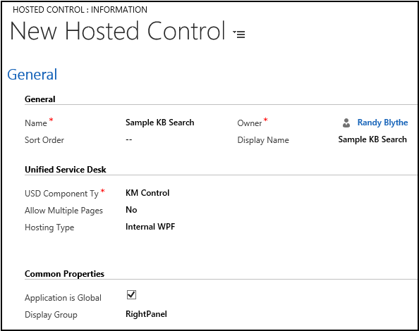  

6. Click **Save and Close**.  

   
## Step 2: Configure an action call to display the knowledge base search  
 Create an action call to display the newly created hosted control in the agent desktop. You’ll use the `default` action for the newly created hosted control to display it. After creating the action, add it to the `SessionNew` event for the **Dynamics 365 Global Manager** hosted control to automatically load and display the hosted control when a new session is created on opening a case.  

1. [!INCLUDE[proc_settings_usd](../includes/proc-settings-usd.md)]  

2. Click **Action Calls**.  

3. Click **New**.  

4. On the **New Action Call** page, specify the following values.  

   |Field|Value|  
   |-----------|-----------|  
   |Name|Sample: Open KB Search Control|  
   |Hosted Control|Sample KB Search|  
   |Action|default|  

   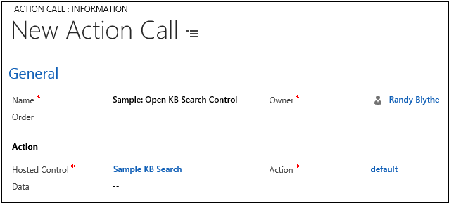  

5. Click **Save and close**.  

6. Go to **Unified Service Desk** page, and then click **Events**.  

7. Search for the `SessionNew` event, and then click it to open the event configuration page.  

8. Click the **Add Action Call record** button to add the action call.  

     

9. Type `Sample: Open KB Search Control` in the search box, and press ENTER or click the search button to add the action to the event. Change the order of the added action to 1, and then click the the **Save** button in the lower-right corner.  

   
## Step 3: Configure action calls to automatically display and hide the knowledge base search panel  
 Create two action calls to display and hide the panel (`RightPanel`) that will display the newly added hosted control. Next, add those to appropriate events to automatically display (expand) and hide (collapse) the panel in the agent desktop when a new session is created and the session is closed respectively.  

 Use the new `SetVisualProperty` action to control the visual properties of the panel layout (**Main Layout** hosted control in the “Base sample application”). `SetVisualProperty` has to be manually added to the hosted control to be used. However, if you create a new instance of a **Panel Layout** type of hosted control, `SetVisualProperty` will be available by default.  

1. [!INCLUDE[proc_settings_usd](../includes/proc-settings-usd.md)]  

2. Click **Hosted Controls**.  

3. Click **Main Layout** in the list of hosted controls.  

   > [!NOTE]
   >  The **Main Layout** hosted control is available when you deploy the Base sample application in your [!INCLUDE[pn_crm_shortest](../includes/pn-crm-shortest.md)] instance.  

4. Click the down arrow next to **Main layout**, and then click **UII Actions**.  

   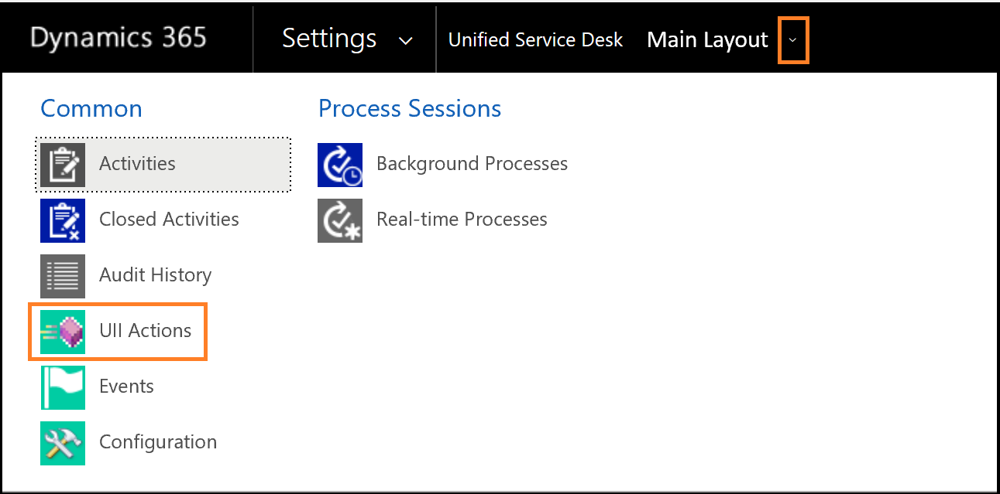  

5. Click **Add New UII Action**.  

6. On the **New UII Action** page, type `SetVisualProperty` in the **Name** field, and then click **Save and Close**.  

   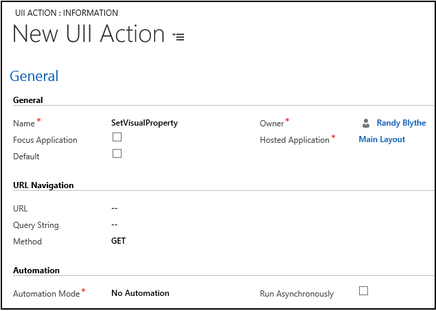  

    The new action call gets added to the **Main layout** hosted control, and is ready to be used.  

7. On the navigation pane, click **Unified Service Desk**.  

8. Click **Action Calls**.  

9. Click **New**.  

10. On the **New Action Call** page, specify the following values.  

    |     Field      |                                                                                              Value                                                                                               |
    |----------------|--------------------------------------------------------------------------------------------------------------------------------------------------------------------------------------------------|
    |      Name      |                                                                                Sample: Expand Right Panel Action                                                                                 |
    | Hosted Control | Main Layout **Note:**  The **Main Layout** hosted control is available when you deploy the Base sample application in your [!INCLUDE[pn_crm_shortest](../includes/pn-crm-shortest.md)] instance. |
    |     Action     |                                                                                        SetVisualProperty                                                                                         |
    |      Data      |                                                           elementname=RightPanelExpander propertyname=IsExpanded value=true                                                            |

    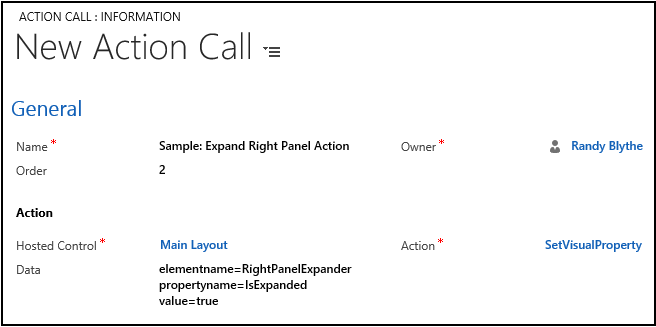  

11. Click **Save and Close**.  

12. Click **New** to create another action call.  

13. On the **New Action Call** page, specify the following values:  

    |     Field      |                                                                                              Value                                                                                               |
    |----------------|--------------------------------------------------------------------------------------------------------------------------------------------------------------------------------------------------|
    |      Name      |                                                                               Sample: Collapse Right Panel Action                                                                                |
    | Hosted Control | Main Layout **Note:**  The **Main Layout** hosted control is available when you deploy the Base sample application in your [!INCLUDE[pn_crm_shortest](../includes/pn-crm-shortest.md)] instance. |
    |     Action     |                                                                                        SetVisualProperty                                                                                         |
    |      Data      |                                                           elementname=RightPanelExpander propertyname=IsExpanded value=false                                                           |

    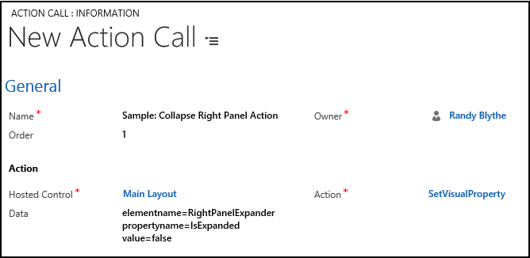  

14. Click **Save and Close**.  

15. Go to **Unified Service Desk** page, and then click **Events**.  

16. Search for the `SessionNew` event, and then click it to open the event configuration page.  

17. Click the **Add Action Call record** button to add the action call.  

      

18. Type `Sample: Expand Right Panel Action` in the search box, and press ENTER or click the search button to add the action to the event. Change the **Order** of the added action to 2, and then click the **Save** button in the lower-right corner.  

19. Go to **Unified Service Desk** page, and then click **Events**.  

20. Search for the `SessionClosed` event for the **Dynamics 365 Global Manager** hosted control, and then click it to open the event configuration page.  

    > [!NOTE]
    >  Ensure that you are editing the configuration of the `SessionClosed` event for the **Dynamics 365 Global Manager** hosted control.  

21. Click the **Add Action Call record** button to add the action call.  

    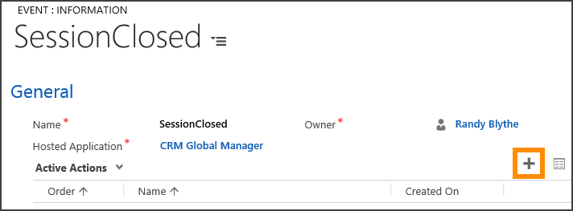  

22. Type `Sample: Collapse Right Panel Action` in the search box, and press ENTER or click the search button to add the action to the event. Change the order of the added action to 1, and then click the **Save** button in the lower-right corner.  

   
## Step 4: Configure an action call to automatically search the knowledge base using the incident (case) title  
 Create an action call to automatically populate the case title in the knowledge base search control to search based on the case title name. After creating the action, you’ll add it to the `BrowserDocumentComplete` event of the **Incident** hosted control to fire this action after the case records have loaded in the agent desktop.  

> [!NOTE]
>  The **Incident** hosted control is created when you deploy the Base sample application in your [!INCLUDE[pn_microsoftcrm](../includes/pn-microsoftcrm.md)] instance.  

1. [!INCLUDE[proc_settings_usd](../includes/proc-settings-usd.md)]  

2. Click **Action Calls**.  

3. Click **New**.  

4. On the **New Action Call** page, specify the following values  

   |Field|Value|  
   |-----------|-----------|  
   |Name|Sample: Search KB with Incident (Case) Title Action|  
   |Hosted Control|Sample KB Search|  
   |Action|Search|  
   |Data|query=[[incident.title]+]|  

   > [!TIP]
   >  You can use additional data parameters in the `Search` action to specify knowledge base search parameters such as the number of search results to return, the type of knowledge base articles to be searched, and sorting options. [!INCLUDE[proc_more_information](../includes/proc-more-information.md)] [Search](../unified-service-desk/km-control-hosted-control.md#Search)  

   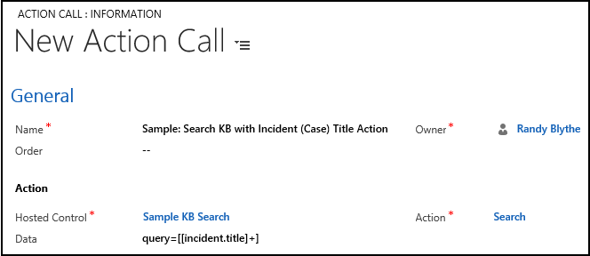  

5. Click **Save**.  

6. On the navigation pane, click **Unified Service Desk**, and then click **Hosted Controls**.  

7. Click **Incident** from the list of hosted controls.  

8. Click the down arrow next to **Incident**, and then click **Events**.  

   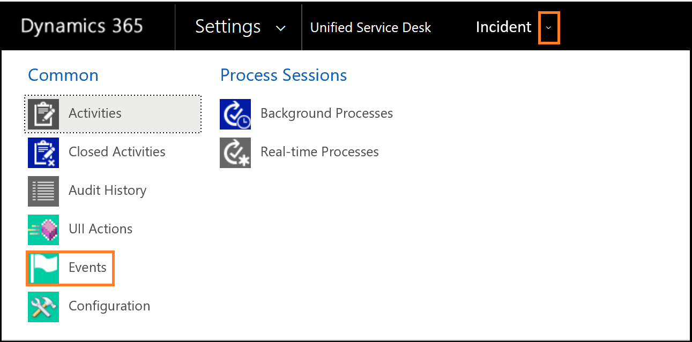  

9. In the events list for the **Incident** hosted control, click `BrowserDocumentComplete`.  

10. Click the **Add Action Call record** button to add the action call.  

    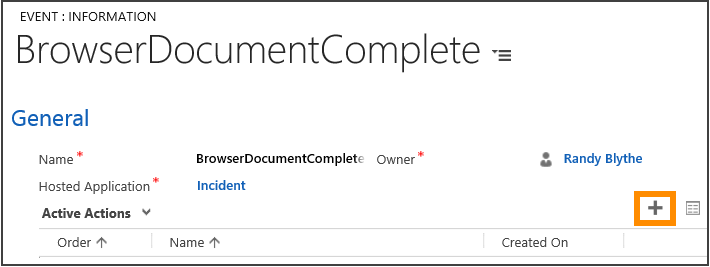  

11. Type `Sample: Search KB with Incident (Case) Title Action` in the search box, and press ENTER or click the search button to add the action to the event. Click the **Save** button in the lower-right corner.  

> [!NOTE]
>  At this point, the knowledge base search control is configured to display knowledge bases from \Dynamics 365 in context with the currently opened case record. Also, the knowledge base search panel is configured to automatically display when a session is created, and automatically hide when you close the session. You can test this by running the [!INCLUDE[pn_unified_service_desk](../includes/pn-unified-service-desk.md)] client application and connecting to the [!INCLUDE[pn_microsoftcrm](../includes/pn-microsoftcrm.md)] instance where you performed steps 1 through 4 of this walkthrough. [!INCLUDE[proc_more_information](../includes/proc-more-information.md)]  
> 
>  Perform the rest of the steps to display a knowledge base article from the search results in a tab, and configure contextual actions for a selected knowledge base article in the search panel such as copying an article link and associating the article to the current case.  

   
## Step 5: Configure hosted controls and action calls to display an article in a tab  
 In this step, you will:  

-   Configure a hosted control of type **Standard Web Application** to display the knowledge base article.  

-   Configure action calls to display the article in the hosted control whose title is clicked in the knowledge base search pane.  

-   Add the action calls to the [ResultOpen](../unified-service-desk/km-control-hosted-control.md#ResultOpen) event of the `KM Control` hosted control so that the action calls are executed when somebody clicks on the KB article title.  

1. [!INCLUDE[proc_settings_usd](../includes/proc-settings-usd.md)]  

2. Click **Hosted Controls**.  

3. Click **New**.  

4. On the **New Hosted Control** page, specify the following values.  

   |Field|Value|  
   |-----------|-----------|  
   |Name|Sample KB Article|  
   |Display Name|[[Sample KB Article.question]+]|  
   |USD Component Type|Standard Web Application|  
   |Allow Multiple Pages|No|  
   |Hosting Type|Internal WPF|  
   |Application is Global|Clear|  
   |Display Group|MainPanel|  

   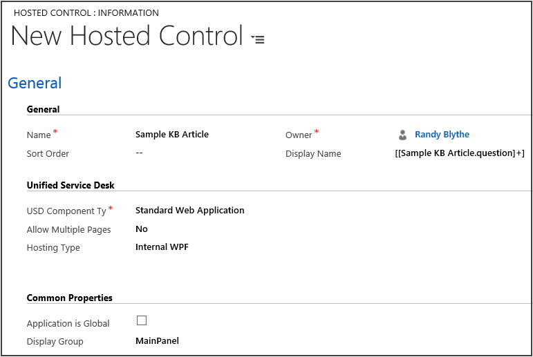  

5. Click **Save and Close**.  

6. You’ll now create an action call to set the context of the selected article in the knowledge base search pane. The context information is required if you want to perform additional actions on the currently displayed knowledge base article such as dynamically displaying the tab title based on the knowledge base article question title, copying the link of the article, and associating or dissociating an article with an incident (case) record.  

[!INCLUDE[proc_settings_usd](../includes/proc-settings-usd.md)]

7. Click **Action Calls**.  

8. Click **New**.  

9. On the **New Action Call** page, specify the following values.  

    |Field|Value|  
    |-----------|-----------|  
    |Name|Sample: Set KB Article Context Action|  
    |Order|1|  
    |Hosted Control|Sample KB Search|  
    |Action|SetArticleContext|  
    |Data|articleapplication=Sample KB Article articledata=[[postdata]+]|  

   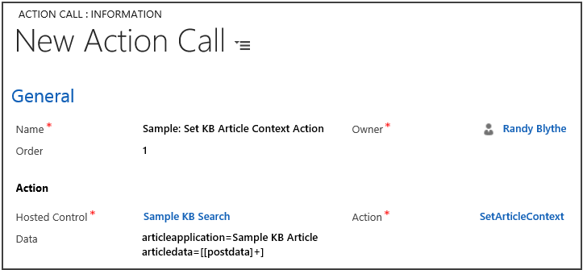  

10. Click **Save and Close**.  

11. Click **New** to create another action call for displaying the article in the hosted control created earlier in this step.  

12. On the **New Action Call** page, specify the following values.  

   |Field|Value|  
   |-----------|-----------|  
   |Name|Sample: Open KB Article Action|  
   |Order|2|  
   |Hosted Control|Sample KB Article|  
   |Action|Navigate|  
   |Data|url=[[Sample KB Search.articleurl]] header=[[header]+] postdata=[[postdata]]|  

   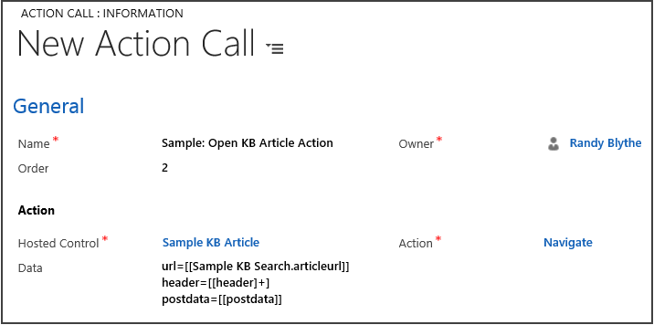  

13. Click **Save and Close**.  

14. Click **New** to create another action call for displaying the hosted control created earlier in this step in the main panel.  

15. On the **New Action Call** page, specify the following values  

   |Field|Value|  
   |-----------|-----------|  
   |Name|Sample: Show KB Article Tab Action|  
   |Order|50|  
   |Hosted Control|Dynamics 365 Global Manager|  
   |Action|ShowTab|  
   |Data|Sample KB Article|  

     

16. Click **Save and Close**.  

17. Now, you’ll add all the three new actions created in this step to the [ResultOpen](../unified-service-desk/km-control-hosted-control.md#ResultOpen) event of the **KM Control** hosted control that you created earlier.  

     On the navigation pane, click **Unified Service Desk**, and then click **Events**.  

18. Search for `ResultOpen` event, and click the event name to open the event information page.  

19. Click the **Add Action Call record** button to add an action call.  

20. Type `Sample: Set KB Article Context Action` in the search box, and press ENTER or click the search button to add the action to the event.  

21. Repeat the previous step with the `Sample: Open KB Article Action` and `Sample: Show KB Article Tab Action` action calls to add them to the event.  

22. Click the **Save** button in the lower-right corner.  

   
## Step 6: Configure contextual actions for the knowledge base article in the tab  
 In this step, you’ll add buttons on the toolbar of the hosted control configured in the previous step (Step 5) and attach action calls to the buttons so that when the button is clicked, appropriate actions are performed in the context of the currently displayed article in the tab. You’ll configure a toolbar with two buttons and respective action calls for the buttons.  

1. [!INCLUDE[proc_settings_usd](../includes/proc-settings-usd.md)]  

2. Click **Toolbars**.  

3. Click **New**.  

4. On the **New Toolbar** page, type `Sample: KB Toolbar` in the **Name** field, and click **Save**.  

5. In the **Buttons** area, click the **+** symbol to add buttons to the toolbar.  

6. On the **New Toolbar Button** page, specify the following values.  

   |Field|Value|  
   |-----------|-----------|  
   |Name|Copy Link|  
   |Button Text|Copy Link|  
   |Order|1 **Note:**  The **Order** field defines the position of buttons in the toolbar. Buttons are arranged from left to right or top to bottom in an ascending order.|  

   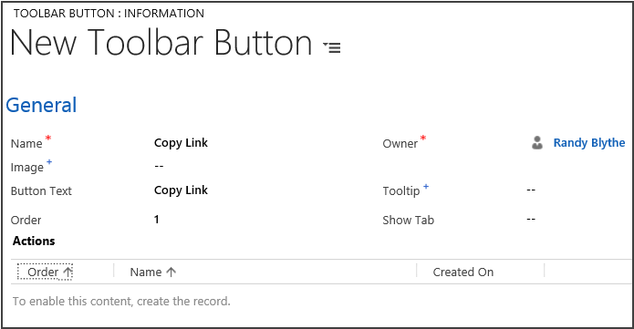  

7. Click **Save**.  

8. You’ll now create an action call for this button to copy the link of the currently displayed article when somebody clicks the button.  

    In the **Actions** area, click **+** on the right corner to add an action call.  

9. In the search box in the **Actions** area, press ENTER or click the search button.  

10. In the search results box, click **New** in the lower right corner to create an action call for this toolbar button.  

    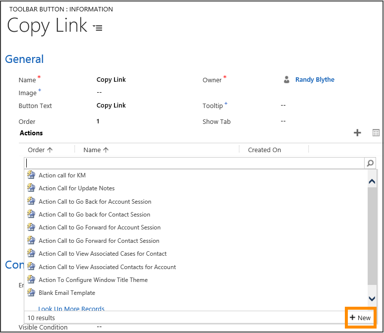  

11. On the **New Action Call** page, specify the following values.  

    |     Field      |                 Value                 |
    |----------------|---------------------------------------|
    |      Name      |  Sample: Copy KB Article Link Action  |
    | Hosted Control |      Dynamics 365 Global Manager      |
    |     Action     |            CopyToClipboard            |
    |      Data      | data=[[Sample KB Article.publicUrl]+] |

12. Click **Save and Close**. The new action call gets added to the **Copy Link** button.  

13. Click **Save** button in the lower-right corner of the page.  

14. Close the **Copy Link** toolbar button page, and return to the **Sample: KB Toolbar** page to add another button.  

15. In the **Buttons** area, click the + button to add buttons to the toolbar.  

16. On the **New Toolbar Button** page, specify the following values.  

    |    Field    |                                                                              Value                                                                               |
    |-------------|------------------------------------------------------------------------------------------------------------------------------------------------------------------|
    |    Name     |                                                                           Link Article                                                                           |
    | Button Text |                                                                           Link Article                                                                           |
    |    Order    | 2 **Note:**  The **Order** field defines the position of buttons in the toolbar. Buttons are arranged from left to right or top to bottom in an ascending order. |

17. Click **Save**.  

18. You’ll now create an action call for this button to associate the currently displayed article with the current case record.  

     In the **Actions** area, click **+** on the right corner to add an action call.  

19. In the search box in the **Actions** area, press ENTER or click the search button.  

20. In the search results box, click **New** in the lower-right corner to create an action call for this toolbar button.  

21. On the **New Action Call** page, specify the following values:  

    |Field|Value|  
    |-----------|-----------|  
    |Name|Sample: Associate KB Article to Case Action|  
    |Hosted Control|Sample KB Search|  
    |Action|Associate|  
    |Data|entitytypename=incident recordid =[[incident.Id]]  articleuniqueid=[[Sample KB Article.articleUId]]  articletitle=[[Sample KB Article.question]]  articleprivateurl=[[Sample KB Article.serviceDeskUri]]  articlepublicurl=[[Sample KB Article.publicUrl]+]|  

    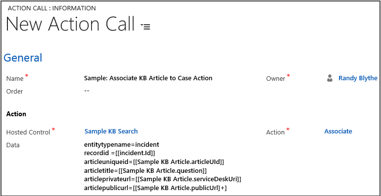  

22. Click **Save and Close**. The new action call gets added to the **Link Article** button.  

23. Click the **Save** button in the lower-right corner of the page.  

24. Close the **Link Article** toolbar button page, and return to the **Sample: KB Toolbar** page.  

25. We will now associate the **Sample: KB Toolbar** tool bar to the hosted control (**Sample KB Article**) where we want it to be displayed.  

26. On the navigation bar, click the down arrow next to **Sample: KB Toolbar**, and then click **Hosted Controls**.  

    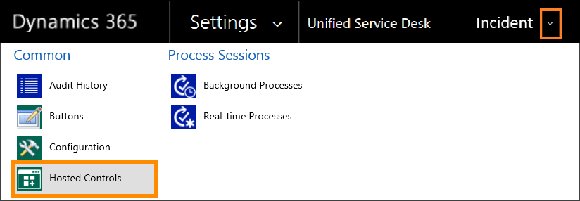  

27. Click **Add Existing Hosted Control**.  

28. In the search box, type `Sample KB Article`, and press ENTER or click the search button to add the hosted control.  

29. Click the **Save** button in the lower-right corner of the page.  

   
## Step 7: Test the application  
 To test the application:  

1. Start the [!INCLUDE[pn_unified_service_desk](../includes/pn-unified-service-desk.md)] client application, and sign in to the [!INCLUDE[pn_crm_shortest](../includes/pn-crm-shortest.md)] instance where you configured [!INCLUDE[pn_unified_service_desk](../includes/pn-unified-service-desk.md)] entities as described earlier.  

2. In the [!INCLUDE[pn_unified_service_desk](../includes/pn-unified-service-desk.md)] application, click **My Work** in the toolbar to display a list of cases assigned to you.  

3. In the **My Work** tab, click a case title to open it in a session. The Sample KB Search panel is automatically displayed on the right side, with the current case title pre-populated in the search box.  

   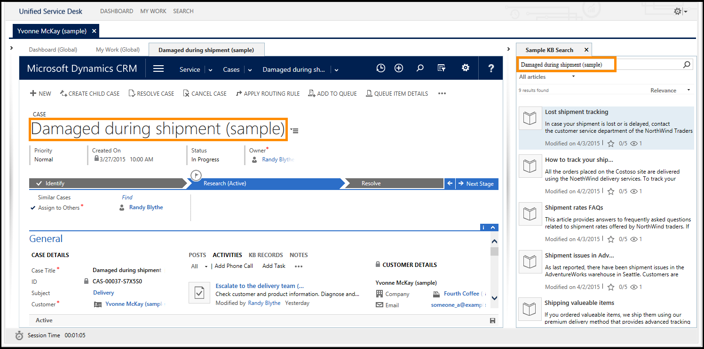  

4. Click a case title in the search results to display the article in the main panel. Notice the two buttons in the article tab: **Copy Link** and **Link Article**.  

     

   -   Click **Copy Link** to copy the URL of the article. You can paste the URL in the browser to go directly to the article or can copy it in an email and send it to your customer.  

   -   Click **Link Article** to associate the article with the current case. A message is displayed at the top of the Sample KB Search panel to inform you that the article has been linked.  

   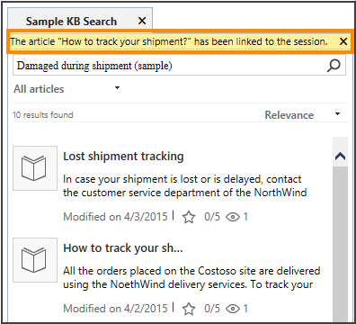  

   
## Conclusion  
 In this walkthrough, you learned how to use the KM Control hosted control to use Dynamics 365 knowledge from within [!INCLUDE[pn_unified_service_desk](../includes/pn-unified-service-desk.md)].  

### See also  
 [Use Dynamics 365 knowledge for effective customer engagement](../unified-service-desk/use-dynamics-365-knowledge-effective-customer-engagement.md)   

 [Configure Dynamics 365 knowledge in Unified Service Desk](../unified-service-desk/configure-unified-service-desk-use-dynamics-365-knowledge.md)   

 [KM Control (Hosted Control)](../unified-service-desk/km-control-hosted-control.md)   

 [Unified Interface KM Control (Hosted Control)](../unified-service-desk/unified-interface-km-control-hosted-control.md)

 [Unified Service Desk Configuration Walkthroughs](../unified-service-desk/unified-service-desk-configuration-walkthroughs.md)
