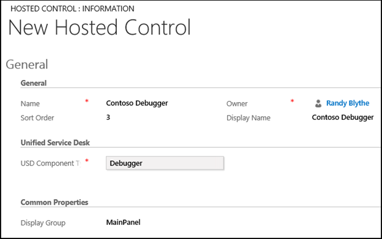
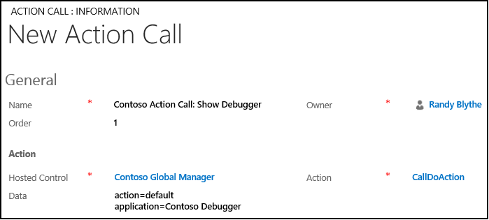
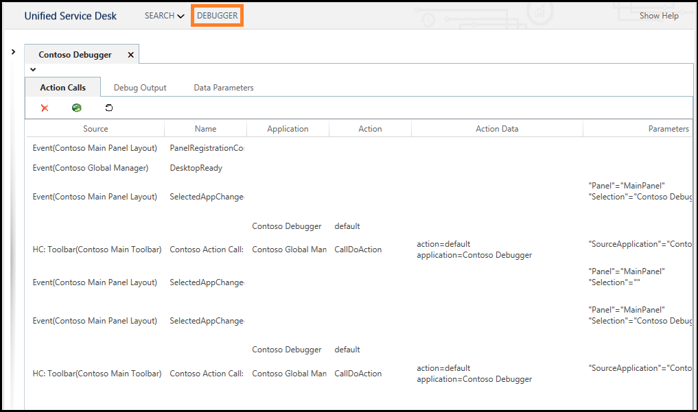

# Walkthrough 6: Configure the Debugger hosted control in your agent application
[!INCLUDE[pn_unified_service_desk](../includes/pn-unified-service-desk.md)] provides a **Debugger** type of hosted control, which provides you key information about your [!INCLUDE[pn_unified_service_desk](../includes/pn-unified-service-desk.md)] configuration that helps you to successfully build an agent application and troubleshoot issues in your configuration. [!INCLUDE[proc_more_information](../includes/proc-more-information.md)] [Debug issues in Unified Service Desk](../unified-service-desk/debug-issues-unified-service-desk.md )  

 This walkthrough demonstrates how to configure a Debugger hosted control for your agent application.  

## Prerequisites  

- You must have completed [Walkthrough 1: Build a simple agent application](../unified-service-desk/walkthrough-1-build-a-simple-agent-application.md) and [Walkthrough 3: Display Microsoft Dynamics 365 for Customer Engagement records in your agent application](../unified-service-desk/walkthrough-3-display-microsoft-dynamics-365-records-in-your-agent-application.md). The configurations that you completed in those walkthroughs are required in this walkthrough.  

- This walkthrough assumes that you’ll be using the same user credential that you used in walkthrough 1 to sign in to the agent application at the end of the walkthrough to test the application. If a different user will be testing the application, you must assign the user to **Contoso Configuration**. [!INCLUDE[proc_more_information](../includes/proc-more-information.md)] [Walkthrough 1: Build a simple agent application](../unified-service-desk/walkthrough-1-build-a-simple-agent-application.md)  

- You must know about the following in [!INCLUDE[pn_unified_service_desk](../includes/pn-unified-service-desk.md)]:  

  - Debugger hosted control. [!INCLUDE[proc_more_information](../includes/proc-more-information.md)] [Debugger (Hosted Control)](../unified-service-desk/debugger-hosted-control.md)  

  - Action call and how to configure it. [!INCLUDE[proc_more_information](../includes/proc-more-information.md)] [Action calls](../unified-service-desk/action-calls.md)  

  - Filter access using [!INCLUDE[pn_unified_service_desk](../includes/pn-unified-service-desk.md)] configuration. [!INCLUDE[proc_more_information](../includes/proc-more-information.md)] [Manage access using Unified Service Desk configuration](admin/manage-access-using-unified-service-desk-configuration.md)  

   
## In This Walkthrough  
 [Step 1: Create a Debugger type of hosted control](../unified-service-desk/walkthrough-configure-debugger-hosted-control-agent-application.md#Step1)  

 [Step 2: Add toolbar button and action call to display the Debugger hosted control](../unified-service-desk/walkthrough-configure-debugger-hosted-control-agent-application.md#Step2)  

 [Step 3: Add the controls to the configuration](../unified-service-desk/walkthrough-configure-debugger-hosted-control-agent-application.md#Step3)  

 [Step 4: Test the application](../unified-service-desk/walkthrough-configure-debugger-hosted-control-agent-application.md#Step4)  

 [Conclusion](../unified-service-desk/walkthrough-configure-debugger-hosted-control-agent-application.md#conclusion)  

   
## Step 1: Create a Debugger type of hosted control  

1. Sign in to [!INCLUDE[pn_microsoftcrm](../includes/pn-microsoftcrm.md)] apps.  

2. [!INCLUDE[proc_settings_usd](../includes/proc-settings-usd.md)]  

3. Click **Hosted Controls**.  

4. Click **New**.  

5. On the **New Hosted Control** page, specify the following values:  

   |Field|Value|  
   |-----------|-----------|  
   |Name|Contoso Debugger|  
   |Sort Order|3|  
   |Display Name|Contoso Debugger|  
   |USD Component Type|Debugger|  
   |Display Group|MainPanel|  

     

6. Click **Save**.  

   
## Step 2: Add toolbar button and action call to display the Debugger hosted control  
 Add a toolbar button to **Contoso Main Toolbar** (created in [Walkthrough 3: Display Microsoft Dynamics 365 for Customer Engagement records in your agent application](../unified-service-desk/walkthrough-3-display-microsoft-dynamics-365-records-in-your-agent-application.md)), and then add an action call for the button to display the **Contoso Debugger** hosted control that you created in step 1.  

1. Sign in to [!INCLUDE[pn_microsoftcrm](../includes/pn-microsoftcrm.md)] apps.  

2. [!INCLUDE[proc_settings_usd](../includes/proc-settings-usd.md)]  

3. Click **Toolbars**.  

4. Click **Contoso Main Toolbar**.  

5. In the **Buttons** area, click **+** to add a toolbar button.  

6. On the **New Toolbar Button** page, specify the following values.  

   |    Field    |                                                                              Value                                                                               |
   |-------------|------------------------------------------------------------------------------------------------------------------------------------------------------------------|
   |    Name     |                                                                     Contoso Debugger Button                                                                      |
   | Button Text |                                                                             DEBUGGER                                                                             |
   |    Order    | 3 **Note:**  The **Order** field defines the position of buttons in the toolbar. Buttons are arranged from left to right or top to bottom in an ascending order. |

7. Click **Save**.  

8. In the **Actions** area, click **+** to create an action call for the button  

9. In the search box, press **ENTER** or click the search icon, and then click **New** in the lower-right corner of the search results pane to create an action call.  

10. On the **New Action Call** page, specify the following values.  

    |Field|Value|  
    |-----------|-----------|  
    |Name|Contoso Action Call: Show Debugger|  
    |Order|1|  
    |Hosted Control|Contoso Global Manager|  
    |Action|CallDoAction|  
    |Data|action=default application=Contoso Debugger|  

      

11. Click **Save**.  

   
## Step 3: Add the controls to the configuration  
 Add the action call and hosted control that you created in this walkthrough to **Contoso Configuration** to display these controls to the user who is assigned to the configuration. **Contoso Configuration** was created in [Walkthrough 1: Build a simple agent application](../unified-service-desk/walkthrough-1-build-a-simple-agent-application.md).  

 Add the following to **Contoso Configuration**.  

|Control name|Control type|  
|------------------|------------------|  
|Contoso Action Call: Show Debugger|Action Call|  
|Contoso Debugger|Hosted Control|  

 To add a control to the configuration:  

1. Sign in to [!INCLUDE[pn_microsoftcrm](../includes/pn-microsoftcrm.md)] apps.  

2. [!INCLUDE[proc_settings_usd](../includes/proc-settings-usd.md)]  

3. Click **Configuration**.  

4. Click **Contoso Configuration** to open the definition.  

5. On the nav bar, click the down arrow next to **Contoso Configuration**, and select **Action Calls**.  

6. On the next page, click **Add Existing Action Call**, type “`Contoso Action Call: Show Debugger`” in the search bar, and then press ENTER or click the search icon.  

7. In the search results, click the action call name to add it.  

8. Similarly, add the hosted control by clicking the down arrow next to **Contoso Configuration**, and clicking **Hosted Controls**.  

9. Click **Save**.  

   
## Step 4: Test the application  
 Start the [!INCLUDE[pn_unified_service_desk](../includes/pn-unified-service-desk.md)] client application, and sign in to the [!INCLUDE[pn_crm_shortest](../includes/pn-crm-shortest.md)] apps instance where you configured [!INCLUDE[pn_unified_service_desk](../includes/pn-unified-service-desk.md)] using the same user credentials that you assigned to the **Contoso Configuration** in [Walkthrough 1: Build a simple agent application](../unified-service-desk/walkthrough-1-build-a-simple-agent-application.md). For information about connecting to a [!INCLUDE[pn_crm_shortest](../includes/pn-crm-shortest.md)] apps instance using the [!INCLUDE[pn_unified_service_desk](../includes/pn-unified-service-desk.md)] client application, see [Connect to a Dynamics 365 for Customer Engagement apps instance using the Unified Service Desk client](admin/connect-dynamics-365-instance-using-unified-service-desk-client.md).  

 Your agent application will now have a **DEBUGGER** button in the toolbar area. Clicking this button displays the Debugger control.  

   

   
## Conclusion  
 In this walkthrough, you saw how to configure the Debugger hosted control in your agent application. You also learned how to filter access to [!INCLUDE[pn_unified_service_desk](../includes/pn-unified-service-desk.md)] controls using configuration.  

### See also  

 [Walkthrough 1: Build a simple agent application](../unified-service-desk/walkthrough-1-build-a-simple-agent-application.md)   

 [Walkthrough 2: Display an external webpage in your agent application](../unified-service-desk/walkthrough-2-display-an-external-webpage-in-your-agent-application.md)   

 [Walkthrough 3: Display Microsoft Dynamics 365 for Customer Engagement records in your agent application](../unified-service-desk/walkthrough-3-display-microsoft-dynamics-365-records-in-your-agent-application.md)   

 [Walkthrough 4: Display a Microsoft Dynamics 365 for Customer Engagement record in a session in your agent application](../unified-service-desk/walkthrough-display-dynamics-365-record-session-agent-application.md)   

 [Walkthrough 5: Display enhanced session information by displaying session name and overview data](../unified-service-desk/walkthrough-5-display-enhanced-session-information-displaying-session-name-overview-data.md)   

 [Walkthrough 7: Configure agent scripting in your agent application](../unified-service-desk/walkthrough-configure-agent-scripting-agent-application.md)   

 [Unified Service Desk Configuration Walkthroughs](../unified-service-desk/unified-service-desk-configuration-walkthroughs.md)
