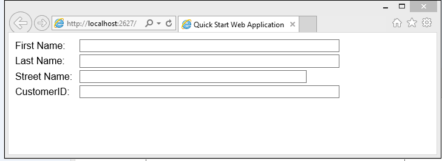
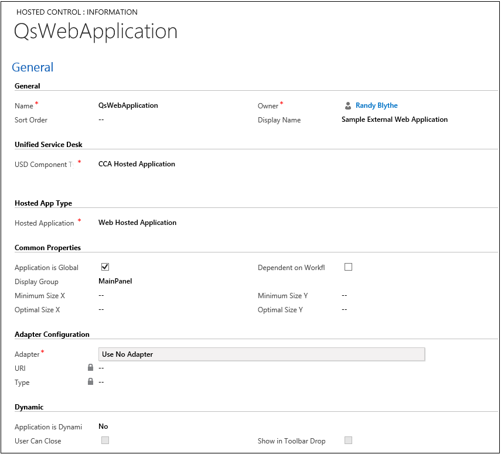
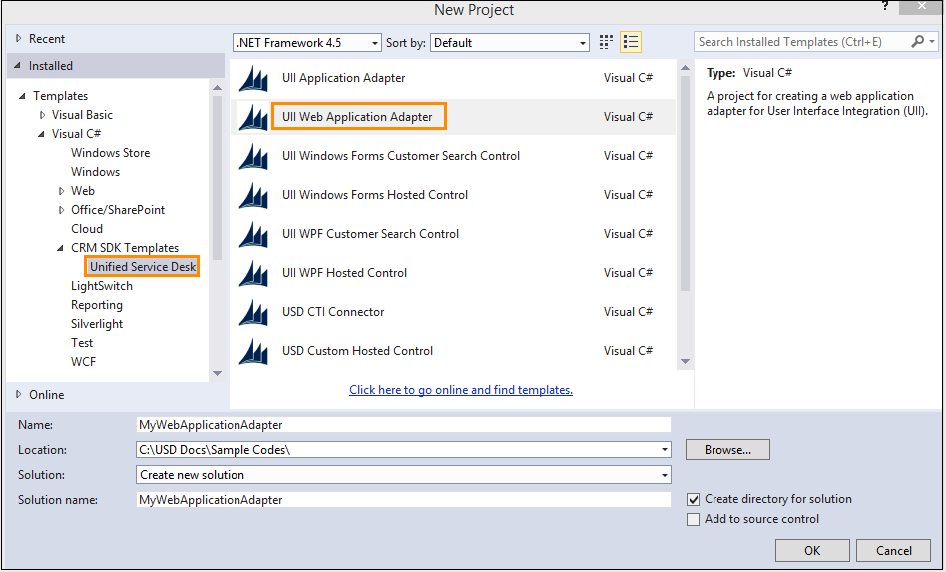
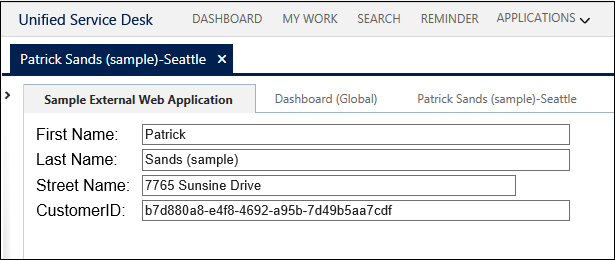

# Walkthrough: Create a UII Web Application Adapter
You can create a web application adapter if you want to enhance and modify web applications for which you don’t have access to the source code or don’t have permissions to change by using managed code. The Common Data Service platform provides a [!INCLUDE[pn_Visual_Studio](../includes/pn-visual-studio.md)] template for creating a web application adapter. The template provides basic code as comments to help you get started with creating the web application adapter.  

 In this walkthrough, you’ll build an external web application called `QsWebApplication` and host it in [!INCLUDE[pn_unified_service_desk](../includes/pn-unified-service-desk.md)]. You’ll then create and configure a web application adapter called `MyWebApplicationAdapter` for the external web application to interact with [!INCLUDE[pn_unified_service_desk](../includes/pn-unified-service-desk.md)]. The web application has four labels, one each for the customer’s first name, last name, address, and ID and four corresponding text boxes to display the [!INCLUDE[pn_unified_service_desk](../includes/pn-unified-service-desk.md)] values.

<a name="Prereq"></a>
## Prerequisites

- [!INCLUDE[pn_Microsoft_.Net_Framework](../includes/pn-microsoft-net-framework.md)] 4.6.2

- [!INCLUDE[pn_unified_service_desk](../includes/pn-unified-service-desk.md)] client application; required for testing the hosted control.

- [!INCLUDE[pn_microsoft_visual_studio_2012](../includes/pn-microsoft-visual-studio-2012.md)], [!INCLUDE[pn_visual_studio_2013](../includes/pn-visual-studio-2013.md)], or [!INCLUDE[pn_visual_studio_2015](../includes/pn-visual-studio-2015.md)]

- [!INCLUDE[tn_nuget_package_manager](../includes/tn-nuget-package-manager.md)] for [Visual Studio 2012](https://visualstudiogallery.msdn.microsoft.com/27077b70-9dad-4c64-adcf-c7cf6bc9970c), [Visual Studio 2013](https://visualstudiogallery.msdn.microsoft.com/4ec1526c-4a8c-4a84-b702-b21a8f5293ca), or [Visual Studio 2015](https://visualstudiogallery.msdn.microsoft.com/5d345edc-2e2d-4a9c-b73b-d53956dc458d)

- **CRM SDK Templates** for [!INCLUDE[pn_Visual_Studio_short](../includes/pn-visual-studio-short.md)] that contains the UII hosted control project template. [Download](https://go.microsoft.com/fwlink/p/?LinkId=400925) the **CRM SDK Templates** from the Visual Studio gallery, and double-click the CRMSDKTemplates.vsix file to install the template in [!INCLUDE[pn_Visual_Studio_short](../includes/pn-visual-studio-short.md)].

<a name="Build"></a>
## Step 1: Build a sample web application

1. [Download the UII SDK package (.exe)](https://go.microsoft.com/fwlink/p/?LinkId=519179)

2. Double-click the package file to extract the contents.

3. Navigate to the \<ExtractedFolder>\UII\SampleCode\UII\AIF\QsWebApplication folder, and open the Microsoft.Uii.QuickStarts.QsWebApplication.csproj file in [!INCLUDE[pn_Visual_Studio_short](../includes/pn-visual-studio-short.md)].

4. Press F5 or choose **Debug** > **Start Debugging** to host the sample web application locally on your computer. The application will be hosted at https://localhost:2627/.

   

<a name="ConfigureExApp"></a>   
## Step 2: Configure a web application

1. Sign in to the Common Data Service platform.  

2. [!INCLUDE[proc_settings_usd](../includes/proc-settings-usd.md)]

3. Choose **Hosted Controls**.

4. Choose **New**.

5. On the **New Hosted Control** page, specify the following values.


   |           Field            |                                                 Value                                                 |
   |----------------------------|-------------------------------------------------------------------------------------------------------|
   |          **Name**          |                                           QsWebApplication                                            |
   |   **USD Component Type**   |                                        CCA Hosted Application                                         |
   |   **Hosted Application**   |                                        Web Hosted Application                                         |
   | **Application is Global**  |                                                Checked                                                |
   |     **Display Group**      |                                               MainPanel                                               |
   |        **Adapter**         |                                            Use No Adapter                                             |
   | **Application is Dynamic** |                                                  No                                                   |
   |  **Application Hosting**   |                                             Use SetParent                                             |
   |          **URL**           | Specify the location where your web application is hosted. In this case, it is https://localhost:2627/ |

     

6. Choose **Save**.

<a name="TestExApp"></a>
## Step 3: Test the web application

1. Make sure that the sample web application that you built in step 1 is still running.

2. Run the [!INCLUDE[pn_unified_service_desk](../includes/pn-unified-service-desk.md)] client to connect to your Common Data Service platform server.  

3. On successful sign in, you’ll see the **Sample External Web Application** on your desktop.

4. Click the **Sample External Web Application** tab to see your web application hosted within **Unified Service Desk**.

   

> [!NOTE]
>  At this point the fields are empty because you’re only hosting the external web application in **Unified Service Desk**. To populate them with values from **Unified Service Desk**, we have to create a web application adapter as illustrated in the next step.  

<a name="createappadapter"></a>   
## Step 4: Create the web application adapter  

1. Start [!INCLUDE[pn_Visual_Studio](../includes/pn-visual-studio.md)], and create a new project.  

2. In the **New Project** dialog box:  

   1. From the list of installed templates on the left, expand [!INCLUDE[pn_Visual_C#](../includes/pn-visual-csharp.md)], and select **CRM SDK Templates** > **Unified Service Desk** > **UII Web Application Adapter**.  

   2. Specify the name and location of the project, and click **OK** to create a new project.  

     

   3. Choose WebAppAdapter.cs and update the definition of **NotifyContextChange** with the following code to populate the text fields from the context information. [!INCLUDE[proc_more_information](../includes/proc-more-information.md)] [Context)](https://docs.microsoft.com/dotnet/api/microsoft.uii.csr.hostedapplicationadapter.notifycontextchange\(microsoft.uii.csr.context\))  

      ```csharp  
      public override bool NotifyContextChange(Context context)  
              {  
                  // Populating text fields from context information.  

                  HTMLDocument htmlDoc = Browser.Document as HTMLDocument;  
                  if (htmlDoc != null)  
                  {  
                      IHTMLElementCollection htmlElementCollection = htmlDoc.all;  
                      IHTMLElement htmlFirstName = htmlElementCollection.item("txtFirstName", 0) as IHTMLElement;  
                      htmlFirstName.setAttribute("value", context["firstname"], 0);  
                      IHTMLElement htmlLastName = htmlElementCollection.item("txtLastName", 0) as IHTMLElement;  
                      htmlLastName.setAttribute("value", context["lastname"], 0);  
                      IHTMLElement htmlAddress = htmlElementCollection.item("txtAddress", 0) as IHTMLElement;  
                      htmlAddress.setAttribute("value", context["address1_line1"], 0);  
                      IHTMLElement htmlID = htmlElementCollection.item("txtID", 0) as IHTMLElement;  
                      htmlID.setAttribute("value", context["CustomerID"], 0);  
                  }  
                  return base.NotifyContextChange(context);  
              }  

      ```  

   4. Add the following code to the override definition of **DoAction** to update the application with values from [!INCLUDE[pn_unified_service_desk](../includes/pn-unified-service-desk.md)]  

      ```csharp  
      public override bool DoAction(HostedWebApplication.WebAction action, ref string data)  
              {  
                  Trace.WriteLine(string.Format("{0}>>>>> RECEIVED (WebAction) Action : {1} ", this.Name, action.Name));  

                  // Check to see if the browser is working on something before allowing the system to do 'normal' behavior.  
                  if (Browser.WebBrowser.ReadyState != tagREADYSTATE.READYSTATE_COMPLETE)  
                  {  
                      // Browser is not in a state to process this request,  Queue it for when the browser is ready to handle it.   
                      Trace.WriteLine(string.Format("{0}>>>>> Browser Busy,({2}) Queuing Action : {1} ", this.Name, action.Name, Browser.WebBrowser.ReadyState.ToString()));  
                      qReqActionList.Enqueue(new BrowserActionData(action, data));  
                      return false;  
                  }  
                Trace.WriteLine(string.Format("{0}>>>>>>>>>>> Action:Name={1} Action:Url={2} Action:Query={3} Action:Init={4}", this.Name, action.Name, action.Url, action.QueryString, action.Initialization));  

                  // Get browser DOM and element collection.  
                  // Create an XML Document to load the passed in data to.  
                  HTMLDocument htmlDoc = Browser.Document as HTMLDocument;  
                  IHTMLElementCollection htmlElementCollection = htmlDoc.all;  

                  // Check action name for something we know how to process.  
                  switch (action.Name)  
                  {  
                      case "UpdateFirstName":  
                          IHTMLElement htmlFirstName = htmlElementCollection.item("txtFirstName", 0) as IHTMLElement;  
                          htmlFirstName.setAttribute("value", data, 0);  
                          break;  
                      case "UpdateLastName":  
                          IHTMLElement htmlLastName = htmlElementCollection.item("txtLastName", 0) as IHTMLElement;  
                          htmlLastName.setAttribute("value", data, 0);  
                          break;  
                      case "UpdateAddress":  
                          IHTMLElement htmlAddress = htmlElementCollection.item("txtAddress", 0) as IHTMLElement;  
                          htmlAddress.setAttribute("value", data, 0);  
                          break;  
                      case "UpdateID":  
                          IHTMLElement htmlID = htmlElementCollection.item("txtID", 0) as IHTMLElement;  
                          htmlID.setAttribute("value", data, 0);  
                          break;  
                  }  
                  return false;  
              }  

      ```  

   5. Save your project, and build it (**Build** > **Build Solution**). After the project builds successfully, an assembly (MyWebApplicationAdapter.dll) is generated in the \bin\debug folder of your project folder. You’ll need this assembly later for testing and using your web application adapter.  

<a name="ConfigureWebAdapter"></a>   
## Step 5: Configure a web application adapter  

1. Sign in to the Common Data Service platform.  

2. On the nav bar, choose **Dynamics 365**.  

3. Choose **Settings** > **Unified Service Desk** > **Hosted Controls**.  

4. From the list of hosted controls, select **QsWebApplication** hosted control.  

     

5. In the **Adapter Configuration** section, specify the following values.  

   |**Field**|Value|  
   |---------------|-----------|  
   |**Adapter**|Use Adapter|  
   |**URI**|MyWebApplicationAdapter|  
   |Type|MyWebApplicationAdapter.WebAppAdapter|  

     

   > [!NOTE]
   > **URI** is the name of your assembly and the **Type** is the name of your assembly (dll) followed by a dot (.) and then the class name in your [!INCLUDE[pn_Visual_Studio_short](../includes/pn-visual-studio-short.md)] project. In this example, the name of the assembly is MyWebApplicationAdapter and name of the class is WebAdapter, which is the default class name when you create a web application adapter.

6. Choose **Save** to save the changes.

<a name="TestAppAdapter"></a>
## Step 6: Test the web application adapter

1. Copy the assembly that contains your web application adapter definition from your [!INCLUDE[pn_Visual_Studio_short](../includes/pn-visual-studio-short.md)] project output folder (\<ProjectFolder>\bin\debug) to the Unified Service Desk application directory. In this case, you’ll copy the MyWebApplicationAdapter.dll file to the c:\Program Files\Microsoft Dynamics CRM USD\USD directory.

2. Run the [!INCLUDE[pn_unified_service_desk](../includes/pn-unified-service-desk.md)] client to connect to your [!INCLUDE[pn_microsoftcrm](../includes/pn-microsoftcrm.md)] apps server.

3. On successful sign in, you will see the sample external web application button on your desktop.

4. Choose **Search** and then choose **Contacts** and select a contact. In this case, select **Patrick Sands**.

   

5. Click **Sample External Web Application** and you’ll see the customer’s first name, last name, address, and ID populated.

   

> [!NOTE]
>  This walkthrough showed you how to read or display data from [!INCLUDE[pn_unified_service_desk](../includes/pn-unified-service-desk.md)] in the external web application. To update the data in [!INCLUDE[pn_unified_service_desk](../includes/pn-unified-service-desk.md)] from the external web application, and vice versa, see [Walkthrough: Create a UII Windows Forms Hosted Control](../unified-service-desk/walkthrough-create-uii-windows-forms-hosted-control.md)

### See also
 [Use UII adapters to interact with external and web applications](../unified-service-desk/use-uii-adapters-interact-external-web-applications.md)
