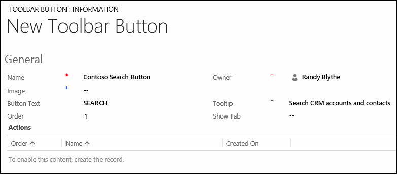
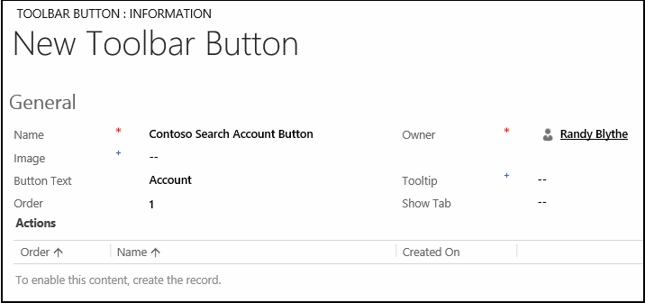
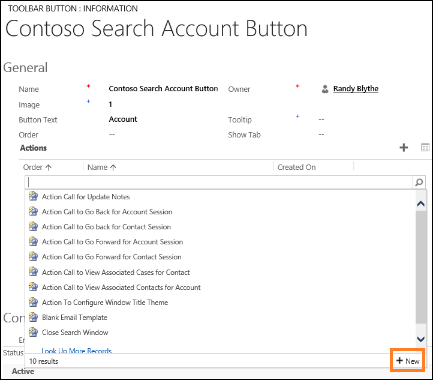
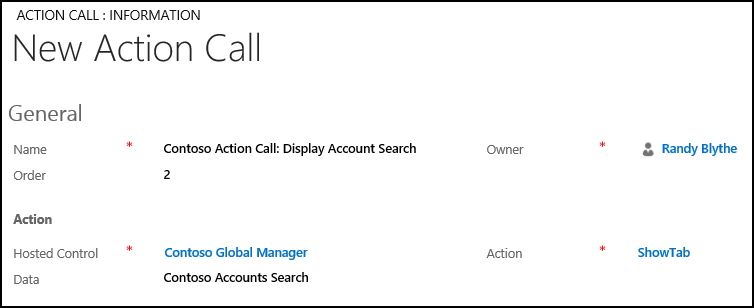
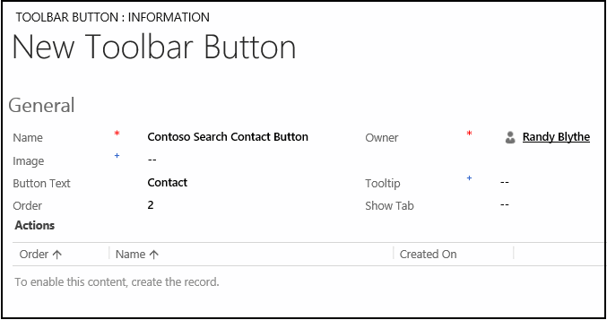
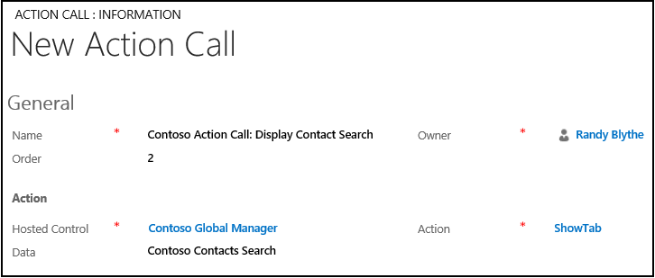
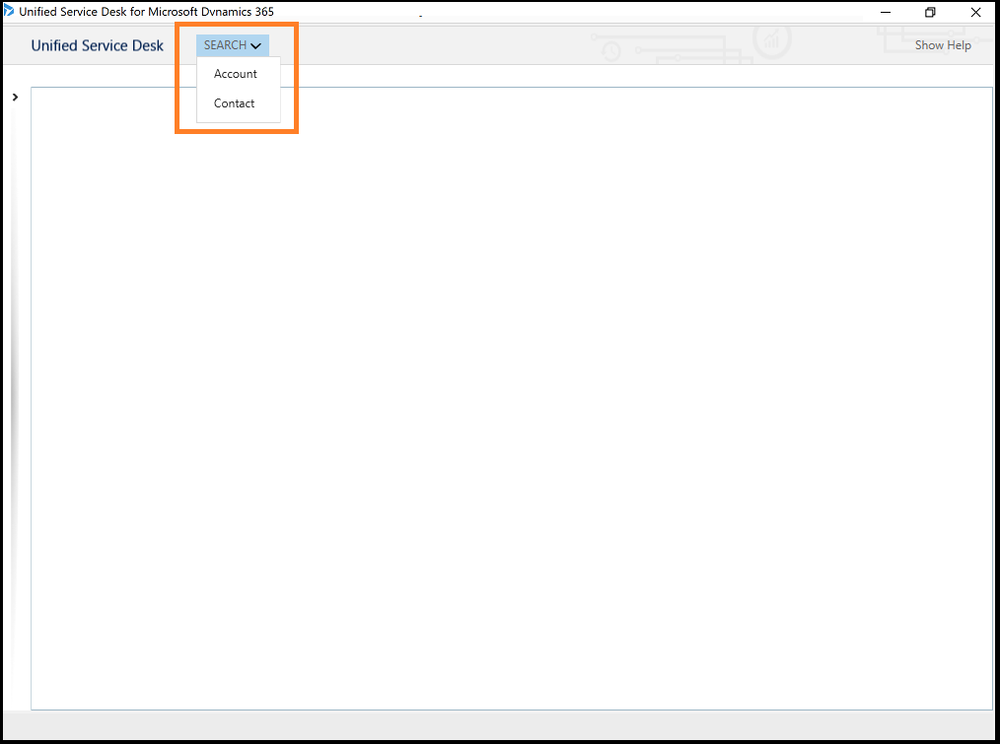

# Walkthrough 3: Display Microsoft Dynamics 365 Unified Interface app records in your agent application
This walkthrough demonstrates how to display [!INCLUDE[pn_microsoftcrm](../includes/pn-microsoftcrm.md)] records of Unified Interface Apps in your agent application. In this walkthrough, you’ll display all the account and contact records in the [!INCLUDE[pn_crm_shortest](../includes/pn-crm-shortest.md)] instance. You’ll also create a search button with drop-down menu items for displaying accounts and contacts in the agent application.  

## Prerequisites  

- You must have completed [Walkthrough 1: Build a simple agent application for Unified Interface Apps](../unified-service-desk/walkthrough1-unified-interface-build-a-simple-agent-application.md). The configurations that you completed in walkthrough 1 are required in this walkthrough.  

- This walkthrough assumes that you will be using the same user credential that you used in walkthrough 1 to sign in to the agent application at the end of the walkthrough to test the application. If a different user will be testing the application, you must assign the user to **Contoso Configuration**. [!INCLUDE[proc_more_information](../includes/proc-more-information.md)] [Walkthrough 1: Build a simple agent application for Unified Interface Apps](../unified-service-desk/walkthrough1-unified-interface-build-a-simple-agent-application.md)  

- You must know about the following in [!INCLUDE[pn_unified_service_desk](../includes/pn-unified-service-desk.md)]:  

  - The following two types of hosted controls: Unified Interface Page and Toolbar Container. [!INCLUDE[proc_more_information](../includes/proc-more-information.md)] [Hosted control types and action/event reference](../unified-service-desk/hosted-control-types-action-event-reference.md)  

  - Action call and how to configure it. [!INCLUDE[proc_more_information](../includes/proc-more-information.md)] [Action calls](../unified-service-desk/action-calls.md)  

  - Filter access using [!INCLUDE[pn_unified_service_desk](../includes/pn-unified-service-desk.md)] configuration. [!INCLUDE[proc_more_information](../includes/proc-more-information.md)] [Manage access using Unified Service Desk configuration](../unified-service-desk/admin/manage-access-using-unified-service-desk-configuration.md)  

   
## In This Walkthrough  
 [Step 1: Create Unified Interface Page type of hosted controls to display account and contact records](../unified-service-desk/walkthrough3-unified-interface-display-microsoft-dynamics-365-records-in-your-agent-application.md#Step1)  

 [Step 2: Create a toolbar container type of hosted control](../unified-service-desk/walkthrough3-unified-interface-display-microsoft-dynamics-365-records-in-your-agent-application.md#Step2)  

 [Step 3: Add a toolbar and attach it to the toolbar container](../unified-service-desk/walkthrough3-unified-interface-display-microsoft-dynamics-365-records-in-your-agent-application.md#Step3)  

 [Step 4: Add toolbar buttons and action calls to display Dynamics 365 records](../unified-service-desk/walkthrough3-unified-interface-display-microsoft-dynamics-365-records-in-your-agent-application.md#Step4)  

 [Step 5: Add the controls to the configuration](../unified-service-desk/walkthrough3-unified-interface-display-microsoft-dynamics-365-records-in-your-agent-application.md#Step5)  

 [Step 6: Test the application](../unified-service-desk/walkthrough3-unified-interface-display-microsoft-dynamics-365-records-in-your-agent-application.md#Step6)  

 [Conclusion](../unified-service-desk/walkthrough3-unified-interface-display-microsoft-dynamics-365-records-in-your-agent-application.md#Conclusion)

   
## Step 1: Create Unified Interface Page type of hosted controls to display account and contact records  
 In this step, you’ll create two hosted controls of **Unified Interface Page** type to display the account and contact records respectively.  

1. Sign in to [!INCLUDE[pn_microsoftcrm](../includes/pn-microsoftcrm.md)].  

2. [!INCLUDE[proc_settings_usd](../includes/proc-settings-usd.md)]  

3. Click **Hosted Controls**.  

4. Click **New**.  

5. On the **New Hosted Control** page, specify the following values:  

   |Field|Value|  
   |-----------|-----------|  
   |Name|Contoso Accounts Search|  
   |Display Name|Contoso: Accounts|  
   |USD Component Type|Unified Interface Page|  
   |Allow Multiple Pages|No|
   |Pre-Fetch Data|Checked|
   |Application is Global|Checked|  
   |Display Group|MainPanel|  

     

6. Click **Save**.  

7. Click **New** to create another hosted control for displaying contact records.  

8. On the **New Hosted Control** page, specify the following values:  

   |Field|Value|  
   |-----------|-----------|  
   |Name|Contoso Contacts Search|  
   |Display Name|Contoso: Contacts|  
   |USD Component Type|Unified Interface Page|  
   |Allow Multiple Pages|No|
   |Pre-Fetch Data|Checked|
   |Application is Global|Checked|  
   |Display Group|MainPanel|  

     

9. Click **Save**.  

   
## Step 2: Create a toolbar container type of hosted control  
 Toolbar Container type of hosted controls are used to hold and display the toolbars in [!INCLUDE[pn_unified_service_desk](../includes/pn-unified-service-desk.md)]. In this section, you’ll create a **Toolbar Container** hosted control that will appear at the top of the client application.  

1. Sign in to [!INCLUDE[pn_microsoftcrm](../includes/pn-microsoftcrm.md)].  

2. [!INCLUDE[proc_settings_usd](../includes/proc-settings-usd.md)]  

3. Click **Hosted Controls**.  

4. Click **New**.  

5. On the **New Hosted Control** page, specify the following values  

   |Field|Value|  
   |-----------|-----------|  
   |Name|Contoso Main Toolbar Container|  
   |USD Component Type|Toolbar Container|  
   |Display Group|ToolbarPanel|  

   

6. Click **Save**.  

   
## Step 3: Add a toolbar and attach it to the toolbar container  
 In this step, you’ll create a toolbar, and attach the toolbar to the toolbar container hosted control created in step 2. This is done to display the toolbar in your agent application.  

1. Sign in to [!INCLUDE[pn_microsoftcrm](../includes/pn-microsoftcrm.md)].  

2. [!INCLUDE[proc_settings_usd](../includes/proc-settings-usd.md)]  

3. Click **Toolbars**.  

4. Click **New**.  

5. On the **New Toolbar** page, type **Contoso Main Toolbar** in the **Name** box, and then click **Save**.  

6. Attach the toolbar to the toolbar container hosted control created in step 2. On the nav bar, click the down arrow next to **Contoso Main Toolbar**, and click **Hosted Controls**.  

7. On the next page, click **Add Existing Hosted Control**, type `Contoso Main Toolbar Container` in the search bar, and then press ENTER or click the search icon.  

8. From the search result, click **Contoso Main Toolbar Container** to add.  

9. Click **Save**.  

   
## Step 4: Add toolbar buttons and action calls to display Dynamics 365 records  from Unified Interface Apps
 In this step, you’ll add buttons on the toolbar and attach action calls to the buttons so that when the button is clicked, appropriate [!INCLUDE[pn_crm_shortest](../includes/pn-crm-shortest.md)] records are displayed in the hosted controls that were created in step 1. You’ll configure the search button so that clicking the button displays the account and contact submenu items, and clicking a button displays the respective [!INCLUDE[pn_crm_shortest](../includes/pn-crm-shortest.md)] records.  

1. After you save the toolbar in step 3, the **Buttons** area becomes available. In the **Buttons** area, click **+** on the right corner to add a button.  

2. On the **New Toolbar Button** page, specify the following values:  

   |    Field    |                                          Value                                           |
   |-------------|------------------------------------------------------------------------------------------|
   |    Name     |                                  Contoso Search Button                                   |
   | Button Text |                                          SEARCH                                          |
   |   Tooltip   | Search [!INCLUDE[pn_crm_shortest](../includes/pn-crm-shortest.md)] accounts and contacts |
   |    Order    |                                            1                                             |

   

3. Click **Save**.

4. On the nav bar, click the down arrow next to Contoso Search Button, and click Toolbar Buttons.

   > [!NOTE]
   >  You are now adding child toolbar buttons to an existing toolbar button to create a submenu structure.

5. On the next page, click **Add New Toolbar Button**.

6. On the **New Toolbar Button** page, specify the following values.

   |Field|Value|  
   |-----------|-----------|  
   |Name|Contoso Search Account Button|  
   |Button Text|Account|  
   |Order|1   The **Order** field defines the position of buttons in the toolbar. Buttons are arranged from left to right or top to bottom in an ascending order.|  

     

7. Click **Save**.  

8. You’ll now add two action calls: first to display the account records in the hosted control created in step 1 and the second one on the Contoso Global Manager hosted control to display the account hosted control.  

    In the **Actions** area, click **+** on the right corner to add an action call.  

9. In the search box in the **Actions** area, press ENTER or click the search icon.  

10. In the search results box, click **New** in the lower right corner to create an action call for this toolbar button.  

      

11. On the **New Action Call** page, specify the following values:  

    |Field|Value|  
    |-----------|-----------|  
    |Name|Contoso Action Call: Search Account|  
    |Order|1|  
    |Hosted Control|Contoso Accounts Search|  
    |Action|Find|  
    |Data|account|  

      

12. Click **Save**. The new action call gets added to the **Contoso Search Account Button** button.  

13. You’ll add another action call to the button to set the focus on the hosted control that displays the account records in the client application. In the **Actions** area, click **+** on the right corner to add an action call.  

14. In the search results box, click **New** in the lower right corner to create an action call for this toolbar button.  

15. On the **New Action Call** page, specify the following values.  

    |Field|Value|  
    |-----------|-----------|  
    |Name|Contoso Action Call: Display Account Search|  
    |Order|2|  
    |Hosted Control|Contoso Global Manager|  
    |Action|ShowTab|  
    |Data|Contoso Accounts Search|  

      

16. Click **Save**. The new action call gets added to the **Contoso Search Account Button** button.  

17. Navigate to **Contoso Search Button** toolbar button to add a child button for searching and displaying contacts. On the nav bar, click the down arrow next to **Contoso Search Button**, and select **Toolbar Buttons**.  

18. On the next page, click **Add New Toolbar Button**.  

19. On the **New Toolbar Button** page, specify the following values:  

    |Field|Value|  
    |-----------|-----------|  
    |Name|Contoso Search Contact Button|  
    |Button Text|Contact|  
    |Order|2   The **Order** field defines the position of buttons in the toolbar. Buttons are arranged from left to right or top to bottom in an ascending order.|  

      

20. Click **Save**.  

21. You’ll now add two action calls: first to display the contact records in the hosted control that were created in step 1 and the second one on the Contoso Global Manager hosted control to display the contacts hosted control.  

     In the **Actions** area, click **+** on the right corner to add an action call.  

22. In the search box in the **Actions** area, press ENTER or click the search icon.  

23. In the search results box, click **New** in the lower right corner to create an action call for this toolbar button.  

24. On the **New Action Call** page, specify the following values:  

    |Field|Value|  
    |-----------|-----------|  
    |Name|Contoso Action Call: Search Contact|  
    |Order|1|  
    |Hosted Control|Contoso Contacts Search|  
    |Action|Find|  
    |Data|contact|  

      

25. Click **Save**. The new action call gets added to the **Contoso Search Contact Button** toolbar button.  

26. You’ll add another action call to the button to set the focus on the hosted control that displays the contact records in the client application. In the **Actions** area, click **+** on the right corner to add an action call.  

27. In the search results box, click **New** in the lower right corner to create an action call for this toolbar button.  

28. On the **New Action Call** page, specify the following values.  

    |Field|Value|  
    |-----------|-----------|  
    |Name|Contoso Action Call: Display Contact Search|  
    |Order|2|  
    |Hosted Control|Contoso Global Manager|  
    |Action|ShowTab|  
    |Data|Contoso Contacts Search|  

      

29. Click **Save**. The new action call gets added to the **Contoso Search Contact Button** toolbar button.  

   
## Step 5: Add the controls to the configuration  
 In this step, you’ll add the action calls, hosted controls, and toolbar that were created in this walkthrough to **Contoso Configuration** to display these controls to the user who is assigned to the configuration. **Contoso Configuration** was created in [Walkthrough 1: Build a simple agent application for Unified Interface Apps](../unified-service-desk/walkthrough1-unified-interface-build-a-simple-agent-application.md).  

 Add the following to **Contoso Configuration**.  

|Control name|Control type|  
|------------------|------------------|  
|Contoso Action Call: Search Account|Action Call|  
|Contoso Action Call: Display Account Search|Action Call|  
|Contoso Action Call: Search Contact|Action Call|  
|Contoso Action Call: Display Contact Search|Action Call|  
|Contoso Accounts Search|Hosted Control|  
|Contoso Contacts Search|Hosted Control|  
|Contoso Main Toolbar Container|Hosted Control|  
|Contoso Main Toolbar|Toolbar|  

 To add a control to the configuration:  

1. Sign in to [!INCLUDE[pn_microsoftcrm](../includes/pn-microsoftcrm.md)].  

2. [!INCLUDE[proc_settings_usd](../includes/proc-settings-usd.md)]  

3. Click **Configuration**.  

4. Click **Contoso Configuration** to open the definition.  

5. On the nav bar, click the down arrow next to **Contoso Configuration**, and select **Action Calls**.  

6. On the next page, click **Add Existing Action Call**, type “`Contoso Action Call`” in the search bar, and then press ENTER or click the search icon.  

7. The action calls listed earlier are displayed in the search results. Add these action calls.  

8. Similarly, add the hosted controls and the toolbar by clicking the down arrow next to **Contoso Configuration**, and clicking **Hosted Controls** and **Toolbars** respectively.  

9. Click **Save**.  

   
## Step 6: Test the application  
 Start the [!INCLUDE[pn_unified_service_desk](../includes/pn-unified-service-desk.md)] client application, and sign in to the [!INCLUDE[pn_crm_shortest](../includes/pn-crm-shortest.md)] instance where you configured [!INCLUDE[pn_unified_service_desk](../includes/pn-unified-service-desk.md)] using the same user credentials that you assigned to the **Contoso Configuration** in [Walkthrough 1: Build a simple agent application for Unified Interface Apps](../unified-service-desk/walkthrough1-unified-interface-build-a-simple-agent-application.md). For information about connecting to a [!INCLUDE[pn_crm_shortest](../includes/pn-crm-shortest.md)] instance using the [!INCLUDE[pn_unified_service_desk](../includes/pn-unified-service-desk.md)] client application, see [Connect to a Dynamics 365 instance using the Unified Service Desk client](../unified-service-desk/admin/connect-dynamics-365-instance-using-unified-service-desk-client.md).  

 Your agent application will now have a **SEARCH** button in the toolbar area with two child buttons (**Account** and **Contact**) that are displayed on clicking the down arrow.  

   

 Click **Account** or **Contact** under the **SEARCH** button to display the respective records from your [!INCLUDE[pn_crm_shortest](../includes/pn-crm-shortest.md)] instance in separate tabs in the [!INCLUDE[pn_unified_service_desk](../includes/pn-unified-service-desk.md)] client application.  

   

   
## Conclusion  
 In this walkthrough, you learned how to display [!INCLUDE[pn_crm_shortest](../includes/pn-crm-shortest.md)] records from Unified Interface Apps in the [!INCLUDE[pn_unified_service_desk](../includes/pn-unified-service-desk.md)] client application. You also learned how to filter access to [!INCLUDE[pn_unified_service_desk](../includes/pn-unified-service-desk.md)] controls using configuration.

### See also
 [Support for Unified Interface Apps in Unified Service Desk](../unified-service-desk/Support-unified-interfaces-apps-usd.md)

 [Preview feature: Unified Interface Page (Hosted Control)](../unified-service-desk/unified-interface-page-hosted-control.md)

 [Preview feature: Unified Service Desk and Unified Interface Configuration Walkthroughs](../unified-service-desk/unified-service-desk-unified-interface-configuration-walkthroughs.md)

 [Walkthrough 1: Build a simple agent application for Unified Interface Apps](../unified-service-desk/walkthrough1-unified-interface-build-a-simple-agent-application.md)   

 [Walkthrough 2: Display an external webpage in your agent application](../unified-service-desk/walkthrough2-unified-interface-display-an-external-webpage-in-your-agent-application.md)   
 [Walkthrough 4: Display a Microsoft Dynamics 365 Unified Interface app record in a session in your agent application](../unified-service-desk/walkthrough4-unified-interface-display-dynamics-365-record-session-agent-application.md)   

 [Walkthrough 5: Display enhanced session information by displaying session name and overview data](../unified-service-desk/walkthrough5-unified-interface-display-enhanced-session-information-displaying-session-name-overview-data.md) 

 [Walkthrough 6: Configure the Debugger hosted control in your agent application](../unified-service-desk/walkthrough6-unified-interface-configure-debugger-hosted-control-agent-application.md)

 [Walkthrough 7: Configure agent scripting in your agent application](../unified-service-desk/walkthrough7-unified-interface-configure-agent-scripting-agent-application.md)